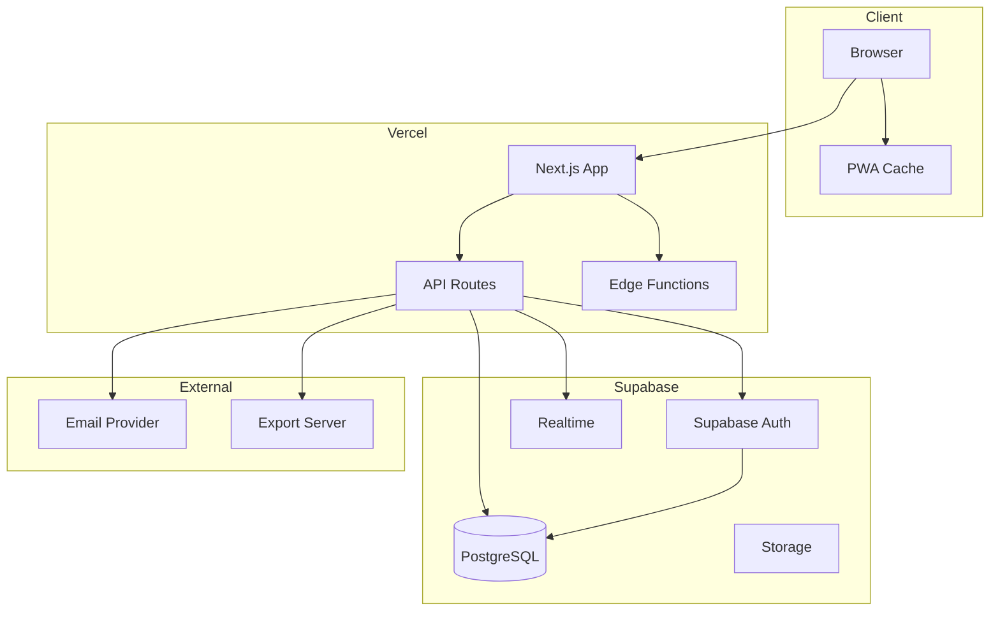
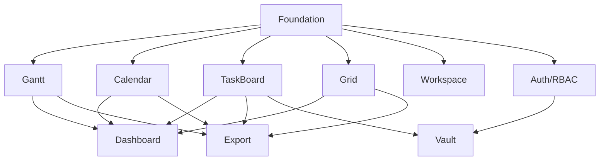
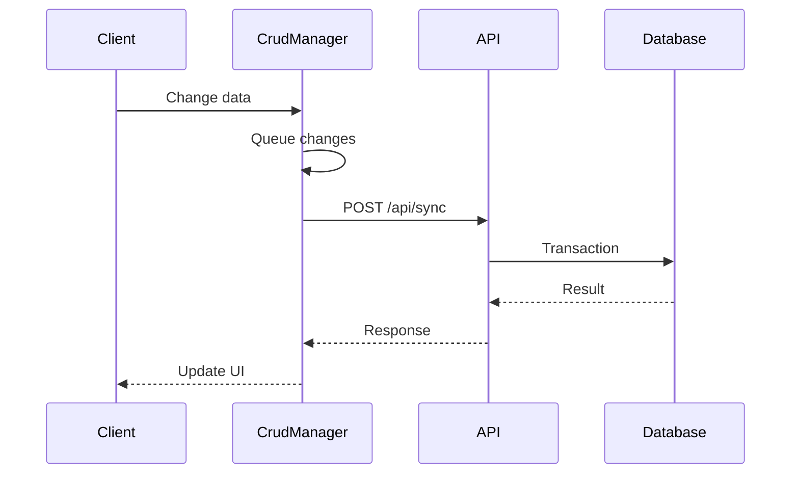
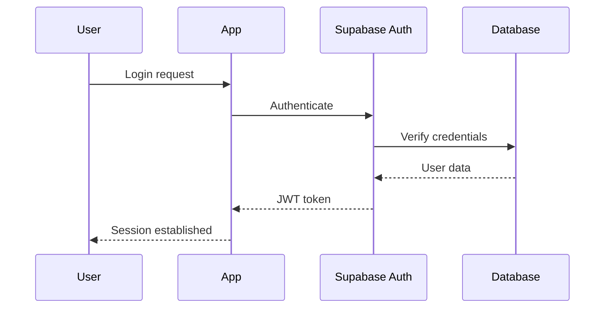

# DELIVERABLES - Documentation (D15-D17)

> **Versie:** 1.0
> **Datum:** 2024-12-29
> **Categorie:** Documentation
> **Deliverables:** D15-D17

[< Terug naar DELIVERABLES.md](./DELIVERABLES.md)

---

## Overzicht Documentation

| Code | Naam | Secties | Taken | Status |
|------|------|---------|-------|--------|
| D15 | ARCHITECTURE.md | 6 | 20 | Pending |
| D16 | CONTRACTS.md | 5 | 16 | Pending |
| D17 | API-DOCS.md | 6 | 18 | Pending |
| **TOTAAL** | | **17** | **54** | |

---

# D15: ARCHITECTURE.md

## Doelstelling

Documenteer de complete systeemarchitectuur inclusief high-level overview, tech stack, component structuur, data flow, security model en development guidelines.

## Scope

### Wat WEL
- System overview met diagrammen
- Tech stack met versies en rationale
- Component architectuur (modules, dependencies)
- Data architectuur (models, sync, caching)
- Security architectuur (auth, RBAC, RLS)
- Development guide (setup, standards)

### Wat NIET
- Code implementatie details (zie codebase)
- API endpoint documentatie (zie D17)
- Interface contracts (zie D16)
- Deployment procedures (zie D14)

## Premortem

| Risico | Impact | Mitigatie |
|--------|--------|-----------|
| Documentatie outdated | Hoog | Living document, review cycle |
| Te veel detail | Medium | Focus op why, niet how |
| Te weinig detail | Medium | Stakeholder review |
| Inconsistente diagrammen | Laag | Standard tooling (Mermaid) |

## Postmortem

| Criterium | Verwacht | Werkelijk | Status |
|-----------|----------|-----------|--------|
| Coverage | 100% modules | TBD | - |
| Accuracy | 100% | TBD | - |
| Readability | >4/5 | TBD | - |
| Diagram clarity | Clear | TBD | - |

## Definition of Done

- [ ] System overview diagram compleet
- [ ] Tech stack gedocumenteerd met versies
- [ ] Alle modules beschreven
- [ ] Module dependencies visualized
- [ ] Data models uitgelegd
- [ ] Sync flow gedocumenteerd
- [ ] Caching strategy beschreven
- [ ] Auth flow gedocumenteerd
- [ ] RBAC model uitgelegd
- [ ] RLS policies samengevat
- [ ] Development setup guide compleet
- [ ] Coding standards beschreven
- [ ] Review door stakeholders

## RACI Matrix

| Activiteit | A0 | A1 (Code) | A2 (Infra) | A3 (Docs) |
|------------|-----|-----------|------------|-----------|
| System Overview | I | C | C | R/A |
| Tech Stack | I | C | C | R/A |
| Component Architecture | I | R/A | C | A |
| Data Architecture | I | C | R/A | A |
| Security Architecture | I | C | R/A | A |
| Development Guide | I | R/A | C | A |

## Artefacts

| Type | Pad | Beschrijving |
|------|-----|--------------|
| Document | `docs/ARCHITECTURE.md` | Main architecture doc |
| Diagram | `docs/diagrams/system-overview.mmd` | System overview |
| Diagram | `docs/diagrams/component-diagram.mmd` | Components |
| Diagram | `docs/diagrams/data-flow.mmd` | Data flow |
| Diagram | `docs/diagrams/auth-flow.mmd` | Auth flow |

## Document Structure

### S15.1: System Overview

```markdown
# System Overview

## High-Level Architecture



## Key Architectural Decisions

1. **Monorepo met Next.js App Router**
   - Reden: Simplicity, co-located API routes

2. **Supabase als Backend-as-a-Service**
   - Reden: Auth, Database, Realtime in één platform

3. **Bryntum Suite voor UI Components**
   - Reden: Enterprise-grade scheduling components

4. **Vercel voor Hosting**
   - Reden: Seamless Next.js integration, edge functions
```

### S15.2: Tech Stack

```markdown
# Tech Stack

## Frontend

| Technology | Version | Purpose |
|------------|---------|---------|
| Next.js | 14.x | React framework |
| React | 18.x | UI library |
| TypeScript | 5.x | Type safety |
| Bryntum Suite | 7.1.x | Gantt, Calendar, TaskBoard, Grid |
| Tailwind CSS | 3.x | Styling |
| React Query | 5.x | Server state |
| Zustand | 4.x | Client state |

## Backend

| Technology | Version | Purpose |
|------------|---------|---------|
| Supabase | Latest | BaaS platform |
| PostgreSQL | 15.x | Database |
| Node.js | 20.x | Runtime |

## Infrastructure

| Technology | Purpose |
|------------|---------|
| Vercel | Hosting, CDN, Edge |
| GitHub | Version control, CI/CD |

## Rationale

### Why Bryntum?
- Enterprise-grade scheduling components
- Unified data model (ProjectModel)
- Built-in CrudManager for sync
- Extensive customization options

### Why Supabase?
- PostgreSQL with Row Level Security
- Built-in authentication
- Realtime subscriptions
- Cost-effective for small teams
```

### S15.3: Component Architecture

```markdown
# Component Architecture

## Module Structure

```
src/
├── app/                    # Next.js App Router
│   ├── (auth)/            # Auth pages
│   ├── (dashboard)/       # Dashboard pages
│   │   ├── gantt/
│   │   ├── calendar/
│   │   ├── taskboard/
│   │   ├── grid/
│   │   ├── vault/
│   │   └── workspaces/
│   └── api/               # API routes
├── components/            # React components
│   ├── shared/           # Shared UI
│   ├── gantt/            # Gantt module
│   ├── calendar/         # Calendar module
│   ├── taskboard/        # TaskBoard module
│   ├── grid/             # Grid module
│   ├── dashboard/        # Dashboard module
│   ├── workspace/        # Workspace module
│   ├── vault/            # Vault module
│   ├── auth/             # Auth module
│   └── export/           # Export module
├── hooks/                # Custom hooks
├── lib/                  # Utilities
├── models/               # Data models
├── providers/            # React providers
├── services/             # External services
├── styles/               # Global styles
└── types/                # TypeScript types
```

## Module Dependencies


```

### S15.4: Data Architecture

```markdown
# Data Architecture

## Data Models

```mermaid
erDiagram
    WORKSPACE ||--o{ PROJECT : contains
    WORKSPACE ||--o{ WORKSPACE_MEMBER : has
    PROJECT ||--o{ TASK : contains
    PROJECT ||--o{ RESOURCE : has
    PROJECT ||--o{ DEPENDENCY : has
    PROJECT ||--o{ ASSIGNMENT : has
    TASK ||--o{ TASK : parent_of
    TASK ||--o{ DEPENDENCY : from
    TASK ||--o{ DEPENDENCY : to
    TASK ||--o{ ASSIGNMENT : assigned
    RESOURCE ||--o{ ASSIGNMENT : assigned_to
    WORKSPACE ||--o{ VAULT_ITEM : processes
```

## Sync Architecture

### CrudManager Flow



## Caching Strategy

| Layer | Cache Type | TTL | Invalidation |
|-------|------------|-----|--------------|
| Browser | React Query | 5min | On mutation |
| Edge | Vercel Cache | 1min | Revalidate |
| Database | PostgreSQL | N/A | N/A |
```

### S15.5: Security Architecture

```markdown
# Security Architecture

## Authentication Flow



## RBAC Model

| Role | Workspace | Project | Tasks | Vault | Admin |
|------|-----------|---------|-------|-------|-------|
| Admin | Full | Full | Full | Full | Full |
| Vault Medewerker | Read | Read | Read | Full | None |
| Medewerker | Read | Full | Full | None | None |
| Klant Editor | Own | Own | Full | None | None |
| Klant Viewer | Own | Own | Read | None | None |

## Row Level Security

```sql
-- Example: Tasks only visible to workspace members
CREATE POLICY tasks_select ON tasks
FOR SELECT USING (
    project_id IN (
        SELECT p.id FROM projects p
        JOIN workspace_members wm ON p.workspace_id = wm.workspace_id
        WHERE wm.user_id = auth.uid()
    )
);
```
```

### S15.6: Development Guide

```markdown
# Development Guide

## Prerequisites

- Node.js 20+
- npm 10+
- Supabase CLI
- Git

## Setup

```bash
# Clone repository
git clone https://github.com/org/gantt-dashboard.git
cd gantt-dashboard

# Install dependencies
npm install

# Setup environment
cp .env.example .env.local

# Start Supabase locally
supabase start

# Run migrations
supabase db push

# Start development server
npm run dev
```

## Coding Standards

### TypeScript
- Strict mode enabled
- No `any` types
- Explicit return types

### React
- Functional components only
- Custom hooks for shared logic
- Error boundaries for error handling

### Naming Conventions
- Components: PascalCase
- Hooks: useCamelCase
- Files: kebab-case or PascalCase for components
- Types: PascalCase with `I` prefix for interfaces

### Git Workflow
- Feature branches from `develop`
- PR required for merge
- Squash merge to main
```

## Gerelateerd

| Relatie | Document | Beschrijving |
|---------|----------|--------------|
| Describes | D1-D10 | Code modules architecture |
| Describes | D11-D14 | Infrastructure architecture |
| References | D16 | CONTRACTS.md for interfaces |
| References | D17 | API-DOCS.md for endpoints |
| Visualized in | M1-M7 | Miro boards |

---

# D16: CONTRACTS.md

## Doelstelling

Definieer alle TypeScript interfaces, API contracts, event payloads, validation schemas en error codes als de "source of truth" voor frontend-backend communicatie.

## Scope

### Wat WEL
- Entity interfaces (Project, Task, Resource, etc.)
- API request/response schemas
- Event payload definitions
- Zod validation schemas
- Error code definitions

### Wat NIET
- Implementation details
- UI component props (colocated)
- Database schema (zie D11)
- API endpoint docs (zie D17)

## Premortem

| Risico | Impact | Mitigatie |
|--------|--------|-----------|
| Interface drift | Hoog | Generated types, single source |
| Missing edge cases | Medium | Comprehensive testing |
| Breaking changes | Hoog | Versioning, changelog |
| Complex nested types | Laag | Flatten where possible |

## Postmortem

| Criterium | Verwacht | Werkelijk | Status |
|-----------|----------|-----------|--------|
| Type coverage | 100% | TBD | - |
| Validation coverage | 100% | TBD | - |
| Error code coverage | 100% | TBD | - |
| Documentation quality | Good | TBD | - |

## Definition of Done

- [ ] All entity interfaces defined
- [ ] All API request schemas defined
- [ ] All API response schemas defined
- [ ] All event payloads defined
- [ ] Zod schemas for validation
- [ ] All error codes documented
- [ ] Examples for each contract
- [ ] Generated from/synced with code

## RACI Matrix

| Activiteit | A0 | A1 (Code) | A2 (Infra) | A3 (Docs) |
|------------|-----|-----------|------------|-----------|
| Entity Interfaces | I | R/A | C | A |
| API Contracts | I | R/A | C | A |
| Event Payloads | I | R/A | I | A |
| Validation Schemas | I | R/A | I | A |
| Error Codes | I | R/A | C | A |

## Artefacts

| Type | Pad | Beschrijving |
|------|-----|--------------|
| Document | `docs/CONTRACTS.md` | Main contracts doc |
| Types | `src/types/*.ts` | Source interfaces |
| Schemas | `src/lib/schemas/*.ts` | Zod schemas |
| Generated | `docs/contracts/` | Generated docs |

## Document Structure

### S16.1: Entity Interfaces

```typescript
// =============================================================================
// ENTITY INTERFACES
// =============================================================================

// -----------------------------------------------------------------------------
// Workspace
// -----------------------------------------------------------------------------
export interface IWorkspace {
  id: string;
  name: string;
  description?: string;
  type: 'afdeling' | 'klant';
  settings: IWorkspaceSettings;
  archivedAt?: string;
  createdBy: string;
  createdAt: string;
  updatedAt: string;
}

export interface IWorkspaceSettings {
  defaultView?: 'gantt' | 'calendar' | 'taskboard' | 'grid';
  theme?: string;
  features?: {
    vault?: boolean;
    export?: boolean;
    baselines?: boolean;
  };
}

export interface IWorkspaceMember {
  id: string;
  workspaceId: string;
  userId: string;
  role: WorkspaceRole;
  joinedAt: string;
  user?: IProfile;
}

export type WorkspaceRole = 'admin' | 'vault_medewerker' | 'medewerker' | 'klant_editor' | 'klant_viewer';

// -----------------------------------------------------------------------------
// Project
// -----------------------------------------------------------------------------
export interface IProject {
  id: string;
  workspaceId: string;
  name: string;
  description?: string;
  startDate?: string;
  endDate?: string;
  status: ProjectStatus;
  settings: IProjectSettings;
  createdBy: string;
  createdAt: string;
  updatedAt: string;
}

export type ProjectStatus = 'draft' | 'active' | 'completed' | 'archived';

export interface IProjectSettings {
  calendarId?: string;
  hoursPerDay?: number;
  daysPerWeek?: number;
  skipWeekends?: boolean;
}

// -----------------------------------------------------------------------------
// Task
// -----------------------------------------------------------------------------
export interface ITask {
  id: string;
  projectId: string;
  parentId?: string;
  name: string;
  startDate?: string;
  endDate?: string;
  duration?: number;
  durationUnit?: DurationUnit;
  percentDone?: number;
  effort?: number;
  effortUnit?: DurationUnit;
  constraintType?: ConstraintType;
  constraintDate?: string;
  manuallyScheduled?: boolean;
  cls?: string;
  iconCls?: string;
  note?: string;
  expanded?: boolean;
  rollup?: boolean;
  showInTimeline?: boolean;
  orderIndex?: number;
  wbsCode?: string;
  createdAt: string;
  updatedAt: string;
}

export type DurationUnit = 'minute' | 'hour' | 'day' | 'week' | 'month';

export type ConstraintType =
  | 'startnoearlierthan'
  | 'startnolaterthan'
  | 'finishnoearlierthan'
  | 'finishnolaterthan'
  | 'muststarton'
  | 'mustfinishon';

// -----------------------------------------------------------------------------
// Dependency
// -----------------------------------------------------------------------------
export interface IDependency {
  id: string;
  projectId: string;
  fromTask: string;
  toTask: string;
  type: DependencyType;
  lag?: number;
  lagUnit?: DurationUnit;
  cls?: string;
  createdAt: string;
}

export type DependencyType = 0 | 1 | 2 | 3; // SS, SF, FS, FF

// -----------------------------------------------------------------------------
// Resource
// -----------------------------------------------------------------------------
export interface IResource {
  id: string;
  projectId: string;
  name: string;
  type: ResourceType;
  calendarId?: string;
  image?: string;
  capacity?: number;
  costPerHour?: number;
  createdAt: string;
  updatedAt: string;
}

export type ResourceType = 'human' | 'material' | 'equipment';

// -----------------------------------------------------------------------------
// Assignment
// -----------------------------------------------------------------------------
export interface IAssignment {
  id: string;
  projectId: string;
  taskId: string;
  resourceId: string;
  units?: number;
  createdAt: string;
}

// -----------------------------------------------------------------------------
// Vault Item
// -----------------------------------------------------------------------------
export interface IVaultItem {
  id: string;
  workspaceId: string;
  projectId?: string;
  sourceData: Record<string, unknown>;
  status: VaultStatus;
  processingNotes?: string;
  processedBy?: string;
  processedAt?: string;
  doneAt?: string;
  expiresAt?: string;
  exportedAt?: string;
  createdAt: string;
  updatedAt: string;
}

export type VaultStatus = 'input' | 'processing' | 'done';

// -----------------------------------------------------------------------------
// Profile
// -----------------------------------------------------------------------------
export interface IProfile {
  id: string;
  email: string;
  fullName?: string;
  avatarUrl?: string;
  role: UserRole;
  createdAt: string;
  updatedAt: string;
}

export type UserRole = 'admin' | 'vault_medewerker' | 'medewerker' | 'klant_editor' | 'klant_viewer';
```

### S16.2: API Contracts

```typescript
// =============================================================================
// API CONTRACTS
// =============================================================================

// -----------------------------------------------------------------------------
// Generic Response
// -----------------------------------------------------------------------------
export interface IApiResponse<T> {
  success: boolean;
  data?: T;
  error?: IApiError;
  meta?: IApiMeta;
}

export interface IApiError {
  code: string;
  message: string;
  details?: Record<string, unknown>;
}

export interface IApiMeta {
  total?: number;
  page?: number;
  pageSize?: number;
}

// -----------------------------------------------------------------------------
// Workspace API
// -----------------------------------------------------------------------------
export interface ICreateWorkspaceRequest {
  name: string;
  type: 'afdeling' | 'klant';
  description?: string;
}

export interface IUpdateWorkspaceRequest {
  name?: string;
  description?: string;
  settings?: Partial<IWorkspaceSettings>;
}

export interface IInviteMemberRequest {
  email: string;
  role: WorkspaceRole;
}

export interface IWorkspaceListResponse {
  workspaces: IWorkspace[];
}

export interface IWorkspaceDetailResponse {
  workspace: IWorkspace;
  members?: IWorkspaceMember[];
}

// -----------------------------------------------------------------------------
// Project API
// -----------------------------------------------------------------------------
export interface ICreateProjectRequest {
  workspaceId: string;
  name: string;
  description?: string;
  startDate?: string;
  endDate?: string;
}

export interface IUpdateProjectRequest {
  name?: string;
  description?: string;
  startDate?: string;
  endDate?: string;
  status?: ProjectStatus;
  settings?: Partial<IProjectSettings>;
}

// -----------------------------------------------------------------------------
// CrudManager Sync
// -----------------------------------------------------------------------------
export interface ICrudManagerRequest {
  requestId: string;
  type: 'load' | 'sync';
  tasks?: ICrudStoreRequest<ITask>;
  dependencies?: ICrudStoreRequest<IDependency>;
  resources?: ICrudStoreRequest<IResource>;
  assignments?: ICrudStoreRequest<IAssignment>;
}

export interface ICrudStoreRequest<T> {
  added?: (T & { $PhantomId?: string })[];
  updated?: T[];
  removed?: { id: string }[];
}

export interface ICrudManagerResponse {
  requestId: string;
  success: boolean;
  tasks?: ICrudStoreResponse<ITask>;
  dependencies?: ICrudStoreResponse<IDependency>;
  resources?: ICrudStoreResponse<IResource>;
  assignments?: ICrudStoreResponse<IAssignment>;
}

export interface ICrudStoreResponse<T> {
  rows: T[];
  removed?: string[];
}

// -----------------------------------------------------------------------------
// Export API
// -----------------------------------------------------------------------------
export interface IExportRequest {
  projectId: string;
  format: ExportFormat;
  options: IExportOptions;
}

export type ExportFormat = 'pdf' | 'excel' | 'csv' | 'png' | 'svg';

export interface IExportOptions {
  // PDF options
  orientation?: 'portrait' | 'landscape';
  paperSize?: 'A4' | 'A3' | 'letter';

  // Excel/CSV options
  columns?: string[];
  includeHeaders?: boolean;

  // Image options
  width?: number;
  height?: number;
  scale?: number;
}
```

### S16.3: Event Payloads

```typescript
// =============================================================================
// EVENT PAYLOADS
// =============================================================================

// -----------------------------------------------------------------------------
// Bryntum Events
// -----------------------------------------------------------------------------
export interface ITaskChangeEvent {
  source: 'gantt' | 'taskboard' | 'grid';
  action: 'add' | 'update' | 'remove';
  records: ITask[];
  changes?: Record<string, { oldValue: unknown; newValue: unknown }>;
}

export interface IDependencyChangeEvent {
  source: 'gantt';
  action: 'add' | 'update' | 'remove';
  records: IDependency[];
}

export interface ISyncEvent {
  requestId: string;
  type: 'beforeSync' | 'sync' | 'syncFail';
  changes?: ICrudManagerRequest;
  response?: ICrudManagerResponse;
  error?: Error;
}

// -----------------------------------------------------------------------------
// Application Events
// -----------------------------------------------------------------------------
export interface IWorkspaceChangeEvent {
  type: 'created' | 'updated' | 'archived' | 'memberAdded' | 'memberRemoved';
  workspace: IWorkspace;
  member?: IWorkspaceMember;
}

export interface IVaultEvent {
  type: 'itemCreated' | 'statusChanged' | 'itemExported' | 'itemExpired';
  item: IVaultItem;
  previousStatus?: VaultStatus;
}

export interface IExportEvent {
  type: 'started' | 'completed' | 'failed';
  exportId: string;
  format: ExportFormat;
  progress?: number;
  result?: { url: string; size: number };
  error?: Error;
}
```

### S16.4: Validation Schemas

```typescript
// =============================================================================
// VALIDATION SCHEMAS (Zod)
// =============================================================================

import { z } from 'zod';

// -----------------------------------------------------------------------------
// Workspace Schemas
// -----------------------------------------------------------------------------
export const createWorkspaceSchema = z.object({
  name: z.string().min(1).max(100),
  type: z.enum(['afdeling', 'klant']),
  description: z.string().max(500).optional(),
});

export const updateWorkspaceSchema = z.object({
  name: z.string().min(1).max(100).optional(),
  description: z.string().max(500).optional(),
  settings: z.object({
    defaultView: z.enum(['gantt', 'calendar', 'taskboard', 'grid']).optional(),
    theme: z.string().optional(),
  }).optional(),
});

export const inviteMemberSchema = z.object({
  email: z.string().email(),
  role: z.enum(['admin', 'vault_medewerker', 'medewerker', 'klant_editor', 'klant_viewer']),
});

// -----------------------------------------------------------------------------
// Project Schemas
// -----------------------------------------------------------------------------
export const createProjectSchema = z.object({
  workspaceId: z.string().uuid(),
  name: z.string().min(1).max(100),
  description: z.string().max(1000).optional(),
  startDate: z.string().datetime().optional(),
  endDate: z.string().datetime().optional(),
});

export const updateProjectSchema = z.object({
  name: z.string().min(1).max(100).optional(),
  description: z.string().max(1000).optional(),
  startDate: z.string().datetime().optional(),
  endDate: z.string().datetime().optional(),
  status: z.enum(['draft', 'active', 'completed', 'archived']).optional(),
});

// -----------------------------------------------------------------------------
// Task Schemas
// -----------------------------------------------------------------------------
export const createTaskSchema = z.object({
  projectId: z.string().uuid(),
  parentId: z.string().uuid().optional(),
  name: z.string().min(1).max(200),
  startDate: z.string().datetime().optional(),
  duration: z.number().min(0).optional(),
  durationUnit: z.enum(['minute', 'hour', 'day', 'week', 'month']).optional(),
});

// -----------------------------------------------------------------------------
// Export Schemas
// -----------------------------------------------------------------------------
export const exportRequestSchema = z.object({
  projectId: z.string().uuid(),
  format: z.enum(['pdf', 'excel', 'csv', 'png', 'svg']),
  options: z.object({
    orientation: z.enum(['portrait', 'landscape']).optional(),
    paperSize: z.enum(['A4', 'A3', 'letter']).optional(),
    columns: z.array(z.string()).optional(),
    width: z.number().min(100).max(4000).optional(),
    height: z.number().min(100).max(4000).optional(),
  }),
});
```

### S16.5: Error Codes

```typescript
// =============================================================================
// ERROR CODES
// =============================================================================

export const ErrorCodes = {
  // Authentication (1xxx)
  AUTH_REQUIRED: 'AUTH_1001',
  AUTH_INVALID_TOKEN: 'AUTH_1002',
  AUTH_EXPIRED_TOKEN: 'AUTH_1003',
  AUTH_INVALID_CREDENTIALS: 'AUTH_1004',

  // Authorization (2xxx)
  AUTHZ_FORBIDDEN: 'AUTHZ_2001',
  AUTHZ_INSUFFICIENT_ROLE: 'AUTHZ_2002',
  AUTHZ_WORKSPACE_ACCESS_DENIED: 'AUTHZ_2003',
  AUTHZ_PROJECT_ACCESS_DENIED: 'AUTHZ_2004',
  AUTHZ_VAULT_ACCESS_DENIED: 'AUTHZ_2005',

  // Validation (3xxx)
  VALIDATION_FAILED: 'VAL_3001',
  VALIDATION_REQUIRED_FIELD: 'VAL_3002',
  VALIDATION_INVALID_FORMAT: 'VAL_3003',
  VALIDATION_OUT_OF_RANGE: 'VAL_3004',

  // Resource (4xxx)
  RESOURCE_NOT_FOUND: 'RES_4001',
  RESOURCE_ALREADY_EXISTS: 'RES_4002',
  RESOURCE_CONFLICT: 'RES_4003',
  RESOURCE_DEPENDENCY: 'RES_4004',

  // Sync (5xxx)
  SYNC_FAILED: 'SYNC_5001',
  SYNC_CONFLICT: 'SYNC_5002',
  SYNC_TIMEOUT: 'SYNC_5003',

  // Export (6xxx)
  EXPORT_FAILED: 'EXPORT_6001',
  EXPORT_TIMEOUT: 'EXPORT_6002',
  EXPORT_TOO_LARGE: 'EXPORT_6003',

  // Server (9xxx)
  SERVER_ERROR: 'SRV_9001',
  SERVER_UNAVAILABLE: 'SRV_9002',
  SERVER_RATE_LIMITED: 'SRV_9003',
} as const;

export type ErrorCode = typeof ErrorCodes[keyof typeof ErrorCodes];

export const ErrorMessages: Record<ErrorCode, string> = {
  [ErrorCodes.AUTH_REQUIRED]: 'Authenticatie vereist',
  [ErrorCodes.AUTH_INVALID_TOKEN]: 'Ongeldig token',
  [ErrorCodes.AUTH_EXPIRED_TOKEN]: 'Verlopen token',
  [ErrorCodes.AUTH_INVALID_CREDENTIALS]: 'Ongeldige inloggegevens',
  [ErrorCodes.AUTHZ_FORBIDDEN]: 'Toegang geweigerd',
  [ErrorCodes.AUTHZ_INSUFFICIENT_ROLE]: 'Onvoldoende rechten',
  [ErrorCodes.AUTHZ_WORKSPACE_ACCESS_DENIED]: 'Geen toegang tot deze workspace',
  [ErrorCodes.AUTHZ_PROJECT_ACCESS_DENIED]: 'Geen toegang tot dit project',
  [ErrorCodes.AUTHZ_VAULT_ACCESS_DENIED]: 'Geen toegang tot de Vault',
  [ErrorCodes.VALIDATION_FAILED]: 'Validatie mislukt',
  [ErrorCodes.VALIDATION_REQUIRED_FIELD]: 'Verplicht veld ontbreekt',
  [ErrorCodes.VALIDATION_INVALID_FORMAT]: 'Ongeldig formaat',
  [ErrorCodes.VALIDATION_OUT_OF_RANGE]: 'Waarde buiten bereik',
  [ErrorCodes.RESOURCE_NOT_FOUND]: 'Resource niet gevonden',
  [ErrorCodes.RESOURCE_ALREADY_EXISTS]: 'Resource bestaat al',
  [ErrorCodes.RESOURCE_CONFLICT]: 'Conflict met bestaande resource',
  [ErrorCodes.RESOURCE_DEPENDENCY]: 'Resource heeft afhankelijkheden',
  [ErrorCodes.SYNC_FAILED]: 'Synchronisatie mislukt',
  [ErrorCodes.SYNC_CONFLICT]: 'Synchronisatie conflict',
  [ErrorCodes.SYNC_TIMEOUT]: 'Synchronisatie timeout',
  [ErrorCodes.EXPORT_FAILED]: 'Export mislukt',
  [ErrorCodes.EXPORT_TIMEOUT]: 'Export timeout',
  [ErrorCodes.EXPORT_TOO_LARGE]: 'Export te groot',
  [ErrorCodes.SERVER_ERROR]: 'Server fout',
  [ErrorCodes.SERVER_UNAVAILABLE]: 'Server niet beschikbaar',
  [ErrorCodes.SERVER_RATE_LIMITED]: 'Te veel verzoeken',
};
```

## Gerelateerd

| Relatie | Document | Beschrijving |
|---------|----------|--------------|
| Implements | D1 | Types used in Foundation |
| Referenced by | D13 | API routes use contracts |
| Referenced by | D17 | API docs reference contracts |
| Validated by | Tests | Unit tests verify contracts |

---

# D17: API-DOCS.md

## Doelstelling

Documenteer alle API endpoints met voorbeelden, parameters, responses en error handling voor developers en API consumers.

## Scope

### Wat WEL
- API overview (base URL, auth, rate limits)
- Workspace endpoints documentatie
- Project endpoints documentatie
- Vault endpoints documentatie
- Export endpoints documentatie
- Code examples (curl, JavaScript)

### Wat NIET
- Implementation details
- Database schema (zie D11)
- Type definitions (zie D16)
- Architecture overview (zie D15)

## Premortem

| Risico | Impact | Mitigatie |
|--------|--------|-----------|
| Docs out of sync | Hoog | OpenAPI generation |
| Missing examples | Medium | Required per endpoint |
| Unclear error handling | Medium | Consistent error format |
| Poor discoverability | Laag | Good navigation, search |

## Postmortem

| Criterium | Verwacht | Werkelijk | Status |
|-----------|----------|-----------|--------|
| Endpoint coverage | 100% | TBD | - |
| Example coverage | 100% | TBD | - |
| Error documentation | 100% | TBD | - |
| Developer satisfaction | >4/5 | TBD | - |

## Definition of Done

- [ ] Overview section complete
- [ ] All workspace endpoints documented
- [ ] All project endpoints documented
- [ ] All vault endpoints documented
- [ ] All export endpoints documented
- [ ] Code examples for each endpoint
- [ ] Error responses documented
- [ ] Authentication documented
- [ ] Rate limits documented
- [ ] Tested with actual API

## RACI Matrix

| Activiteit | A0 | A1 (Code) | A2 (Infra) | A3 (Docs) |
|------------|-----|-----------|------------|-----------|
| Overview | I | C | C | R/A |
| Workspace Endpoints | I | C | I | R/A |
| Project Endpoints | I | C | I | R/A |
| Vault Endpoints | I | C | I | R/A |
| Export Endpoints | I | C | I | R/A |
| Examples | I | C | I | R/A |

## Artefacts

| Type | Pad | Beschrijving |
|------|-----|--------------|
| Document | `docs/API-DOCS.md` | Main API documentation |
| OpenAPI | `docs/openapi.yaml` | OpenAPI specification |
| Examples | `docs/examples/` | Code examples |
| Postman | `docs/postman/` | Postman collection |

## Document Structure

### S17.1: Overview

```markdown
# API Documentation

## Base URL

```
Production: https://gantt-dashboard.vercel.app/api
Development: http://localhost:3000/api
```

## Authentication

All API requests require authentication via Bearer token.

```bash
curl -H "Authorization: Bearer <your-jwt-token>" \
     https://gantt-dashboard.vercel.app/api/workspaces
```

### Obtaining a Token

Tokens are obtained via Supabase Auth:

```javascript
const { data } = await supabase.auth.signInWithPassword({
  email: 'user@example.com',
  password: 'password'
});

const token = data.session.access_token;
```

## Rate Limits

| Endpoint Type | Limit | Window |
|---------------|-------|--------|
| Read operations | 100 | 1 minute |
| Write operations | 30 | 1 minute |
| Export operations | 10 | 1 minute |
| Sync operations | 20 | 1 minute |

Rate limit headers:
- `X-RateLimit-Limit`: Maximum requests allowed
- `X-RateLimit-Remaining`: Requests remaining
- `X-RateLimit-Reset`: Unix timestamp when limit resets

## Response Format

All responses follow this format:

```json
{
  "success": true,
  "data": { ... },
  "meta": {
    "total": 100,
    "page": 1,
    "pageSize": 20
  }
}
```

Error responses:

```json
{
  "success": false,
  "error": {
    "code": "RES_4001",
    "message": "Resource niet gevonden",
    "details": { "id": "xxx" }
  }
}
```
```

### S17.2: Workspace Endpoints

```markdown
## Workspaces

### List Workspaces

`GET /api/workspaces`

Returns all workspaces the authenticated user has access to.

**Response**

```json
{
  "success": true,
  "data": {
    "workspaces": [
      {
        "id": "123e4567-e89b-12d3-a456-426614174000",
        "name": "Afdeling A",
        "type": "afdeling",
        "description": "Hoofdafdeling",
        "createdAt": "2024-01-01T00:00:00Z",
        "updatedAt": "2024-01-01T00:00:00Z"
      }
    ]
  }
}
```

**Example**

```bash
curl -X GET \
     -H "Authorization: Bearer $TOKEN" \
     https://gantt-dashboard.vercel.app/api/workspaces
```

---

### Create Workspace

`POST /api/workspaces`

Creates a new workspace.

**Request Body**

| Field | Type | Required | Description |
|-------|------|----------|-------------|
| name | string | Yes | Workspace name (1-100 chars) |
| type | string | Yes | "afdeling" or "klant" |
| description | string | No | Description (max 500 chars) |

**Example**

```bash
curl -X POST \
     -H "Authorization: Bearer $TOKEN" \
     -H "Content-Type: application/json" \
     -d '{"name": "Nieuwe Afdeling", "type": "afdeling"}' \
     https://gantt-dashboard.vercel.app/api/workspaces
```

---

### Get Workspace

`GET /api/workspaces/:id`

Returns a single workspace with its members.

**Parameters**

| Parameter | Type | Description |
|-----------|------|-------------|
| id | UUID | Workspace ID |

---

### Update Workspace

`PUT /api/workspaces/:id`

Updates workspace properties.

---

### Delete Workspace

`DELETE /api/workspaces/:id`

Archives a workspace (soft delete).

---

### Workspace Members

`GET /api/workspaces/:id/members`
`POST /api/workspaces/:id/members`
`DELETE /api/workspaces/:id/members/:userId`

Manage workspace members.

---

### Workspace Invites

`POST /api/workspaces/:id/invites`

Send invitation email to new member.

**Request Body**

```json
{
  "email": "newuser@example.com",
  "role": "medewerker"
}
```
```

### S17.3: Project Endpoints

```markdown
## Projects

### List Projects

`GET /api/projects?workspaceId=xxx`

Returns projects in a workspace.

---

### Create Project

`POST /api/projects`

Creates a new project.

**Request Body**

```json
{
  "workspaceId": "123e4567-e89b-12d3-a456-426614174000",
  "name": "Project Alpha",
  "description": "Description here",
  "startDate": "2024-01-01"
}
```

---

### Sync Project Data

`POST /api/projects/:id/sync`

CrudManager sync endpoint for Bryntum components.

**Request Body (Load)**

```json
{
  "requestId": "12345",
  "type": "load"
}
```

**Request Body (Sync)**

```json
{
  "requestId": "12345",
  "type": "sync",
  "tasks": {
    "added": [
      { "$PhantomId": "phantom-1", "name": "New Task" }
    ],
    "updated": [
      { "id": "xxx", "percentDone": 50 }
    ],
    "removed": [
      { "id": "yyy" }
    ]
  }
}
```

**Response**

```json
{
  "requestId": "12345",
  "success": true,
  "tasks": {
    "rows": [
      { "id": "real-id", "$PhantomId": "phantom-1", "name": "New Task" }
    ],
    "removed": ["yyy"]
  }
}
```

---

### Create Baseline

`POST /api/projects/:id/baseline`

Creates a project baseline snapshot.

---

### Complete Project

`POST /api/projects/:id/complete`

Marks project as complete and creates Vault item.
```

### S17.4: Vault Endpoints

```markdown
## Vault

### List Vault Items

`GET /api/vault?workspaceId=xxx&status=xxx`

Returns vault items. Requires vault access role.

**Query Parameters**

| Parameter | Type | Description |
|-----------|------|-------------|
| workspaceId | UUID | Filter by workspace |
| status | string | "input", "processing", or "done" |

---

### Get Vault Item

`GET /api/vault/:id`

Returns vault item details with source data.

---

### Update Vault Item

`PUT /api/vault/:id`

Updates vault item status or notes.

---

### Process Vault Item

`POST /api/vault/:id/process`

Moves item from Input to Processing with notes.

**Request Body**

```json
{
  "notes": "Processing started, validating data..."
}
```

---

### Export Vault Item

`POST /api/vault/:id/export`

Exports processed item to permanent storage.

**Request Body**

```json
{
  "destination": "permanent"
}
```
```

### S17.5: Export Endpoints

```markdown
## Export

### PDF Export

`POST /api/export/pdf`

Generates PDF export of Gantt or Calendar view.

**Request Body**

```json
{
  "projectId": "xxx",
  "type": "gantt",
  "options": {
    "orientation": "landscape",
    "paperSize": "A3"
  }
}
```

**Response**

Binary PDF file with headers:
- `Content-Type: application/pdf`
- `Content-Disposition: attachment; filename="export.pdf"`

---

### Excel Export

`POST /api/export/excel`

Generates Excel export of task data.

---

### CSV Export

`POST /api/export/csv`

Generates CSV export.

---

### Image Export

`POST /api/export/image`

Generates PNG or SVG image.

**Request Body**

```json
{
  "projectId": "xxx",
  "type": "gantt",
  "format": "png",
  "options": {
    "width": 1920,
    "height": 1080
  }
}
```
```

### S17.6: Examples

```markdown
## Code Examples

### JavaScript/TypeScript

```typescript
// Using fetch
async function loadWorkspaces() {
  const response = await fetch('/api/workspaces', {
    headers: {
      'Authorization': `Bearer ${token}`,
    },
  });

  const { data } = await response.json();
  return data.workspaces;
}

// Using Bryntum CrudManager
const project = new ProjectModel({
  transport: {
    load: {
      url: '/api/projects/xxx/sync',
    },
    sync: {
      url: '/api/projects/xxx/sync',
    },
  },
  autoLoad: true,
  autoSync: true,
});
```

### cURL

```bash
# List workspaces
curl -X GET \
     -H "Authorization: Bearer $TOKEN" \
     https://gantt-dashboard.vercel.app/api/workspaces

# Create project
curl -X POST \
     -H "Authorization: Bearer $TOKEN" \
     -H "Content-Type: application/json" \
     -d '{"workspaceId":"xxx","name":"New Project"}' \
     https://gantt-dashboard.vercel.app/api/projects

# Export PDF
curl -X POST \
     -H "Authorization: Bearer $TOKEN" \
     -H "Content-Type: application/json" \
     -d '{"projectId":"xxx","type":"gantt"}' \
     --output export.pdf \
     https://gantt-dashboard.vercel.app/api/export/pdf
```
```

## Gerelateerd

| Relatie | Document | Beschrijving |
|---------|----------|--------------|
| Implements | D13 | Documents the API routes |
| References | D16 | Uses contracts for types |
| Part of | D15 | Architecture documentation |
| Tested with | Postman | Collection for testing |

---

## Versie Historie

| Versie | Datum | Auteur | Wijzigingen |
|--------|-------|--------|-------------|
| 1.0 | 2024-12-29 | A3 | Initieel document met D15-D17 |

---

*Document versie: 1.0*
*Laatst bijgewerkt: 29 December 2024*
*Documentation: 3 | Secties: 17 | Taken: 54*
