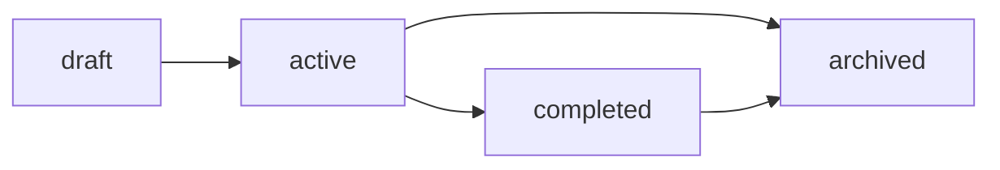

# DELIVERABLES - Process Documents (P1-P5)

> **Versie:** 1.0
> **Datum:** 2024-12-29
> **Categorie:** Process Documents
> **Deliverables:** P1-P5

[< Terug naar DELIVERABLES.md](./DELIVERABLES.md)

---

## Overzicht Process Documents

| Code | Naam | Secties | Taken | Status |
|------|------|---------|-------|--------|
| P1 | ROLLEN.md | 7 | 12 | Pending |
| P2 | PROCEDURES.md | 4 | 30 | Pending |
| P3 | GLOSSARY.md | 2 | 8 | Pending |
| P4 | TAXONOMY.md | 5 | 10 | Pending |
| P5 | ONBOARDING.md | 6 | 12 | Pending |
| **TOTAAL** | | **24** | **72** | |

---

# P1: ROLLEN.md

## Doelstelling

Documenteer alle rollen binnen het platform en de organisatie met hun verantwoordelijkheden, bevoegdheden en onderlinge relaties.

## Scope

### Wat WEL
- Platform rollen (5 rollen)
- Organisatie rollen
- Verantwoordelijkheden per rol
- Bevoegdheden (permissions)
- Rapportage lijnen
- Rol transitie regels

### Wat NIET
- Technical RBAC implementation
- UI/UX voor rol management
- Database schema voor rollen
- API endpoints

## Premortem

| Risico | Impact | Mitigatie |
|--------|--------|-----------|
| Onduidelijke grenzen | Hoog | Expliciete permission matrix |
| Rol overlap | Medium | RACI voor taken |
| Ontbrekende rollen | Medium | Stakeholder review |
| Verouderde beschrijvingen | Medium | Review cyclus |

## Postmortem

| Criterium | Verwacht | Werkelijk | Status |
|-----------|----------|-----------|--------|
| Rol coverage | 100% | TBD | - |
| Stakeholder approval | Yes | TBD | - |
| Clarity score | >4/5 | TBD | - |

## Definition of Done

- [ ] Alle 5 platform rollen gedocumenteerd
- [ ] Verantwoordelijkheden per rol beschreven
- [ ] Bevoegdheden matrix compleet
- [ ] Organisatie rollen beschreven
- [ ] Rapportage lijnen gedefinieerd
- [ ] Rol transitie regels
- [ ] Stakeholder review passed

## RACI Matrix

| Activiteit | A0 | A1 | A2 | A3 (Docs) |
|------------|-----|-----|-----|-----------|
| Platform rollen | R/A | C | C | A |
| Org rollen | R/A | I | I | A |
| Permissions | C | R/A | C | A |
| Review | R/A | C | C | A |

## Artefacts

| Type | Pad | Beschrijving |
|------|-----|--------------|
| Document | `docs/ROLLEN.md` | Main rollen document |

## Document Structure

### S1: Platform Rollen Overview

```markdown
# Platform Rollen

## Overzicht

Het platform kent 5 rollen met verschillende bevoegdheden:

| Rol | Code | Niveau | Beschrijving |
|-----|------|--------|--------------|
| Admin | admin | 1 (hoogste) | Volledige toegang tot platform |
| Vault Medewerker | vault_medewerker | 2 | Vault verwerking specialist |
| Medewerker | medewerker | 3 | Standaard interne gebruiker |
| Klant Editor | klant_editor | 4 | Externe klant met edit rechten |
| Klant Viewer | klant_viewer | 5 (laagste) | Externe klant met alleen lees rechten |

## Rol Hiërarchie

```
Admin
├── Vault Medewerker
├── Medewerker
└── Klant Editor
    └── Klant Viewer
```
```

### S2: Admin Rol

```markdown
## Admin

### Beschrijving
De Admin heeft volledige toegang tot alle functionaliteiten van het platform binnen hun workspace(s). Deze rol is bedoeld voor workspace beheerders en technische administrators.

### Verantwoordelijkheden
- Workspace configuratie en beheer
- Gebruikersbeheer (uitnodigen, rollen toewijzen, deactiveren)
- Project aanmaken en archiveren
- Platform instellingen configureren
- Support en escalatie afhandeling
- Audit log review

### Bevoegdheden (Permissions)
| Permission | Toegestaan |
|------------|------------|
| workspace.create | ✓ |
| workspace.update | ✓ |
| workspace.delete | ✓ |
| workspace.members.manage | ✓ |
| project.create | ✓ |
| project.update | ✓ |
| project.delete | ✓ |
| task.* | ✓ |
| vault.view | ✓ |
| vault.process | ✓ |
| export.* | ✓ |
| settings.* | ✓ |

### Toewijzing
- Automatisch aan workspace creator
- Handmatig door bestaande Admin
- Maximum: geen limiet per workspace

### Rapporteert aan
- Platform-niveau: Niemand (hoogste niveau)
- Organisatie-niveau: Afhankelijk van bedrijfsstructuur
```

### S3: Vault Medewerker Rol

```markdown
## Vault Medewerker

### Beschrijving
Gespecialiseerde rol voor het verwerken van data in de Vault. Heeft geen toegang tot reguliere project editing, maar volledige controle over de Vault workflow.

### Verantwoordelijkheden
- Vault items verwerken (Input → Processing → Done)
- Data validatie uitvoeren
- Processing notes documenteren
- Export naar permanent storage
- Audit trail onderhouden

### Bevoegdheden (Permissions)
| Permission | Toegestaan |
|------------|------------|
| workspace.view | ✓ |
| project.view | ✓ |
| task.view | ✓ |
| vault.view | ✓ |
| vault.process | ✓ |
| vault.export | ✓ |
| export.view | ✓ |

### Toewijzing
- Door Admin
- Vereist: Training Vault procedures
- Maximum: 3 per workspace (aanbevolen)

### Rapporteert aan
- Admin voor escalaties
- Workflow supervisor voor dagelijkse taken
```

### S4: Medewerker Rol

```markdown
## Medewerker

### Beschrijving
Standaard rol voor interne teamleden die aan projecten werken. Kan taken beheren, planning aanpassen en data exporteren binnen toegewezen workspaces.

### Verantwoordelijkheden
- Project planning en taken beheer
- Resource allocatie
- Voortgang rapportage
- Data export voor rapportage
- Samenwerking met teamleden

### Bevoegdheden (Permissions)
| Permission | Toegestaan |
|------------|------------|
| workspace.view | ✓ |
| project.view | ✓ |
| project.update | ✓ |
| task.* | ✓ |
| resource.* | ✓ |
| export.basic | ✓ |

### Toewijzing
- Door Admin
- Default voor nieuwe interne users
- Geen maximum

### Rapporteert aan
- Admin voor permissie issues
- Project lead voor inhoudelijke zaken
```

### S5: Klant Editor Rol

```markdown
## Klant Editor

### Beschrijving
Externe klant met bewerkingsrechten op eigen project. Kan taken aanpassen maar heeft geen toegang tot interne workspaces of de Vault.

### Verantwoordelijkheden
- Eigen taken beheren
- Status updates geven
- Feedback leveren op planning
- Eigen data exporteren

### Bevoegdheden (Permissions)
| Permission | Toegestaan | Scope |
|------------|------------|-------|
| workspace.view | ✓ | Eigen |
| project.view | ✓ | Eigen |
| project.update | ✓ | Eigen |
| task.view | ✓ | Eigen |
| task.update | ✓ | Eigen |
| export.basic | ✓ | Eigen |

### Toewijzing
- Via uitnodiging door Admin
- Alleen voor 'klant' type workspaces
- Maximum: 10 per workspace (configureerbaar)

### Rapporteert aan
- Afdeling contactpersoon
- Project lead
```

### S6: Klant Viewer Rol

```markdown
## Klant Viewer

### Beschrijving
Externe klant met alleen lees-toegang. Kan project voortgang bekijken maar geen wijzigingen aanbrengen.

### Verantwoordelijkheden
- Project voortgang monitoren
- Planning bekijken
- Feedback via externe kanalen

### Bevoegdheden (Permissions)
| Permission | Toegestaan | Scope |
|------------|------------|-------|
| workspace.view | ✓ | Eigen |
| project.view | ✓ | Eigen |
| task.view | ✓ | Eigen |

### Toewijzing
- Via uitnodiging door Admin
- Alleen voor 'klant' type workspaces
- Geen maximum

### Rapporteert aan
- N.v.t. (geen actieve taken)
```

### S7: Organisatie Rollen

```markdown
## Organisatie Rollen

Naast platform rollen kent de organisatie de volgende functionele rollen:

### Platform Administrator (technisch)
- Beheert de technische infrastructuur
- Lost platform-brede issues op
- Onderhoudt Supabase/Vercel configuratie
- Is niet gekoppeld aan specifieke workspace

### Afdeling Manager
- Verantwoordelijk voor afdeling workspace
- Stuurt Medewerkers aan
- Rapporteert aan directie
- Platform rol: Admin

### Project Lead
- Leidt specifieke projecten
- Coördineert resources
- Platform rol: Admin of Medewerker

### Klant Contactpersoon
- Single point of contact voor klant
- Beheert klant workspace
- Platform rol: Admin (op klant workspace)
```

## Gerelateerd

| Relatie | Document | Beschrijving |
|---------|----------|--------------|
| Implements | OUTCOMES.md | O9 Rollen |
| Visualized in | M7 | Rollen board |
| Used by | D8 | RBAC implementation |
| Referenced by | P2 | Procedures |
| Referenced by | P5 | Onboarding |

---

# P2: PROCEDURES.md

## Doelstelling

Documenteer alle operationele procedures voor dagelijks gebruik van het platform, onderhoud, escalaties en uitzonderlijke situaties.

## Scope

### Wat WEL
- Dagelijkse operaties (28 procedures)
- Onderhoud procedures
- Escalatie procedures
- Uitzonderingsprocedures
- Checklists

### Wat NIET
- Technical runbooks
- Code deployment procedures
- Database maintenance scripts
- Security incident response (separate doc)

## Premortem

| Risico | Impact | Mitigatie |
|--------|--------|-----------|
| Onvolledige procedures | Hoog | User feedback loop |
| Outdated procedures | Hoog | Quarterly review |
| Te complex | Medium | Simpele checklists |
| Niet gevolgd | Hoog | Training, reminders |

## Postmortem

| Criterium | Verwacht | Werkelijk | Status |
|-----------|----------|-----------|--------|
| Procedure coverage | 28 procedures | TBD | - |
| User adoption | >80% | TBD | - |
| Update frequency | Quarterly | TBD | - |

## Definition of Done

- [ ] Dagelijkse procedures (sectie 1)
- [ ] Onderhoud procedures (sectie 2)
- [ ] Escalatie procedures (sectie 3)
- [ ] Uitzonderingsprocedures (sectie 4)
- [ ] Checklists per procedure
- [ ] Stakeholder review
- [ ] Training materiaal

## RACI Matrix

| Activiteit | A0 | A1 | A2 | A3 (Docs) |
|------------|-----|-----|-----|-----------|
| Procedure definitie | R/A | C | C | A |
| Checklists | C | C | C | R/A |
| Review | R/A | C | C | A |

## Artefacts

| Type | Pad | Beschrijving |
|------|-----|--------------|
| Document | `docs/PROCEDURES.md` | Main procedures document |
| Checklists | `docs/checklists/` | Printable checklists |

## Document Structure

### S1: Dagelijkse Procedures

```markdown
# Dagelijkse Procedures

## Workspace Management

### PROC-001: Workspace Aanmaken
**Doel:** Nieuwe workspace aanmaken voor afdeling of klant

**Trigger:** Verzoek via [kanaal]

**Stappen:**
1. Login als Admin
2. Navigeer naar Workspaces > Nieuw
3. Vul in:
   - Naam: [afdelingsnaam] of [klantnaam]
   - Type: "afdeling" of "klant"
   - Beschrijving: Optioneel
4. Klik "Aanmaken"
5. Configureer instellingen
6. Nodig eerste gebruiker uit

**Checklist:**
- [ ] Naam correct gespeld
- [ ] Type correct gekozen
- [ ] Eerste Admin uitgenodigd
- [ ] Welkomstmail verstuurd

**Verantwoordelijke:** Admin

---

### PROC-002: Gebruiker Uitnodigen
**Doel:** Nieuwe gebruiker toegang geven tot workspace

**Stappen:**
1. Open workspace settings
2. Ga naar "Leden"
3. Klik "Uitnodigen"
4. Vul email in
5. Selecteer rol
6. Verstuur uitnodiging

**Checklist:**
- [ ] Email adres geverifieerd
- [ ] Juiste rol gekozen
- [ ] Uitnodiging verstuurd
- [ ] Follow-up na 3 dagen indien niet geaccepteerd

---

### PROC-003: Project Aanmaken
### PROC-004: Project Archiveren
### PROC-005: Taak Aanmaken
### PROC-006: Resource Toewijzen
### PROC-007: Baseline Aanmaken
### PROC-008: Data Exporteren
```

### S2: Onderhoud Procedures

```markdown
# Onderhoud Procedures

### PROC-020: Workspace Audit
**Frequentie:** Maandelijks
**Doel:** Controleer workspace gezondheid

**Stappen:**
1. Review actieve gebruikers
2. Controleer inactieve accounts (>30 dagen)
3. Review project statussen
4. Controleer storage gebruik
5. Genereer rapport

**Checklist:**
- [ ] Inactieve users geidentificeerd
- [ ] Storage onder limiet
- [ ] Geen orphan projects
- [ ] Rapport verstuurd naar stakeholders

---

### PROC-021: Vault Cleanup
**Frequentie:** Wekelijks
**Doel:** Verwerk expired vault items

**Stappen:**
1. Open Vault dashboard
2. Filter op "Expired" status
3. Review elk item
4. Archiveer of delete
5. Log acties in audit

---

### PROC-022: Gebruikers Review
### PROC-023: Permission Audit
### PROC-024: Backup Verificatie
```

### S3: Escalatie Procedures

```markdown
# Escalatie Procedures

### PROC-030: Permission Escalatie
**Trigger:** Gebruiker heeft extra rechten nodig

**Escalatie pad:**
1. Medewerker vraagt aan bij Project Lead
2. Project Lead evalueert
3. Bij goedkeuring: Admin voert uit
4. Log in audit trail

**Maximum responstijd:** 4 uur

---

### PROC-031: Technische Escalatie
**Trigger:** Platform functioneert niet correct

**Escalatie pad:**
1. Gebruiker meldt bij Admin
2. Admin checkt status pagina
3. Bij platform issue: Contact A2 (Infra)
4. A2 escaleert naar Vercel/Supabase indien nodig

**Maximum responstijd:**
- P1 (platform down): 15 minuten
- P2 (functie broken): 1 uur
- P3 (minor issue): 4 uur

---

### PROC-032: Data Verlies Escalatie
### PROC-033: Security Incident
### PROC-034: Klant Klacht
```

### S4: Uitzonderingsprocedures

```markdown
# Uitzonderingsprocedures

### PROC-040: Emergency Admin Access
**Trigger:** Enige Admin is niet beschikbaar

**Stappen:**
1. Contact Platform Administrator
2. Verificatie via secundair kanaal
3. Tijdelijke Admin rol toekennen
4. Log actie met reden
5. Review na 24 uur

---

### PROC-041: Bulk User Import
**Trigger:** >10 users tegelijk toevoegen

**Stappen:**
1. Bereid CSV voor met template
2. Valideer email adressen
3. Import via Admin panel
4. Verzend bulk uitnodigingen
5. Monitor acceptatie rate

---

### PROC-042: Workspace Merge
### PROC-043: Data Recovery
### PROC-044: Rol Bulk Update
```

## Gerelateerd

| Relatie | Document | Beschrijving |
|---------|----------|--------------|
| References | P1 | Rol definities |
| Visualized in | M7 | Procedure flows |
| Training | P5 | Onboarding procedures |

---

# P3: GLOSSARY.md

## Doelstelling

Definieer alle termen, afkortingen en concepten die binnen het platform en project worden gebruikt.

## Scope

### Wat WEL
- Platform terminologie
- Bryntum specifieke termen
- Project management termen
- Afkortingen lijst
- Synoniemen mapping

### Wat NIET
- General IT terminology
- Programming concepts
- External tool documentation

## Definition of Done

- [ ] A-Z terminologie compleet
- [ ] Alle afkortingen verklaard
- [ ] Synoniemen gemapped
- [ ] Cross-references
- [ ] Stakeholder review

## RACI Matrix

| Activiteit | A0 | A1 | A2 | A3 (Docs) |
|------------|-----|-----|-----|-----------|
| Term definitie | C | C | C | R/A |
| Review | R/A | C | C | A |

## Artefacts

| Type | Pad | Beschrijving |
|------|-----|--------------|
| Document | `docs/GLOSSARY.md` | Glossary document |

## Document Structure

### S1: Terminologie A-Z

```markdown
# Glossary

## A

**Afdeling**
Een interne business unit binnen de organisatie. Heeft een eigen workspace van type "afdeling".

**Admin**
Hoogste platform rol met volledige toegang tot workspace beheer en gebruikersbeheer.

**Assignment**
Koppeling tussen een taak en een resource. Definieert wie aan welke taak werkt.

## B

**Baseline**
Snapshot van de projectplanning op een specifiek moment. Gebruikt voor vergelijking met actuele voortgang.

**Bryntum**
Software vendor die de Gantt, Calendar, TaskBoard en Grid componenten levert.

## C

**Calendar**
1. De Calendar view voor event management
2. Een werktijd definitie (welke dagen/uren zijn werkdagen)

**Column (TaskBoard)**
Een verticale swimlane in het TaskBoard, meestal gekoppeld aan een status.

**Constraint**
Een beperking op een taak, zoals "Niet eerder starten dan" of "Moet eindigen op".

**Critical Path**
De langste keten van afhankelijke taken die de projectduur bepaalt.

**CrudManager**
Bryntum component voor data synchronisatie tussen frontend en backend.

## D

**Dashboard**
Centrale interface met navigatie en view widgets.

**Dependency**
Relatie tussen twee taken die volgorde afdwingt (FS, SS, FF, SF).

**Done (Vault)**
Status van een Vault item dat verwerkt is en wacht op export of verwijdering.

## E-F

**Event**
Een tijdgebonden item in de Calendar view.

**Export**
Functie om data te downloaden in PDF, Excel, CSV of image formaat.

**FS (Finish-to-Start)**
Meest voorkomende dependency type: taak B start nadat taak A eindigt.

## G-H

**Gantt Chart**
Tijdlijn visualisatie van taken met afhankelijkheden.

**Grid**
Tabelweergave voor data met sorting, filtering en editing.

## I-K

**Input (Vault)**
Eerste status van nieuwe Vault items, wachtend op verwerking.

**Klant**
Externe partij met beperkte toegang tot een specifiek project.

## L-M

**Lag**
Vertraging (positief) of overlap (negatief) in een dependency.

**Medewerker**
Standaard interne gebruiker rol met project edit rechten.

**Milestone**
Taak met duur 0, markeert een belangrijk moment.

## N-O

**Non-working time**
Niet-werkbare tijd (weekenden, feestdagen) in de planning.

## P

**Permission**
Specifieke bevoegdheid binnen het platform (bijv. task.edit).

**Processing (Vault)**
Status van Vault item dat actief wordt verwerkt.

**Progress Line**
Visuele lijn in Gantt die huidige datum en voortgang toont.

**ProjectModel**
Bryntum centrale data container die alle stores beheert.

## R

**RBAC**
Role-Based Access Control - systeem voor toegangsbeheer op basis van rollen.

**Resource**
Persoon, materiaal of equipment dat aan taken kan worden toegewezen.

**RLS**
Row Level Security - PostgreSQL feature voor data isolatie.

**Rollup**
Samenvatting van child taken in parent taak.

## S

**Store**
Bryntum data container (TaskStore, ResourceStore, etc.).

**Swimlane**
Horizontale groepering in TaskBoard, vaak op basis van assignee.

**Sync**
Synchronisatie van data tussen frontend en backend.

## T

**TaskBoard**
Kanban-style view met columns en cards.

**TaskStore**
Bryntum store die alle taken bevat.

## U-V

**Vault**
Module voor gecontroleerde dataverwerking met 30-dagen retentie.

**View**
Een weergave van project data (Gantt, Calendar, TaskBoard, Grid).

## W

**WBS (Work Breakdown Structure)**
Hiërarchische structuur van taken.

**Widget**
Embedded component in dashboard layout.

**WIP Limit**
Maximum aantal items in een TaskBoard column.

**Workspace**
Hoogste niveau container voor projecten en gebruikers.
```

### S2: Afkortingen

```markdown
# Afkortingen

| Afkorting | Betekenis |
|-----------|-----------|
| API | Application Programming Interface |
| CSV | Comma-Separated Values |
| CRUD | Create, Read, Update, Delete |
| FF | Finish-to-Finish (dependency type) |
| FS | Finish-to-Start (dependency type) |
| JWT | JSON Web Token |
| KR | Key Result |
| PDF | Portable Document Format |
| RBAC | Role-Based Access Control |
| RLS | Row Level Security |
| SF | Start-to-Finish (dependency type) |
| SS | Start-to-Start (dependency type) |
| SSR | Server-Side Rendering |
| UI | User Interface |
| UUID | Universally Unique Identifier |
| WBS | Work Breakdown Structure |
| WIP | Work In Progress |
```

## Gerelateerd

| Relatie | Document | Beschrijving |
|---------|----------|--------------|
| Used by | All docs | Terminology reference |
| Extended by | P4 | Taxonomy hierarchies |

---

# P4: TAXONOMY.md

## Doelstelling

Definieer de hiërarchische structuren, classificaties en categorisaties binnen het platform.

## Scope

### Wat WEL
- Entity hiërarchie
- Status classificaties
- Type categorieën
- Priority levels
- Tag/label systeem

### Wat NIET
- Database implementation
- UI for taxonomy management
- API endpoints

## Definition of Done

- [ ] Entity hiërarchie gedocumenteerd
- [ ] Status classificaties compleet
- [ ] Type categorieën gedefinieerd
- [ ] Priority schema beschreven
- [ ] Tag systeem ontworpen

## RACI Matrix

| Activiteit | A0 | A1 | A2 | A3 (Docs) |
|------------|-----|-----|-----|-----------|
| Hiërarchie definitie | R/A | C | C | A |
| Status classificatie | C | R/A | I | A |
| Review | R/A | C | C | A |

## Artefacts

| Type | Pad | Beschrijving |
|------|-----|--------------|
| Document | `docs/TAXONOMY.md` | Taxonomy document |

## Document Structure

### S1: Entity Hiërarchie

```markdown
# Entity Hiërarchie

## Platform Structuur

```
Platform
└── Workspace
    ├── Project
    │   ├── Task
    │   │   └── Subtask (recursive)
    │   ├── Resource
    │   ├── Dependency
    │   ├── Assignment
    │   ├── Calendar
    │   └── Baseline
    └── Vault Item
```

## Data Ownership

| Entity | Owned By | Cascades To |
|--------|----------|-------------|
| Workspace | Platform | Projects, Members, Vault Items |
| Project | Workspace | Tasks, Resources, Dependencies, Assignments |
| Task | Project | Subtasks, Dependencies, Assignments |
| Resource | Project | Assignments |
```

### S2: Status Classificaties

```markdown
# Status Classificaties

## Project Status

| Status | Code | Beschrijving | Transitions |
|--------|------|--------------|-------------|
| Draft | draft | Nieuw, nog niet actief | → active |
| Active | active | In uitvoering | → completed, archived |
| Completed | completed | Afgerond, naar Vault | → archived |
| Archived | archived | Alleen-lezen | - |



## Task Status (TaskBoard)

| Status | Kolom | Kleur | WIP Default |
|--------|-------|-------|-------------|
| Backlog | backlog | #9E9E9E | - |
| To Do | todo | #2196F3 | 10 |
| In Progress | in_progress | #FF9800 | 5 |
| Review | review | #9C27B0 | 3 |
| Done | done | #4CAF50 | - |

## Vault Status

| Status | Beschrijving | Duration |
|--------|--------------|----------|
| Input | Wacht op verwerking | Onbeperkt |
| Processing | Wordt verwerkt | Onbeperkt |
| Done | Verwerkt, wacht op export/cleanup | 30 dagen |
```

### S3: Type Categorieën

```markdown
# Type Categorieën

## Workspace Types

| Type | Code | Kenmerken |
|------|------|-----------|
| Afdeling | afdeling | Interne users, Vault toegang, Onbeperkt |
| Klant | klant | Externe users, Geen Vault, Archiveerbaar |

## Resource Types

| Type | Code | Beschrijving |
|------|------|--------------|
| Human | human | Personen |
| Material | material | Materialen, verbruiksgoederen |
| Equipment | equipment | Apparatuur, gereedschap |

## Dependency Types

| Type | Code | Beschrijving |
|------|------|--------------|
| Start-to-Start | 0 | B start wanneer A start |
| Start-to-Finish | 1 | B eindigt wanneer A start |
| Finish-to-Start | 2 | B start wanneer A eindigt (meest voorkomend) |
| Finish-to-Finish | 3 | B eindigt wanneer A eindigt |
```

### S4: Priority Levels

```markdown
# Priority Levels

## Task Priority

| Priority | Code | Kleur | SLA |
|----------|------|-------|-----|
| Critical | 1 | #D32F2F | < 4 uur response |
| High | 2 | #F57C00 | < 1 dag response |
| Medium | 3 | #1976D2 | < 3 dagen response |
| Low | 4 | #388E3C | Best effort |
| None | 0 | #9E9E9E | - |

## Usage Guidelines

- **Critical**: Blocker voor andere taken, deadline today
- **High**: Belangrijke deadline komende week
- **Medium**: Normale werkzaamheden
- **Low**: Nice to have, geen deadline
```

### S5: Tag Systeem

```markdown
# Tag Systeem

## Standaard Tags

| Categorie | Tags | Kleur |
|-----------|------|-------|
| Phase | planning, development, testing, deployment | Blauw |
| Type | feature, bug, improvement, documentation | Groen |
| Area | frontend, backend, database, infra | Oranje |
| Client | [dynamisch per klant] | Paars |

## Tag Regels

1. Maximum 5 tags per item
2. Tags zijn workspace-scoped
3. Tags kunnen door Admin worden beheerd
4. Verwijderde tags worden soft-deleted
```

## Gerelateerd

| Relatie | Document | Beschrijving |
|---------|----------|--------------|
| References | P3 | Glossary definities |
| Used by | D1-D10 | Code implementation |
| Visualized in | M1-M7 | Miro boards |

---

# P5: ONBOARDING.md

## Doelstelling

Beschrijf de onboarding flows voor elke rol, inclusief stappen, training materiaal en evaluatie criteria.

## Scope

### Wat WEL
- Onboarding flow per rol
- Eerste dag checklist
- Training materiaal overzicht
- Evaluatie criteria
- Mentorship structure

### Wat NIET
- Actual training content
- Video tutorials
- Quiz systems
- HR procedures

## Definition of Done

- [ ] Onboarding flow per rol
- [ ] Eerste dag checklists
- [ ] Training materiaal referenties
- [ ] Evaluatie criteria
- [ ] Mentor guidelines
- [ ] Feedback mechanisme

## RACI Matrix

| Activiteit | A0 | A1 | A2 | A3 (Docs) |
|------------|-----|-----|-----|-----------|
| Flow definitie | R/A | C | C | A |
| Checklists | C | C | C | R/A |
| Training refs | C | C | C | R/A |
| Review | R/A | C | C | A |

## Artefacts

| Type | Pad | Beschrijving |
|------|-----|--------------|
| Document | `docs/ONBOARDING.md` | Onboarding document |
| Checklists | `docs/onboarding/` | Role-specific checklists |

## Document Structure

### S1: Onboarding Overview

```markdown
# Onboarding Overview

## Doelen

1. Nieuwe gebruikers snel productief maken
2. Consistente kennisoverdracht
3. Platform adoptie verbeteren
4. Support load verminderen

## Timeline

| Fase | Periode | Focus |
|------|---------|-------|
| Pre-boarding | Dag -7 tot 0 | Account setup, toegang |
| Dag 1 | Eerste dag | Introductie, basics |
| Week 1 | Dag 1-5 | Core functionaliteit |
| Week 2-4 | Dag 6-30 | Verdieping, zelfstandigheid |
| Review | Dag 30 | Evaluatie, feedback |
```

### S2: Admin Onboarding

```markdown
## Admin Onboarding

### Pre-boarding

**Door:** Platform Administrator

- [ ] Account aanmaken
- [ ] Admin rol toewijzen
- [ ] Welkomstmail versturen
- [ ] Training sessie plannen

### Dag 1 Checklist

**Duur:** 2 uur

1. [ ] Login en wachtwoord instellen
2. [ ] Platform rondleiding
3. [ ] Workspace navigatie begrijpen
4. [ ] Settings verkennen
5. [ ] Eerste test-project aanmaken

### Week 1 Training

| Dag | Onderwerp | Duur |
|-----|-----------|------|
| 1 | Platform basics | 2 uur |
| 2 | User management | 1 uur |
| 3 | Project setup | 2 uur |
| 4 | Procedures doorlopen | 1 uur |
| 5 | Zelfstandig oefenen | - |

### Evaluatie Criteria

- [ ] Kan workspace aanmaken
- [ ] Kan gebruikers uitnodigen
- [ ] Kan rollen toewijzen
- [ ] Kan project setup uitvoeren
- [ ] Kent escalatie procedures
```

### S3: Vault Medewerker Onboarding

```markdown
## Vault Medewerker Onboarding

### Vereisten

- Begrijpt data privacy principes
- Bekend met de organisatie processen
- Aandacht voor detail

### Week 1 Training

| Dag | Onderwerp | Duur |
|-----|-----------|------|
| 1 | Platform basics | 1 uur |
| 2 | Vault introductie | 2 uur |
| 3 | Processing workflow | 2 uur |
| 4 | Export procedures | 1 uur |
| 5 | Onder begeleiding werken | - |

### Supervised Period

- Eerste 10 Vault items onder begeleiding
- Review door senior Vault medewerker
- Sign-off na 10 succesvolle verwerkingen

### Evaluatie Criteria

- [ ] Kent Vault workflow (Input → Processing → Done)
- [ ] Kan processing notes correct invullen
- [ ] Begrijpt 30-dagen retentie
- [ ] Kan exporteren naar permanent storage
- [ ] Kent escalatie procedure
```

### S4: Medewerker Onboarding

```markdown
## Medewerker Onboarding

### Dag 1 Checklist

**Duur:** 1.5 uur

1. [ ] Login en profiel instellen
2. [ ] Workspace en project vinden
3. [ ] Views begrijpen (Gantt, Calendar, TaskBoard, Grid)
4. [ ] Eerste taak aanmaken
5. [ ] Eerste taak voltooien

### Week 1 Training

| Dag | Onderwerp | Duur |
|-----|-----------|------|
| 1 | Basis navigatie | 1.5 uur |
| 2 | Gantt view diepgang | 1 uur |
| 3 | Calendar & TaskBoard | 1 uur |
| 4 | Export functies | 30 min |
| 5 | Zelfstandig werken | - |

### Self-paced Learning

- Online help documentatie
- Video tutorials (indien beschikbaar)
- Sandbox project voor oefenen

### Evaluatie Criteria

- [ ] Kan navigeren tussen views
- [ ] Kan taken CRUD uitvoeren
- [ ] Kan dependencies maken
- [ ] Kan data exporteren
- [ ] Weet waar hulp te vinden
```

### S5: Klant Onboarding

```markdown
## Klant Onboarding (Editor & Viewer)

### Pre-boarding

**Door:** Klant Contactpersoon

1. [ ] Uitnodiging versturen
2. [ ] Verwachtingen communiceren
3. [ ] Training sessie plannen (optioneel)

### Eerste Login Flow

1. Email uitnodiging ontvangen
2. Link klikken
3. Account aanmaken (of bestaand gebruiken)
4. Workspace accepteren
5. Rondleiding popup doorlopen

### Quick Start Guide

**Voor Klant Editor:**
- Hoe taken te bekijken
- Hoe status te updaten
- Hoe voortgang te zien
- Hoe te communiceren

**Voor Klant Viewer:**
- Hoe project te bekijken
- Hoe views te wisselen
- Hoe te navigeren

### Support

- Directe contact met Klant Contactpersoon
- Email support: [email]
- Geen directe platform support
```

### S6: Evaluatie & Feedback

```markdown
## Evaluatie Framework

### 30-dagen Review

**Voor alle rollen:**

1. Checklist completion rate
2. Self-assessment vragenlijst
3. Mentor feedback
4. System usage metrics

### Feedback Formulier

- Hoe duidelijk was de onboarding?
- Wat miste je in de training?
- Wat zou je verbeteren?
- Ben je klaar voor zelfstandig werk?

### Escalatie bij Issues

Als onboarding niet succesvol:
1. Extra training sessie plannen
2. Buddy/mentor toewijzen
3. Aangepast tempo overwegen
4. Rol geschiktheid evalueren
```

## Gerelateerd

| Relatie | Document | Beschrijving |
|---------|----------|--------------|
| References | P1 | Rol definities |
| References | P2 | Procedures voor training |
| References | P3 | Terminologie |
| Visualized in | M7 | Onboarding journeys |

---

## Versie Historie

| Versie | Datum | Auteur | Wijzigingen |
|--------|-------|--------|-------------|
| 1.0 | 2024-12-29 | A3 | Initieel document met P1-P5 |

---

*Document versie: 1.0*
*Laatst bijgewerkt: 29 December 2024*
*Process Documents: 5 | Secties: 24 | Taken: 72*
