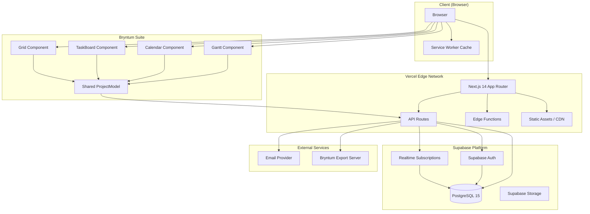
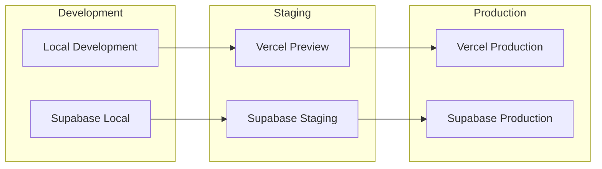
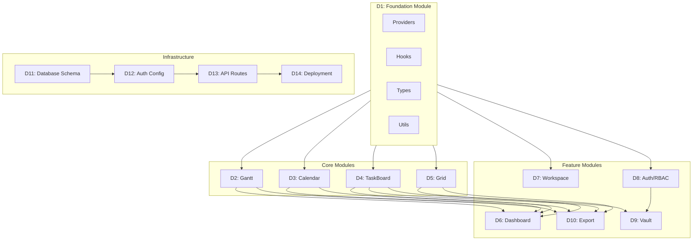
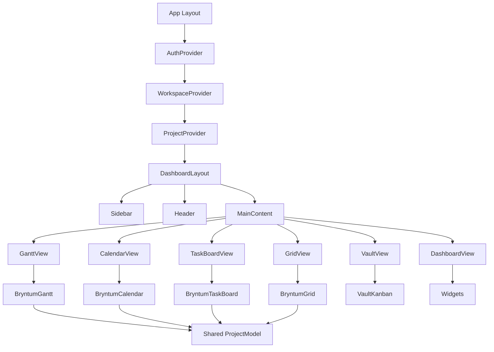
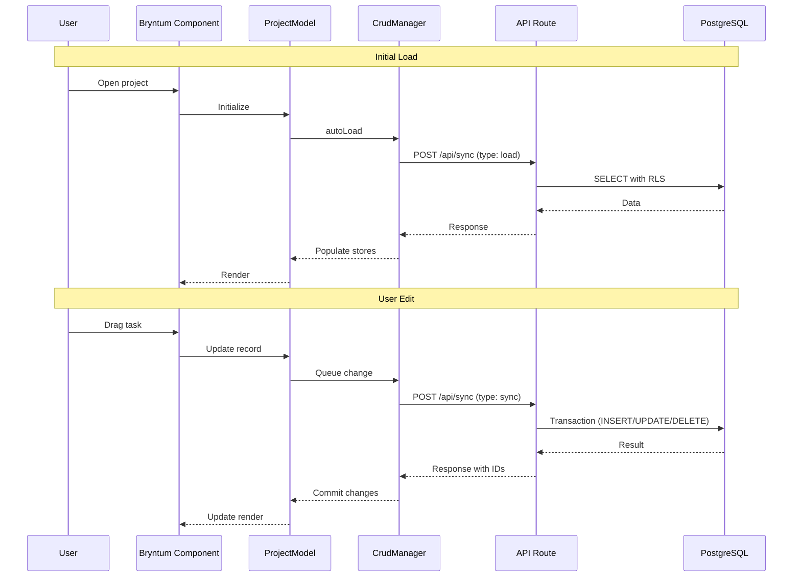
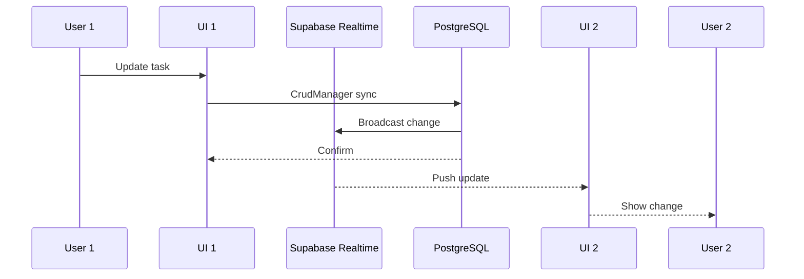
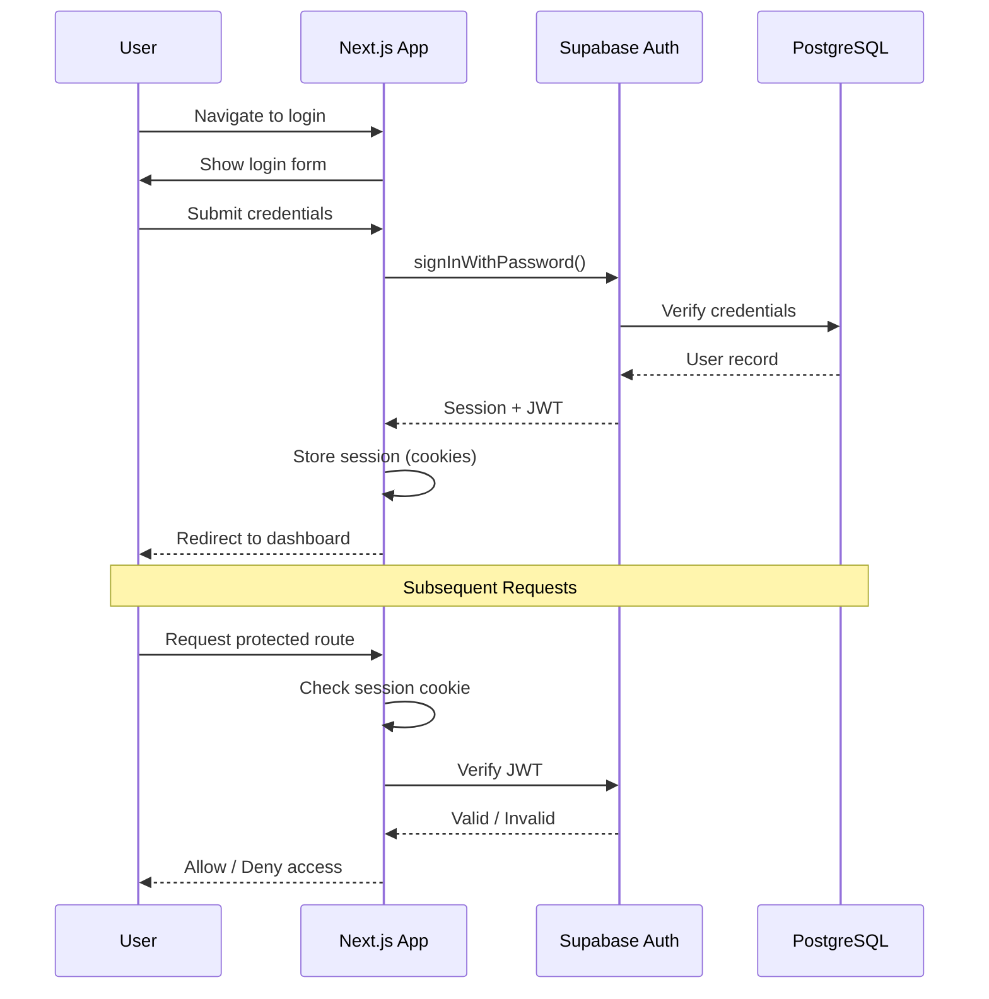
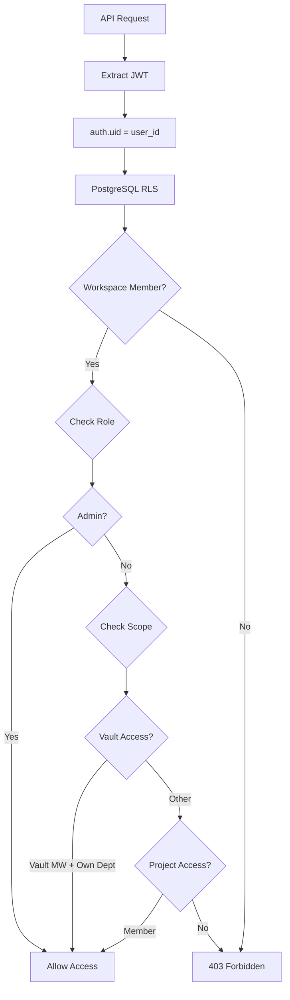
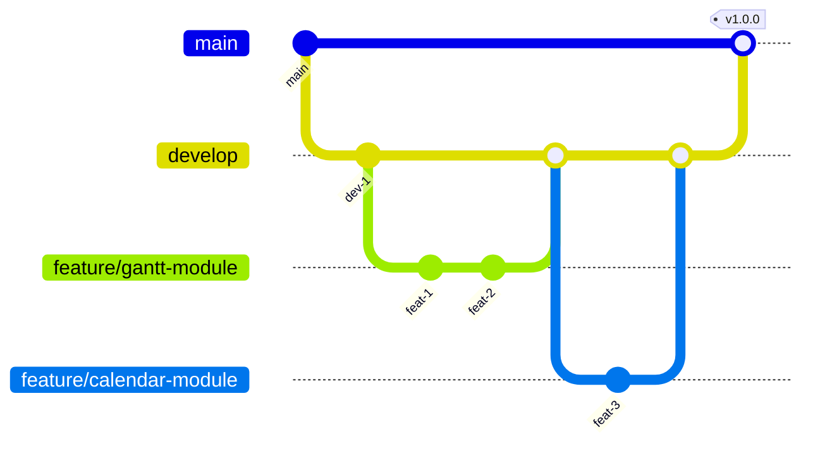

# ARCHITECTURE.md - Gantt Dashboard

> **Versie:** 1.0
> **Datum:** 2024-12-30
> **Deliverable:** D15
> **Status:** Complete

---

## Inhoudsopgave

1. [System Overview](#1-system-overview)
2. [Tech Stack](#2-tech-stack)
3. [Component Architecture](#3-component-architecture)
4. [Data Architecture](#4-data-architecture)
5. [Security Architecture](#5-security-architecture)
6. [Development Guide](#6-development-guide)

---

## 1. System Overview

### 1.1 High-Level Architecture



### 1.2 Deployment Architecture



### 1.3 Key Architectural Decisions

| Beslissing | Rationale | Alternatieven Overwogen |
|------------|-----------|------------------------|
| **Next.js 14 App Router** | Server Components, streaming, co-located API routes | Pages Router, Remix, Nuxt |
| **Supabase BaaS** | Auth + DB + Realtime in 1 platform, Row Level Security | Firebase, PlanetScale + Auth0 |
| **Bryntum Suite** | Enterprise-grade scheduling, unified ProjectModel | FullCalendar, dhtmlx, custom |
| **Vercel Hosting** | Seamless Next.js integration, edge network, previews | Netlify, AWS Amplify |
| **TypeScript Strict** | Type safety, betere DX, minder runtime errors | JavaScript + JSDoc |

### 1.4 Design Principles

1. **Separation of Concerns**: UI, state, data access gescheiden
2. **Single Source of Truth**: Bryntum ProjectModel voor alle views
3. **Security by Default**: RLS op database niveau
4. **Offline-First Ready**: Service worker + local cache
5. **Incremental Enhancement**: Core functionaliteit eerst, features daarna

---

## 2. Tech Stack

### 2.1 Frontend

| Technology | Version | Purpose | License |
|------------|---------|---------|---------|
| **Next.js** | 16.x | React framework met App Router | MIT |
| **React** | 18.x | UI library | MIT |
| **TypeScript** | 5.x | Static typing | Apache 2.0 |
| **Bryntum Gantt** | 7.1.x | Gantt chart component | Commercial |
| **Bryntum Calendar** | 7.1.x | Calendar component | Commercial |
| **Bryntum TaskBoard** | 7.1.x | Kanban board component | Commercial |
| **Bryntum Grid** | 7.1.x | Data grid component | Commercial |
| **SCSS** | 1.78.x | Styling preprocessor | MIT |

### 2.2 Backend

| Technology | Version | Purpose |
|------------|---------|---------|
| **Supabase** | Latest | Backend-as-a-Service platform |
| **PostgreSQL** | 15.x | Relational database |
| **PostgREST** | - | Auto-generated REST API |
| **GoTrue** | - | Authentication service |
| **Realtime** | - | WebSocket subscriptions |

### 2.3 Infrastructure

| Technology | Purpose |
|------------|---------|
| **Vercel** | Hosting, CDN, Edge Functions, Preview Deployments |
| **GitHub** | Version control, CI/CD via GitHub Actions |
| **Supabase CLI** | Local development, migrations |

### 2.4 Development Tools

| Tool | Purpose |
|------|---------|
| **ESLint** | Code linting |
| **Prettier** | Code formatting |
| **TypeScript** | Static type checking |
| **Supabase CLI** | Database migrations, local dev |

### 2.5 Bryntum Suite Rationale

**Waarom Bryntum?**

1. **Enterprise-grade Components**: Productie-klaar met uitgebreide features
2. **Unified Data Model**: Gedeelde ProjectModel tussen alle views
3. **Built-in CrudManager**: Automatische sync met backend
4. **Performance**: Virtual rendering voor grote datasets
5. **Customization**: Uitgebreide theming en configuratie opties
6. **TypeScript Support**: Volledige type definitions

**Bryntum Component Mapping:**

| Component | Use Case | Key Features |
|-----------|----------|--------------|
| **Gantt** | Project timeline | Dependencies, critical path, baselines |
| **Calendar** | Event scheduling | Multiple views, recurring events |
| **TaskBoard** | Kanban workflow | Swimlanes, WIP limits, drag-drop |
| **Grid** | Data tables | Sorting, filtering, grouping, export |

---

## 3. Component Architecture

### 3.1 Directory Structure

```
gantt-dashboard/
├── app/                          # Next.js App Router
│   ├── (auth)/                   # Auth route group
│   │   ├── login/
│   │   └── register/
│   ├── (dashboard)/              # Dashboard route group
│   │   ├── [workspaceId]/
│   │   │   ├── gantt/
│   │   │   ├── calendar/
│   │   │   ├── taskboard/
│   │   │   ├── grid/
│   │   │   └── vault/
│   │   └── workspaces/
│   ├── api/                      # API routes
│   │   ├── workspaces/
│   │   ├── projects/
│   │   ├── sync/
│   │   ├── vault/
│   │   └── export/
│   ├── layout.tsx
│   └── page.tsx
├── components/                   # React components
│   ├── shared/                   # Shared UI components
│   │   ├── Button/
│   │   ├── Modal/
│   │   ├── Sidebar/
│   │   └── Header/
│   ├── bryntum/                  # Bryntum wrappers
│   │   ├── Gantt/
│   │   ├── Calendar/
│   │   ├── TaskBoard/
│   │   └── Grid/
│   ├── dashboard/                # Dashboard widgets
│   ├── workspace/                # Workspace management
│   ├── vault/                    # Vault components
│   ├── auth/                     # Auth components
│   └── export/                   # Export components
├── hooks/                        # Custom React hooks
│   ├── useAuth.ts
│   ├── useWorkspace.ts
│   ├── useProject.ts
│   ├── useVault.ts
│   └── usePermissions.ts
├── lib/                          # Utilities
│   ├── supabase/
│   │   ├── client.ts
│   │   ├── server.ts
│   │   └── middleware.ts
│   ├── bryntum/
│   │   ├── config.ts
│   │   └── projectModel.ts
│   └── utils/
├── providers/                    # React Context providers
│   ├── AuthProvider.tsx
│   ├── WorkspaceProvider.tsx
│   ├── ProjectProvider.tsx
│   └── ThemeProvider.tsx
├── services/                     # External service clients
│   ├── api.ts
│   └── export.ts
├── styles/                       # Global styles
│   ├── globals.scss
│   ├── variables.scss
│   └── bryntum-overrides.scss
├── types/                        # TypeScript types
│   ├── database.types.ts
│   ├── bryntum.types.ts
│   └── api.types.ts
├── vendor/                       # Third-party libs
│   ├── gantt/
│   └── gantt-react/
├── docs/                         # Documentation
├── public/                       # Static assets
└── supabase/                     # Database migrations
    ├── migrations/
    └── seed.sql
```

### 3.2 Module Dependencies



### 3.3 Component Hierarchy



### 3.4 Bryntum Integration Pattern

```typescript
// components/bryntum/Gantt/Gantt.tsx
'use client';

import { BryntumGantt } from '@bryntum/gantt-react';
import { useProject } from '@/hooks/useProject';
import { ganttConfig } from './GanttConfig';

export function Gantt() {
    const { project, isLoading } = useProject();

    if (isLoading) return <Loading />;

    return (
        <BryntumGantt
            project={project}
            {...ganttConfig}
        />
    );
}

// lib/bryntum/projectModel.ts
import { ProjectModel } from '@bryntum/gantt';

export function createProjectModel(options: ProjectModelOptions) {
    return new ProjectModel({
        autoLoad: true,
        autoSync: true,
        validateResponse: process.env.NODE_ENV === 'development',
        transport: {
            load: {
                url: `/api/projects/${options.projectId}/sync`,
                method: 'POST',
                headers: {
                    'Authorization': `Bearer ${options.token}`
                }
            },
            sync: {
                url: `/api/projects/${options.projectId}/sync`,
                method: 'POST',
                headers: {
                    'Authorization': `Bearer ${options.token}`
                }
            }
        }
    });
}
```

---

## 4. Data Architecture

### 4.1 Entity Relationship Diagram

```mermaid
erDiagram
    PROFILE ||--o{ WORKSPACE_MEMBER : has
    WORKSPACE ||--o{ WORKSPACE_MEMBER : contains
    WORKSPACE ||--o{ PROJECT : contains
    WORKSPACE ||--o{ VAULT_ITEM : has

    PROJECT ||--o{ TASK : contains
    PROJECT ||--o{ RESOURCE : has
    PROJECT ||--o{ DEPENDENCY : has
    PROJECT ||--o{ ASSIGNMENT : has
    PROJECT ||--o{ CALENDAR : uses

    TASK ||--o{ TASK : parent_of
    TASK ||--o{ DEPENDENCY : from
    TASK ||--o{ DEPENDENCY : to
    TASK ||--o{ ASSIGNMENT : assigned

    RESOURCE ||--o{ ASSIGNMENT : assigned_to
    RESOURCE ||--o{ CALENDAR : uses

    PROFILE {
        uuid id PK
        string email
        string full_name
        string avatar_url
        string role
        timestamp created_at
    }

    WORKSPACE {
        uuid id PK
        string name
        string type
        string description
        jsonb settings
        uuid created_by FK
        timestamp created_at
        timestamp archived_at
    }

    WORKSPACE_MEMBER {
        uuid id PK
        uuid workspace_id FK
        uuid user_id FK
        string role
        timestamp joined_at
    }

    PROJECT {
        uuid id PK
        uuid workspace_id FK
        string name
        string description
        date start_date
        date end_date
        string status
        jsonb settings
        uuid created_by FK
        timestamp created_at
    }

    TASK {
        uuid id PK
        uuid project_id FK
        uuid parent_id FK
        string name
        timestamp start_date
        timestamp end_date
        integer duration
        string duration_unit
        integer percent_done
        string constraint_type
        timestamp constraint_date
        boolean manually_scheduled
        integer order_index
        string wbs_code
    }

    DEPENDENCY {
        uuid id PK
        uuid project_id FK
        uuid from_task FK
        uuid to_task FK
        integer type
        integer lag
        string lag_unit
    }

    RESOURCE {
        uuid id PK
        uuid project_id FK
        string name
        string type
        uuid calendar_id FK
        string image
        decimal cost_per_hour
    }

    ASSIGNMENT {
        uuid id PK
        uuid project_id FK
        uuid task_id FK
        uuid resource_id FK
        decimal units
    }

    CALENDAR {
        uuid id PK
        uuid project_id FK
        string name
        integer hours_per_day
        jsonb intervals
    }

    VAULT_ITEM {
        uuid id PK
        uuid workspace_id FK
        uuid project_id FK
        jsonb source_data
        string status
        text processing_notes
        uuid processed_by FK
        timestamp processed_at
        timestamp done_at
        timestamp expires_at
    }
```

### 4.2 Bryntum ProjectModel Data Flow



### 4.3 Sync Request/Response Format

```typescript
// Load Request
interface CrudLoadRequest {
    requestId: string;
    type: 'load';
}

// Load Response
interface CrudLoadResponse {
    requestId: string;
    success: boolean;
    tasks: { rows: Task[] };
    dependencies: { rows: Dependency[] };
    resources: { rows: Resource[] };
    assignments: { rows: Assignment[] };
    calendars: { rows: Calendar[] };
    project: ProjectConfig;
}

// Sync Request
interface CrudSyncRequest {
    requestId: string;
    type: 'sync';
    tasks?: {
        added?: (Task & { $PhantomId: string })[];
        updated?: Task[];
        removed?: { id: string }[];
    };
    dependencies?: { /* similar */ };
    resources?: { /* similar */ };
    assignments?: { /* similar */ };
}

// Sync Response
interface CrudSyncResponse {
    requestId: string;
    success: boolean;
    tasks?: {
        rows: Task[];  // For added records with real IDs
        removed?: string[];
    };
    // Similar for other stores
}
```

### 4.4 Caching Strategy

| Layer | Type | TTL | Invalidation |
|-------|------|-----|--------------|
| **Browser** | Bryntum Store | Session | Manual / Sync |
| **React Query** | Server State Cache | 5 min | On mutation, staleTime |
| **Vercel Edge** | CDN Cache | 60 sec | On-demand revalidation |
| **Supabase** | Connection Pool | - | - |

### 4.5 Realtime Sync Architecture



---

## 5. Security Architecture

### 5.1 Authentication Flow



### 5.2 RBAC Model

#### 5.2.1 Roles

| Role | Code | Scope | Description |
|------|------|-------|-------------|
| **Admin** | `admin` | Platform | Volledige toegang tot alles |
| **Vault Medewerker** | `vault_medewerker` | Afdeling | Vault verwerking + basis platform |
| **Medewerker** | `medewerker` | Afdeling | Project en taak beheer |
| **Klant Editor** | `klant_editor` | Project | Bewerken eigen klant-project |
| **Klant Viewer** | `klant_viewer` | Project | Alleen lezen eigen klant-project |

#### 5.2.2 Permission Matrix

```
                          Admin   Vault MW   Medewerker   Klant Ed   Klant View
WORKSPACE
  - Create                  X
  - Read (own)              X        X           X           X           X
  - Read (all)              X
  - Update                  X
  - Delete                  X
  - Invite members          X        X

PROJECT
  - Create                  X        X           X
  - Read (own workspace)    X        X           X           X           X
  - Update                  X        X           X           X
  - Delete                  X        X
  - Complete                X        X           X

TASK
  - Create                  X        X           X           X
  - Read                    X        X           X           X           X
  - Update                  X        X           X           X
  - Delete                  X        X           X

VAULT
  - View                    X        X*
  - Process                 X        X*
  - Export                  X        X*

ADMIN
  - Manage users            X
  - Manage roles            X
  - System config           X

* = Beperkt tot eigen afdeling
```

#### 5.2.3 Permission Check Implementation

```typescript
// hooks/usePermissions.ts
export function usePermissions() {
    const { user } = useAuth();
    const { workspace } = useWorkspace();

    const can = useCallback((action: Action, resource: Resource) => {
        const role = workspace?.members.find(m => m.userId === user?.id)?.role;
        return checkPermission(role, action, resource);
    }, [user, workspace]);

    return { can };
}

// Usage in component
function TaskEditButton({ task }) {
    const { can } = usePermissions();

    if (!can('update', 'task')) return null;

    return <Button onClick={() => editTask(task)}>Edit</Button>;
}
```

### 5.3 Row Level Security (RLS)

#### 5.3.1 RLS Policy Overview

```sql
-- Workspaces: Users can only see workspaces they are members of
CREATE POLICY workspace_select ON workspaces
FOR SELECT USING (
    id IN (
        SELECT workspace_id FROM workspace_members
        WHERE user_id = auth.uid()
    )
);

-- Projects: Users can only see projects in their workspaces
CREATE POLICY project_select ON projects
FOR SELECT USING (
    workspace_id IN (
        SELECT workspace_id FROM workspace_members
        WHERE user_id = auth.uid()
    )
);

-- Tasks: Users can only see tasks in accessible projects
CREATE POLICY task_select ON tasks
FOR SELECT USING (
    project_id IN (
        SELECT id FROM projects
        WHERE workspace_id IN (
            SELECT workspace_id FROM workspace_members
            WHERE user_id = auth.uid()
        )
    )
);

-- Vault: Only admin and vault_medewerker can access
CREATE POLICY vault_select ON vault_items
FOR SELECT USING (
    workspace_id IN (
        SELECT workspace_id FROM workspace_members
        WHERE user_id = auth.uid()
        AND role IN ('admin', 'vault_medewerker')
    )
);
```

#### 5.3.2 RLS Flow Diagram



### 5.4 API Security

```typescript
// middleware.ts
import { createMiddlewareClient } from '@supabase/auth-helpers-nextjs';

export async function middleware(request: NextRequest) {
    const response = NextResponse.next();
    const supabase = createMiddlewareClient({ req: request, res: response });

    // Verify session
    const { data: { session } } = await supabase.auth.getSession();

    // Protected routes
    if (request.nextUrl.pathname.startsWith('/api/')) {
        if (!session) {
            return NextResponse.json(
                { error: 'Unauthorized' },
                { status: 401 }
            );
        }
    }

    // Protected pages
    if (request.nextUrl.pathname.startsWith('/dashboard')) {
        if (!session) {
            return NextResponse.redirect(new URL('/login', request.url));
        }
    }

    return response;
}
```

---

## 6. Development Guide

### 6.1 Prerequisites

| Requirement | Version | Purpose |
|-------------|---------|---------|
| Node.js | 20.x+ | JavaScript runtime |
| npm | 10.x+ | Package manager |
| Git | 2.x+ | Version control |
| Supabase CLI | Latest | Local database |
| VS Code | Latest | Recommended IDE |

### 6.2 Local Setup

```bash
# 1. Clone repository
git clone https://github.com/veha/gantt-dashboard.git
cd gantt-dashboard

# 2. Install dependencies
npm install

# 3. Setup environment
cp .env.example .env.local

# 4. Configure .env.local
NEXT_PUBLIC_SUPABASE_URL=your_supabase_url
NEXT_PUBLIC_SUPABASE_ANON_KEY=your_anon_key
SUPABASE_SERVICE_ROLE_KEY=your_service_key

# 5. Start Supabase locally (optional)
supabase start
supabase db push

# 6. Start development server
npm run dev

# 7. Open browser
# http://localhost:3000
```

### 6.3 Project Scripts

```json
{
    "scripts": {
        "dev": "next dev",
        "build": "next build",
        "start": "next start",
        "lint": "next lint",
        "type-check": "tsc --noEmit",
        "test": "jest",
        "test:e2e": "playwright test",
        "db:push": "supabase db push",
        "db:reset": "supabase db reset",
        "db:seed": "supabase db seed"
    }
}
```

### 6.4 Coding Standards

#### 6.4.1 TypeScript

```typescript
// GOED: Explicit types, no any
interface TaskProps {
    task: Task;
    onUpdate: (task: Task) => void;
}

function TaskCard({ task, onUpdate }: TaskProps): JSX.Element {
    return <div>{task.name}</div>;
}

// FOUT: any types, implicit returns
function TaskCard({ task, onUpdate }: any) {
    return <div>{task.name}</div>;
}
```

#### 6.4.2 React Components

```typescript
// GOED: Functional components, named exports
export function TaskCard({ task }: TaskCardProps) {
    const [isEditing, setIsEditing] = useState(false);

    // Event handlers with clear names
    const handleEdit = useCallback(() => {
        setIsEditing(true);
    }, []);

    return (
        <div className={styles.card}>
            {/* ... */}
        </div>
    );
}

// FOUT: Class components, default exports
export default class TaskCard extends Component { }
```

#### 6.4.3 File Naming

| Type | Convention | Example |
|------|------------|---------|
| Components | PascalCase | `TaskCard.tsx` |
| Hooks | camelCase | `useTask.ts` |
| Utils | camelCase | `formatDate.ts` |
| Types | PascalCase | `Task.types.ts` |
| Styles | kebab-case | `task-card.module.scss` |

#### 6.4.4 Import Order

```typescript
// 1. React/Next
import { useState, useCallback } from 'react';
import { useRouter } from 'next/navigation';

// 2. Third-party libraries
import { BryntumGantt } from '@bryntum/gantt-react';

// 3. Internal modules (absolute imports)
import { useAuth } from '@/hooks/useAuth';
import { Button } from '@/components/shared/Button';

// 4. Types
import type { Task } from '@/types/database.types';

// 5. Styles
import styles from './TaskCard.module.scss';
```

### 6.5 Git Workflow



#### Git Conventions

```bash
# Branch naming
feature/D2-gantt-module
bugfix/fix-dependency-render
hotfix/security-patch

# Commit messages
feat(gantt): add dependency drag-drop
fix(calendar): resolve timezone issue
docs: update ARCHITECTURE.md
chore: upgrade dependencies
```

### 6.6 Testing Strategy

| Type | Tool | Coverage Target |
|------|------|-----------------|
| Unit Tests | Jest + RTL | 80% |
| Integration Tests | Jest | Critical paths |
| E2E Tests | Playwright | Happy paths |
| Visual Tests | Storybook | Components |

### 6.7 Environment Variables

```bash
# .env.local (local development)
NEXT_PUBLIC_SUPABASE_URL=http://localhost:54321
NEXT_PUBLIC_SUPABASE_ANON_KEY=your-local-anon-key
SUPABASE_SERVICE_ROLE_KEY=your-local-service-key

# .env.production (Vercel)
NEXT_PUBLIC_SUPABASE_URL=https://xxx.supabase.co
NEXT_PUBLIC_SUPABASE_ANON_KEY=your-prod-anon-key
SUPABASE_SERVICE_ROLE_KEY=your-prod-service-key

# Bryntum License (required for production)
BRYNTUM_LICENSE_KEY=your-bryntum-license
```

---

## Appendix

### A. Related Documents

| Document | Description |
|----------|-------------|
| [DELIVERABLES.md](../DELIVERABLES.md) | All project deliverables |
| [CONTRACTS.md](./CONTRACTS.md) | TypeScript interfaces, API contracts |
| [API-DOCS.md](./API-DOCS.md) | API endpoint documentation |
| [OUTCOMES.md](../OUTCOMES.md) | Project outcomes and key results |

### B. External Resources

| Resource | URL |
|----------|-----|
| Bryntum Docs | https://bryntum.com/products/gantt/docs/ |
| Next.js Docs | https://nextjs.org/docs |
| Supabase Docs | https://supabase.com/docs |
| Vercel Docs | https://vercel.com/docs |

### C. Version History

| Version | Date | Author | Changes |
|---------|------|--------|---------|
| 1.0 | 2024-12-30 | A1/A8 | Initial version |

---

*Document: D15 ARCHITECTURE.md*
*Versie: 1.0*
*Laatst bijgewerkt: 30 December 2024*
