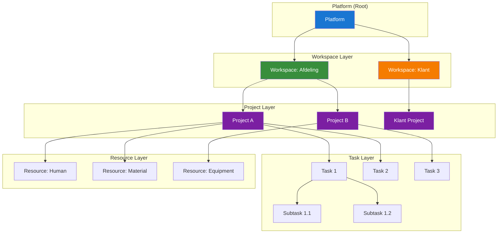
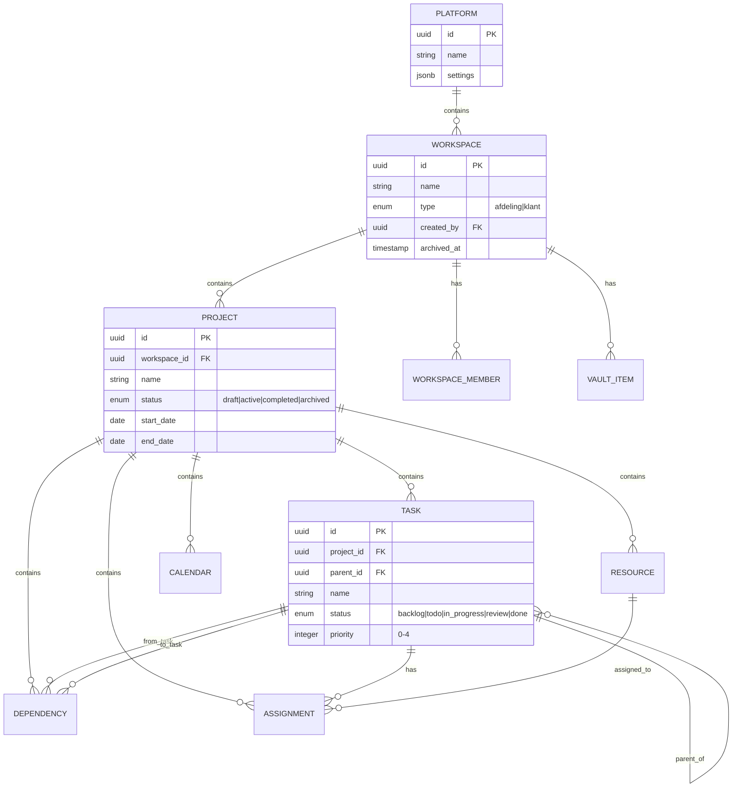
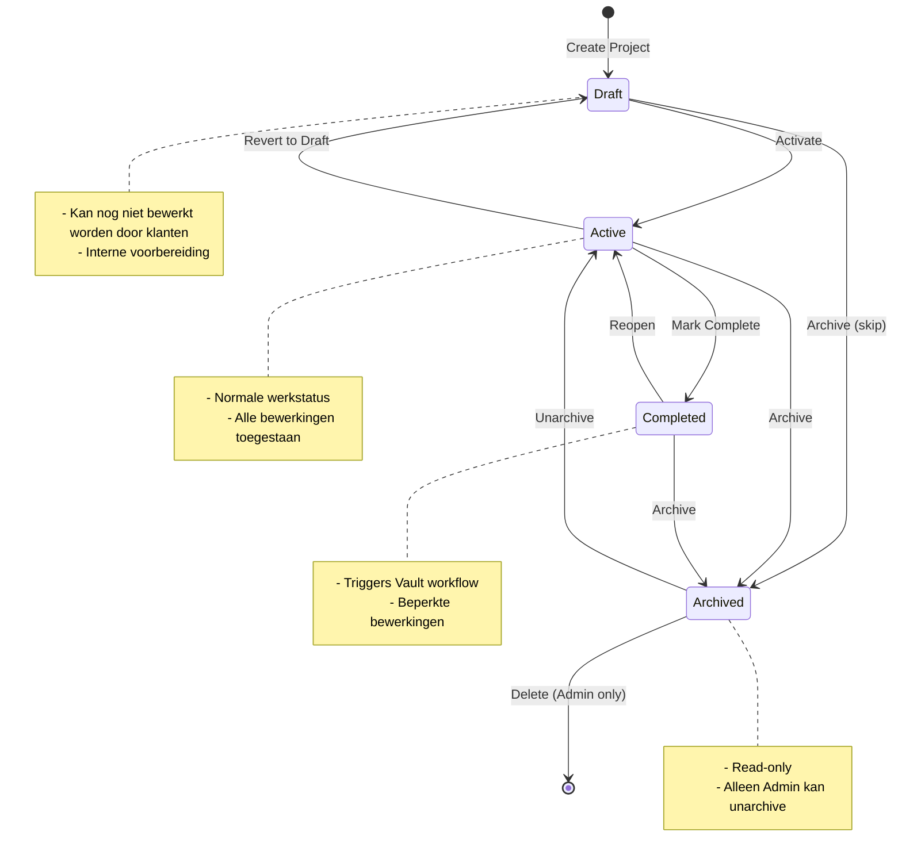
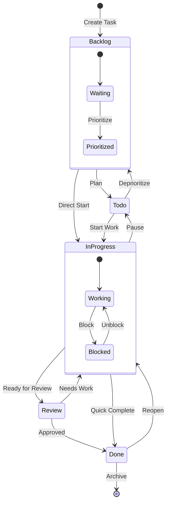
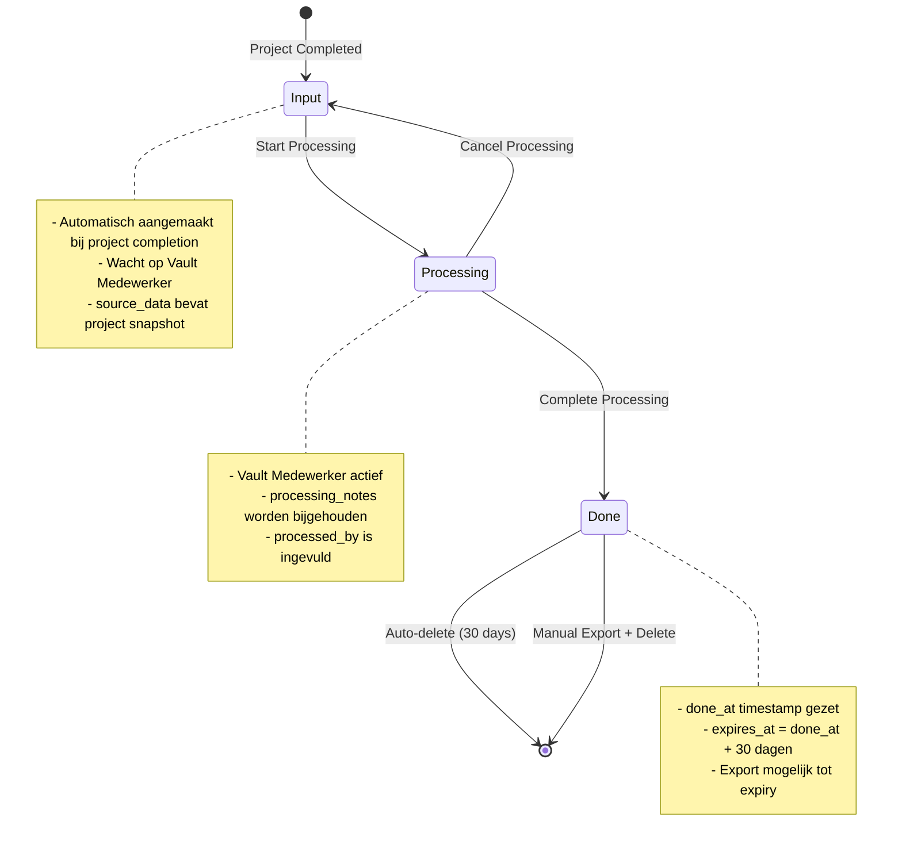
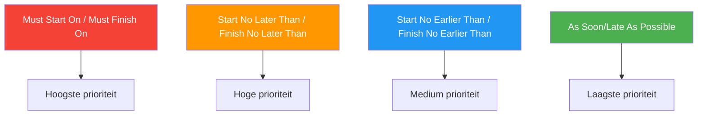
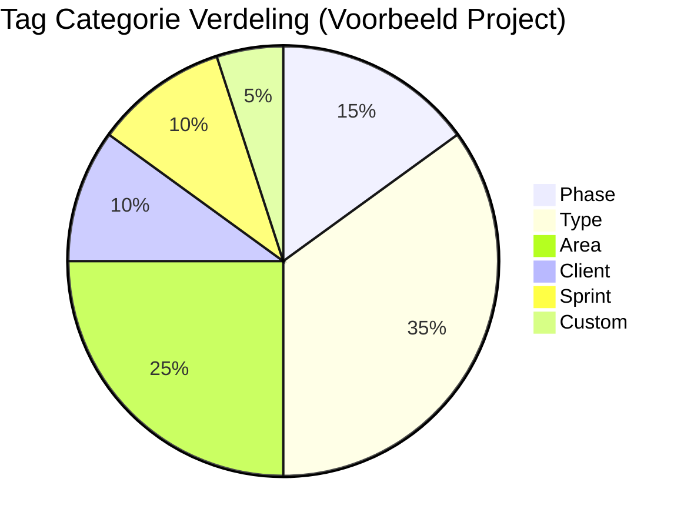

# TAXONOMY.md - Platform Classificaties & Hiërarchieën

> **Versie:** 1.0.0
> **Datum:** 2024-12-30
> **Deliverable:** P4
> **Status:** Compleet

---

## Inhoudsopgave

1. [Entity Hiërarchie](#1-entity-hiërarchie)
2. [Status Classificaties](#2-status-classificaties)
3. [Type Categorieën](#3-type-categorieën)
4. [Priority Levels](#4-priority-levels)
5. [Tag Systeem](#5-tag-systeem)

---

## 1. Entity Hiërarchie

### 1.1 Platform Structuur

Het Gantt Dashboard platform is opgebouwd uit een hiërarchische structuur van entities die data ownership en toegang bepalen.



### 1.2 Entity Definities

| Entity | Parent | Beschrijving | Scope |
|--------|--------|--------------|-------|
| **Platform** | - | Root entity, bevat alle workspaces | Globaal |
| **Workspace** | Platform | Container voor projecten en users | Afdeling/Klant |
| **Project** | Workspace | Planning container met taken en resources | Workspace |
| **Task** | Project/Task | Werkunit met duur, dates, assignments | Project |
| **Resource** | Project | Persoon, materiaal of equipment | Project |
| **Dependency** | Project | Relatie tussen twee taken | Project |
| **Assignment** | Project | Koppeling Task-Resource | Project |
| **Calendar** | Project | Werktijd definitie | Project |
| **Vault Item** | Workspace | Afgerond project in verwerking | Workspace |

### 1.3 Data Ownership & Cascade Relaties



### 1.4 Cascade Delete Regels

| Parent Entity | Child Entity | On Delete |
|---------------|--------------|-----------|
| Workspace | Project | CASCADE |
| Workspace | Workspace Member | CASCADE |
| Workspace | Vault Item | CASCADE |
| Project | Task | CASCADE |
| Project | Resource | CASCADE |
| Project | Dependency | CASCADE |
| Project | Assignment | CASCADE |
| Project | Calendar | CASCADE |
| Task | Child Tasks | CASCADE |
| Task | Dependencies (from/to) | CASCADE |
| Task | Assignments | CASCADE |
| Resource | Assignments | CASCADE |

### 1.5 Hiërarchie Navigatie

```
Platform
└── Workspace (Afdeling: "Operations")
    ├── Members
    │   ├── User A (Admin)
    │   ├── User B (Medewerker)
    │   └── User C (Vault Medewerker)
    ├── Projects
    │   ├── Project "Q1 Implementatie"
    │   │   ├── Tasks
    │   │   │   ├── Task "Fase 1: Planning"
    │   │   │   │   ├── Subtask "Requirements"
    │   │   │   │   └── Subtask "Design"
    │   │   │   └── Task "Fase 2: Uitvoering"
    │   │   ├── Resources
    │   │   │   ├── Resource "Jan" (Human)
    │   │   │   └── Resource "Laptop" (Equipment)
    │   │   ├── Dependencies
    │   │   ├── Assignments
    │   │   └── Calendars
    │   └── Project "Q2 Onderhoud"
    └── Vault Items
        ├── Vault Item "Afgerond Project X"
        └── Vault Item "Afgerond Project Y"
```

---

## 2. Status Classificaties

### 2.1 Project Status

Projecten doorlopen een lifecycle van concept tot archivering.

#### Status Definities

| Status | Code | Kleur | Beschrijving |
|--------|------|-------|--------------|
| **Draft** | `draft` | `#9E9E9E` (Grijs) | Project in voorbereiding, nog niet actief |
| **Active** | `active` | `#4CAF50` (Groen) | Project is actief en wordt bewerkt |
| **Completed** | `completed` | `#2196F3` (Blauw) | Project is afgerond, klaar voor Vault |
| **Archived** | `archived` | `#795548` (Bruin) | Project is gearchiveerd, read-only |

#### State Machine Diagram



#### Toegestane Transities

| Van | Naar | Wie | Trigger |
|-----|------|-----|---------|
| Draft | Active | Admin, Medewerker | Handmatig |
| Draft | Archived | Admin | Handmatig |
| Active | Completed | Admin, Medewerker | "Klaar" knop |
| Active | Draft | Admin | Handmatig |
| Active | Archived | Admin | Handmatig |
| Completed | Active | Admin | Reopen |
| Completed | Archived | Admin | Na Vault verwerking |
| Archived | Active | Admin | Unarchive |

---

### 2.2 Task Status (TaskBoard)

Taken op het TaskBoard volgen een Kanban workflow.

#### Status Definities

| Status | Code | Column | Kleur | WIP Limit |
|--------|------|--------|-------|-----------|
| **Backlog** | `backlog` | Backlog | `#9E9E9E` (Grijs) | - |
| **To Do** | `todo` | To Do | `#2196F3` (Blauw) | 10 |
| **In Progress** | `in_progress` | In Progress | `#FF9800` (Oranje) | 5 |
| **Review** | `review` | Review | `#9C27B0` (Paars) | 3 |
| **Done** | `done` | Done | `#4CAF50` (Groen) | - |

#### State Machine Diagram



#### Drag & Drop Regels

| Van | Naar | Toegestaan | Voorwaarde |
|-----|------|------------|------------|
| Backlog | To Do | Ja | - |
| Backlog | In Progress | Ja | - |
| To Do | In Progress | Ja | WIP check |
| To Do | Backlog | Ja | - |
| In Progress | Review | Ja | WIP check |
| In Progress | Done | Ja | - |
| Review | Done | Ja | - |
| Review | In Progress | Ja | WIP check |
| Done | In Progress | Ja | WIP check |
| Done | Backlog/To Do | Nee | - |

---

### 2.3 Vault Status

Vault items doorlopen een verwerkingsworkflow met automatische cleanup.

#### Status Definities

| Status | Code | Kleur | Beschrijving | Retention |
|--------|------|-------|--------------|-----------|
| **Input** | `input` | `#FF9800` (Oranje) | Nieuw item, wacht op verwerking | Onbeperkt |
| **Processing** | `processing` | `#2196F3` (Blauw) | Actief in verwerking | Onbeperkt |
| **Done** | `done` | `#4CAF50` (Groen) | Verwerkt, wacht op export/delete | 30 dagen |

#### State Machine Diagram



#### Retention Policy

| Status | Retention | Auto-action |
|--------|-----------|-------------|
| Input | Onbeperkt | Geen |
| Processing | Onbeperkt | Geen |
| Done | 30 dagen | Auto-delete na expires_at |

#### Vault Workflow Triggers

| Trigger | Actie | Resultaat |
|---------|-------|-----------|
| Project → Completed | Create Vault Item | Status: Input |
| Vault MW clicks "Start" | Update status | Status: Processing |
| Vault MW clicks "Complete" | Update status + timestamps | Status: Done |
| 30 dagen na done_at | Cron job | DELETE item |
| Export + Confirm | Manual delete | DELETE item |

---

## 3. Type Categorieën

### 3.1 Workspace Types

Workspaces zijn gecategoriseerd op basis van hun doel en toegangsmodel.

| Type | Code | Beschrijving | Toegestane Rollen | Vault Toegang |
|------|------|--------------|-------------------|---------------|
| **Afdeling** | `afdeling` | Interne business unit | Admin, Vault MW, Medewerker | Ja |
| **Klant** | `klant` | Externe klant workspace | Admin, Klant Editor, Klant Viewer | Nee |

#### Type Karakteristieken

```
┌─────────────────────────────────────────────────────────────────────────────┐
│                        WORKSPACE TYPE VERGELIJKING                          │
├─────────────────────────────────────────────────────────────────────────────┤
│                                                                              │
│  TYPE: AFDELING                      TYPE: KLANT                            │
│  ─────────────────                   ────────────                           │
│  ├── Interne gebruikers              ├── Externe gebruikers                 │
│  ├── Vault module zichtbaar          ├── Vault module verborgen             │
│  ├── Meerdere projecten              ├── Typisch 1 project                  │
│  ├── Volledige export opties         ├── Beperkte export opties             │
│  ├── Admin, Vault MW, Medewerker     ├── Admin, Klant Editor, Klant Viewer  │
│  └── ISO workflow support            └── Geen ISO workflow                  │
│                                                                              │
└─────────────────────────────────────────────────────────────────────────────┘
```

---

### 3.2 Resource Types

Resources worden gecategoriseerd op basis van hun aard.

| Type | Code | Icoon | Beschrijving | Cost Tracking |
|------|------|-------|--------------|---------------|
| **Human** | `human` | `👤` | Persoon/medewerker | Per uur |
| **Material** | `material` | `📦` | Materialen en supplies | Per eenheid |
| **Equipment** | `equipment` | `🔧` | Machines en apparatuur | Per uur/dag |

#### Resource Type Eigenschappen

| Eigenschap | Human | Material | Equipment |
|------------|-------|----------|-----------|
| Calendar support | Ja | Nee | Ja |
| Capacity tracking | Ja (FTE) | Ja (units) | Ja (availability) |
| Cost per hour | Ja | N.v.t. | Ja |
| Cost per unit | Nee | Ja | Nee |
| Vacation/leave | Ja | N.v.t. | N.v.t. |
| Maintenance | Nee | Nee | Ja |

---

### 3.3 Dependency Types

Dependencies definiëren de volgorde relatie tussen taken.

| Type | Code | Naam | Beschrijving | Bryntum |
|------|------|------|--------------|---------|
| **SS** | `0` | Start-to-Start | B start wanneer A start | `StartToStart` |
| **SF** | `1` | Start-to-Finish | B eindigt wanneer A start | `StartToEnd` |
| **FS** | `2` | Finish-to-Start | B start wanneer A eindigt | `EndToStart` |
| **FF** | `3` | Finish-to-Finish | B eindigt wanneer A eindigt | `EndToEnd` |

#### Dependency Visualisatie

```
SS (Start-to-Start) - Code: 0
┌──────────────┐
│    Task A    │────┐
└──────────────┘    │
                    ▼ (gelijktijdig starten)
┌──────────────┐
│    Task B    │
└──────────────┘

SF (Start-to-Finish) - Code: 1
┌──────────────┐
│    Task A    │────┐
└──────────────┘    │
                    ▼ (B eindigt als A start)
          ┌──────────────┐
          │    Task B    │
          └──────────────┘

FS (Finish-to-Start) - Code: 2 [MEEST GEBRUIKT]
┌──────────────┐
│    Task A    │────┐
└──────────────┘    │
                    ▼ (B start na A)
                    ┌──────────────┐
                    │    Task B    │
                    └──────────────┘

FF (Finish-to-Finish) - Code: 3
┌──────────────┐
│    Task A    │────┐
└──────────────┘    │
                    ▼ (gelijktijdig eindigen)
┌──────────────┐
│    Task B    │
└──────────────┘
```

#### Dependency met Lag

| Lag | Betekenis | Voorbeeld |
|-----|-----------|-----------|
| `0` | Geen vertraging | Direct na predecessor |
| `+2d` | 2 dagen wachten | Start 2 dagen na predecessor |
| `-1d` | 1 dag overlap | Start 1 dag voor predecessor eindigt |

---

### 3.4 Constraint Types

Constraints beperken wanneer een taak kan worden gepland.

| Type | Code | Beschrijving | Scheduling Effect |
|------|------|--------------|-------------------|
| **Start No Earlier Than** | `startnoearlierthan` | Niet eerder starten dan datum | Hard minimum start |
| **Start No Later Than** | `startnolaterthan` | Niet later starten dan datum | Hard maximum start |
| **Finish No Earlier Than** | `finishnoearlierthan` | Niet eerder eindigen dan datum | Hard minimum finish |
| **Finish No Later Than** | `finishnolaterthan` | Niet later eindigen dan datum | Hard maximum finish |
| **Must Start On** | `muststarton` | Moet precies op datum starten | Gefixeerde start |
| **Must Finish On** | `mustfinishon` | Moet precies op datum eindigen | Gefixeerde finish |
| **As Soon As Possible** | `assoonaspossible` | Zo vroeg mogelijk | Default, geen restrictie |
| **As Late As Possible** | `aslataspossible` | Zo laat mogelijk | Backward scheduling |

#### Constraint Prioriteit



---

## 4. Priority Levels

### 4.1 Priority Definities

Taken kunnen worden geprioriteerd op een schaal van 0-4.

| Level | Code | Naam | Kleur | Hex | Icoon |
|-------|------|------|-------|-----|-------|
| **0** | `0` | None | Grijs | `#9E9E9E` | - |
| **1** | `1` | Critical | Rood | `#F44336` | `🔴` |
| **2** | `2` | High | Oranje | `#FF9800` | `🟠` |
| **3** | `3` | Medium | Blauw | `#2196F3` | `🔵` |
| **4** | `4` | Low | Groen | `#4CAF50` | `🟢` |

### 4.2 SLA Responstijden

Gebaseerd op priority worden verwachte responstijden ingesteld.

| Priority | Initial Response | Resolution Target | Escalation After |
|----------|------------------|-------------------|------------------|
| **Critical** | 1 uur | 4 uur | 2 uur |
| **High** | 4 uur | 1 dag | 8 uur |
| **Medium** | 1 dag | 3 dagen | 2 dagen |
| **Low** | 2 dagen | 1 week | 5 dagen |
| **None** | - | - | - |

### 4.3 Priority Visualisatie in UI

```
┌─────────────────────────────────────────────────────────────────────────────┐
│                          PRIORITY INDICATOR DESIGN                          │
├─────────────────────────────────────────────────────────────────────────────┤
│                                                                              │
│  Gantt View (Left border)                                                   │
│  ┌────┬────────────────────────────────────────────────────────────────┐   │
│  │████│ Critical Task - immediate attention required                    │   │
│  └────┴────────────────────────────────────────────────────────────────┘   │
│  ┌────┬────────────────────────────────────────────────────────────────┐   │
│  │████│ High Priority Task                                              │   │
│  └────┴────────────────────────────────────────────────────────────────┘   │
│                                                                              │
│  TaskBoard (Card badge)                                                     │
│  ┌──────────────────────────────────────┐                                   │
│  │ [🔴] Task Name                       │                                   │
│  │      Due: Tomorrow                   │                                   │
│  │      Assignee: Jan                   │                                   │
│  └──────────────────────────────────────┘                                   │
│                                                                              │
│  Grid View (Priority column)                                                │
│  │ Name          │ Priority  │ Status      │                               │
│  │───────────────│───────────│─────────────│                               │
│  │ Task Alpha    │ 🔴 Critical│ In Progress │                               │
│  │ Task Beta     │ 🟠 High    │ To Do       │                               │
│  │ Task Gamma    │ 🔵 Medium  │ Done        │                               │
│                                                                              │
└─────────────────────────────────────────────────────────────────────────────┘
```

### 4.4 Priority Usage Guidelines

| Priority | Wanneer gebruiken | Voorbeelden |
|----------|-------------------|-------------|
| **Critical** | Blokkeert andere taken, deadline overschreden, klant-escalatie | Productie down, security issue |
| **High** | Belangrijke deadline komende dagen, klant wacht | Milestone volgende week, review blocking |
| **Medium** | Normale werkitems met duidelijke deadline | Standaard project taken |
| **Low** | Nice-to-have, geen urgentie | Documentatie updates, optimalisaties |
| **None** | Backlog items zonder urgentie | Ideeën, future enhancements |

---

## 5. Tag Systeem

### 5.1 Tag Structuur

Tags worden gebruikt voor filtering, grouping en categorisatie van taken.

#### Tag Definities

| Eigenschap | Waarde |
|------------|--------|
| Max per item | 5 tags |
| Scope | Workspace |
| Karakters | Alfanumeriek + hyphen |
| Case | Case-insensitive (opgeslagen als lowercase) |
| Max lengte | 30 karakters |

### 5.2 Standaard Tag Categorieën

| Categorie | Prefix | Kleur | Voorbeelden |
|-----------|--------|-------|-------------|
| **Phase** | `phase-` | `#9C27B0` (Paars) | `phase-discovery`, `phase-development`, `phase-testing` |
| **Type** | `type-` | `#2196F3` (Blauw) | `type-feature`, `type-bug`, `type-docs`, `type-tech-debt` |
| **Area** | `area-` | `#FF9800` (Oranje) | `area-frontend`, `area-backend`, `area-database`, `area-infra` |
| **Client** | `client-` | `#4CAF50` (Groen) | `client-acme`, `client-beta`, `client-internal` |
| **Sprint** | `sprint-` | `#00BCD4` (Cyan) | `sprint-1`, `sprint-2`, `sprint-backlog` |
| **Custom** | - | `#9E9E9E` (Grijs) | Vrije tags zonder prefix |

### 5.3 Tag Kleur Schema



### 5.4 Tag Regels

| Regel | Beschrijving | Enforcement |
|-------|--------------|-------------|
| **Max 5 tags** | Elk item mag maximaal 5 tags hebben | Hard limit in UI + API |
| **Workspace scope** | Tags zijn alleen zichtbaar binnen workspace | RLS policy |
| **Unique per item** | Dezelfde tag kan niet dubbel op item | Unique constraint |
| **Auto-create** | Nieuwe tags worden automatisch aangemaakt | On-the-fly creation |
| **Orphan cleanup** | Ongebruikte tags worden na 90 dagen verwijderd | Cron job |

### 5.5 Tag Filtering & Grouping

```
┌─────────────────────────────────────────────────────────────────────────────┐
│                              TAG FILTER UI                                   │
├─────────────────────────────────────────────────────────────────────────────┤
│                                                                              │
│  Filter by Tags:                                                            │
│  ┌─────────────────────────────────────────────────────────────────────┐   │
│  │ [phase-development] [type-feature] [area-frontend]  [+ Add tag]     │   │
│  └─────────────────────────────────────────────────────────────────────┘   │
│                                                                              │
│  Filter Mode: ( ) Match ANY  (•) Match ALL                                 │
│                                                                              │
│  Results: 12 tasks matching                                                 │
│                                                                              │
│  ┌──────────────────────────────────────────────────────────────────────┐  │
│  │ □ Task 1   [phase-development] [type-feature] [area-frontend]        │  │
│  │ □ Task 2   [phase-development] [type-feature] [area-frontend]        │  │
│  │ □ Task 3   [phase-development] [type-feature] [area-frontend] [+2]   │  │
│  └──────────────────────────────────────────────────────────────────────┘  │
│                                                                              │
└─────────────────────────────────────────────────────────────────────────────┘
```

### 5.6 Tag API Contract

```typescript
interface Tag {
    id: string;           // UUID
    workspace_id: string; // FK to workspace
    name: string;         // lowercase, max 30 chars
    color: string;        // Hex color code
    category?: string;    // Optional: phase, type, area, client, sprint
    usage_count: number;  // Number of items using this tag
    created_at: Date;
    last_used_at: Date;
}

interface TaskTag {
    task_id: string;      // FK to task
    tag_id: string;       // FK to tag
    added_at: Date;
    added_by: string;     // FK to user
}
```

---

## Appendix

### A. Status Color Palette

| Context | Status | Hex | RGB |
|---------|--------|-----|-----|
| Project | Draft | `#9E9E9E` | 158, 158, 158 |
| Project | Active | `#4CAF50` | 76, 175, 80 |
| Project | Completed | `#2196F3` | 33, 150, 243 |
| Project | Archived | `#795548` | 121, 85, 72 |
| Task | Backlog | `#9E9E9E` | 158, 158, 158 |
| Task | To Do | `#2196F3` | 33, 150, 243 |
| Task | In Progress | `#FF9800` | 255, 152, 0 |
| Task | Review | `#9C27B0` | 156, 39, 176 |
| Task | Done | `#4CAF50` | 76, 175, 80 |
| Vault | Input | `#FF9800` | 255, 152, 0 |
| Vault | Processing | `#2196F3` | 33, 150, 243 |
| Vault | Done | `#4CAF50` | 76, 175, 80 |
| Priority | Critical | `#F44336` | 244, 67, 54 |
| Priority | High | `#FF9800` | 255, 152, 0 |
| Priority | Medium | `#2196F3` | 33, 150, 243 |
| Priority | Low | `#4CAF50` | 76, 175, 80 |
| Priority | None | `#9E9E9E` | 158, 158, 158 |

### B. Gerelateerde Documenten

| Document | Relatie | Beschrijving |
|----------|---------|--------------|
| [GLOSSARY.md](./GLOSSARY.md) | Source | Terminologie definities |
| [ROLLEN.md](./ROLLEN.md) | Reference | Rol-gebaseerde toegang |
| [ARCHITECTURE.md](./ARCHITECTURE.md) | Reference | Data model details |
| [CONTRACTS.md](./CONTRACTS.md) | Implementation | TypeScript interfaces |

### C. Versie Historie

| Versie | Datum | Auteur | Wijzigingen |
|--------|-------|--------|-------------|
| 1.0.0 | 2024-12-30 | A10 | Initieel document |

---

*Document versie: 1.0.0*
*Laatst bijgewerkt: 30 December 2024*
*Entity types: 10 | Status types: 12 | Categories: 15+*
