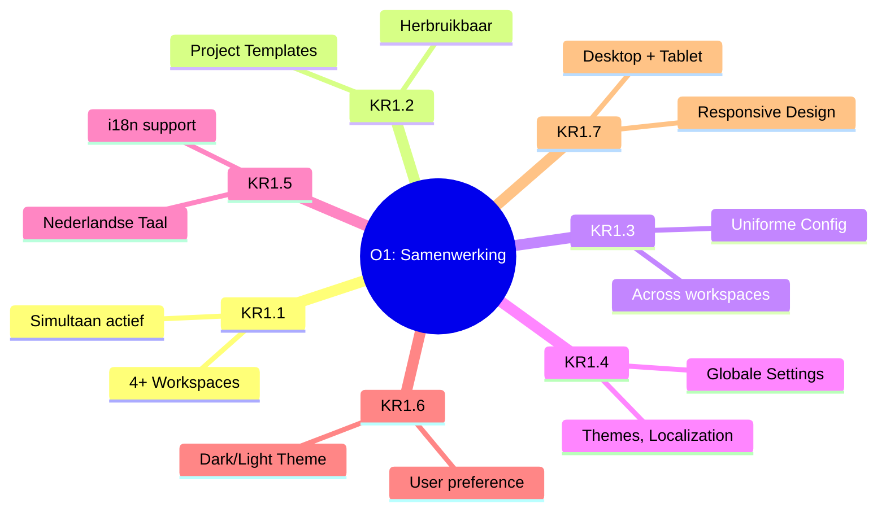
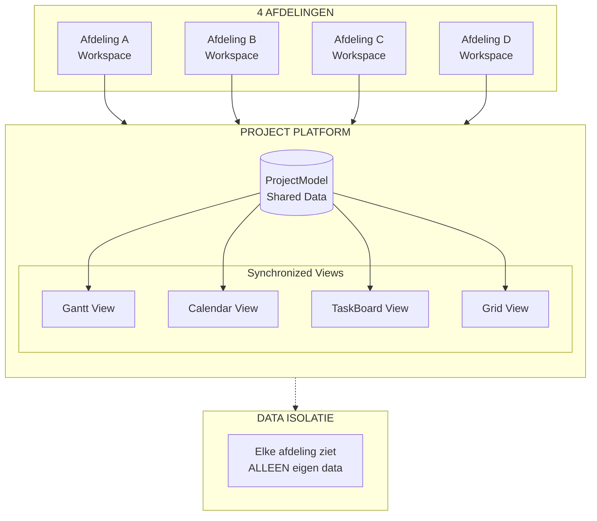
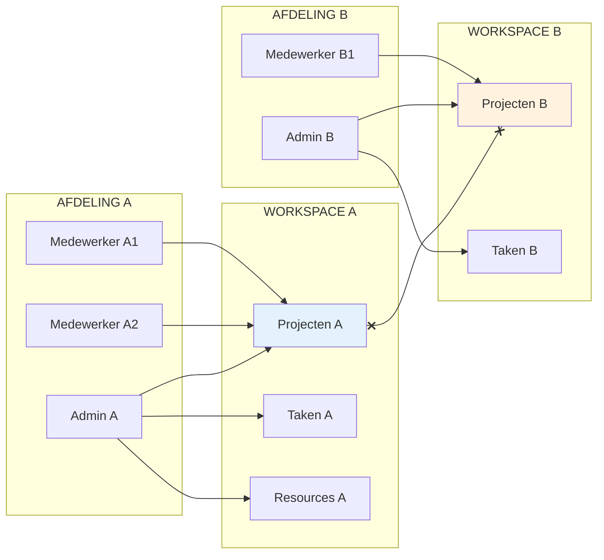
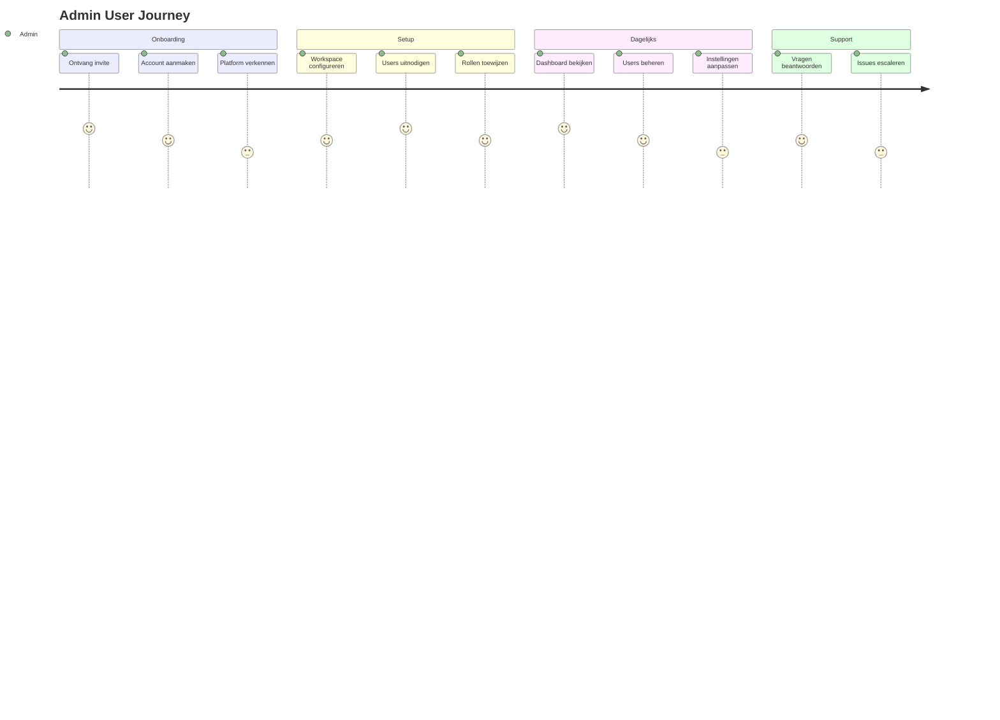
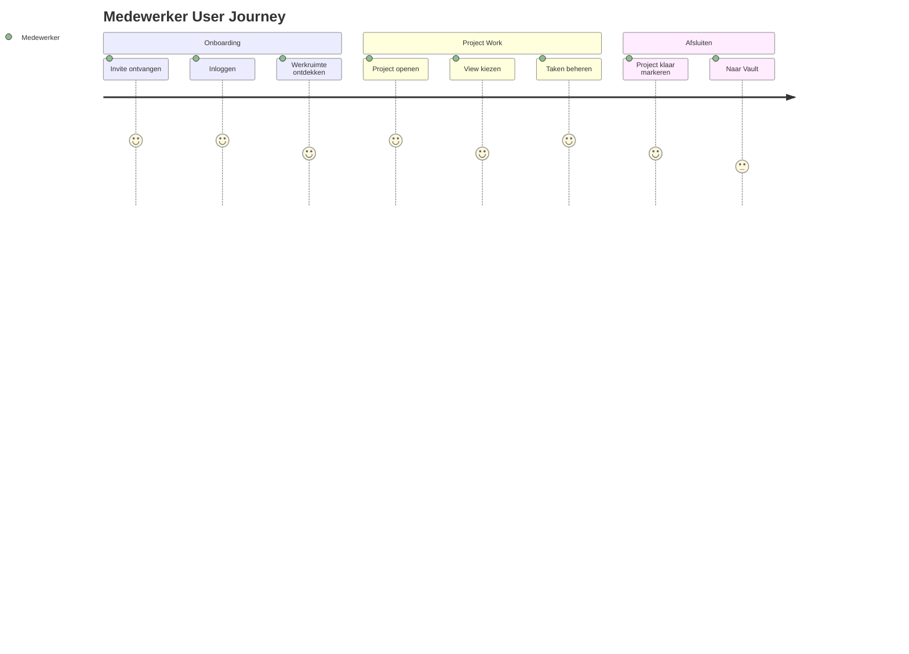
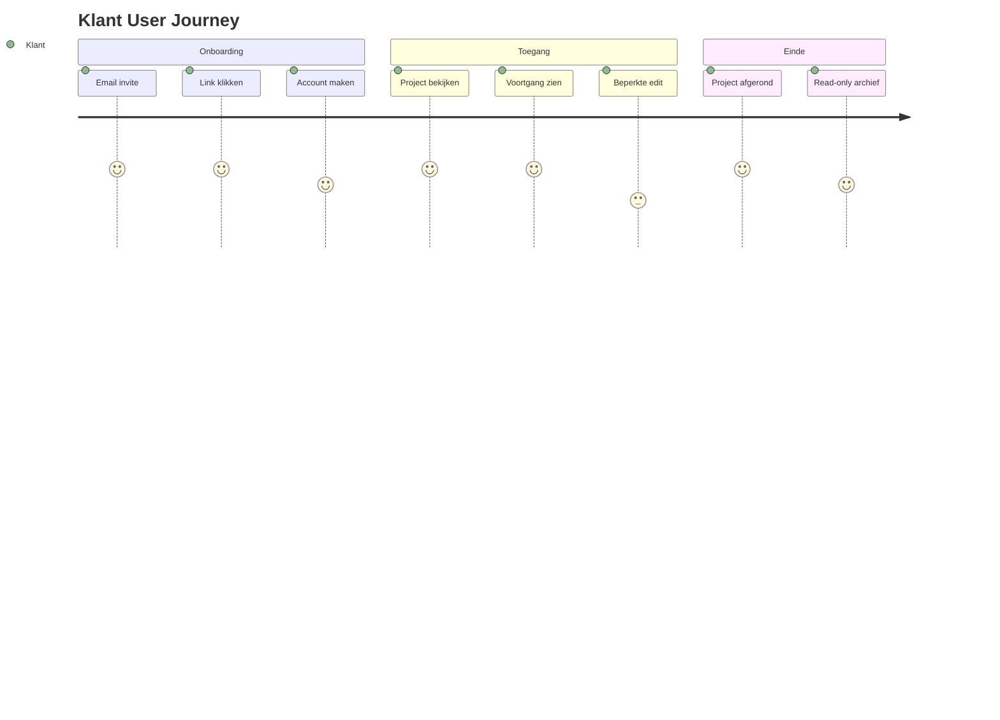
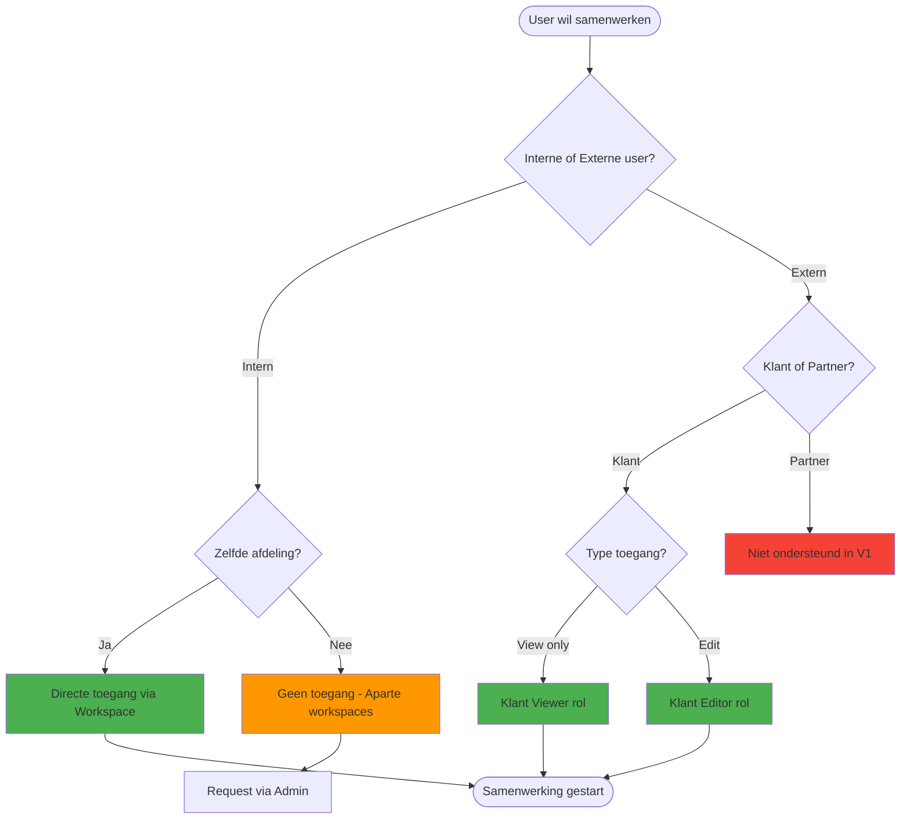

# M1: Samenwerking Board Specificatie

> **Outcome:** O1 - Gestandaardiseerde Samenwerking
> **Versie:** 1.0
> **Datum:** 2024-12-30
> **Status:** Specificatie voor Miro implementatie

---

## Board Overzicht

| Aspect | Waarde |
|--------|--------|
| **Board Naam** | O1: Gestandaardiseerde Samenwerking |
| **Doel** | Visualiseer hoe 4 afdelingen samenwerken via uniform platform |
| **Frames** | 8 |
| **Geschatte Breedte** | 8000px |
| **Geschatte Hoogte** | 6000px |

---

## Board Layout

```
+-----------------------------------------------------------------------------------+
|                                                                                   |
|  [F1: Header & KPI's]                                                            |
|                                                                                   |
+-----------------------------------------------------------------------------------+
|                           |                           |                           |
|  [F2: KPI Metrics]        |  [F3: Platform Overview]  |  [F4: User Flows]        |
|                           |                           |                           |
+-----------------------------------------------------------------------------------+
|                           |                                                       |
|  [F5: User Journey Maps]  |  [F6: Platform Wireframes]                           |
|                           |                                                       |
+-----------------------------------------------------------------------------------+
|                           |                                                       |
|  [F7: Decision Trees]     |  [F8: Footer & Links]                                |
|                           |                                                       |
+-----------------------------------------------------------------------------------+
```

---

## Frame 1: Header & KPI Overview

**Positie:** 0, 0 | **Grootte:** 8000 x 800px

### Content

```
+-----------------------------------------------------------------------------------+
|                                                                                   |
|    O1: GESTANDAARDISEERDE SAMENWERKING                                           |
|    ================================================================              |
|                                                                                   |
|    "Alle afdelingen werken volgens dezelfde ISO-conforme werkwijze               |
|     in een gedeeld platform"                                                      |
|                                                                                   |
|    +------------+  +------------+  +------------+  +------------+                |
|    | Afdelingen |  | Werkwijze  |  | Max Users  |  | Gebruik    |                |
|    |     4      |  |   Uniform  |  |     5      |  | 40 uur/wk  |                |
|    +------------+  +------------+  +------------+  +------------+                |
|                                                                                   |
|    [Legenda]  [Versie: 1.0]  [Laatst bijgewerkt: 2024-12-30]                    |
|                                                                                   |
+-----------------------------------------------------------------------------------+
```

### Elementen

| Element | Type | Kleur | Beschrijving |
|---------|------|-------|--------------|
| Titel | Text | #1A1A1A | H1, 48px, Bold |
| Subtitel | Text | #666666 | 24px, Italic |
| KPI Cards | Rectangle | #FFFFFF | 150x100px, shadow |
| KPI Values | Text | #2196F3 | 36px, Bold |
| Legenda | Sticky | #FFEB3B | Uitleg symbolen |

---

## Frame 2: KPI Metrics Visualisatie

**Positie:** 0, 900 | **Grootte:** 2600 x 1800px

### Mermaid Diagram: O1 Key Results



### KPI Dashboard Layout

```
+------------------------------------------------------------------+
|  KEY RESULTS O1: GESTANDAARDISEERDE SAMENWERKING                 |
+------------------------------------------------------------------+
|                                                                   |
|  +------------------+  +------------------+  +------------------+ |
|  | KR1.1            |  | KR1.2            |  | KR1.3            | |
|  | 4+ Workspaces    |  | Template System  |  | Uniform Config   | |
|  |                  |  |                  |  |                  | |
|  | [====----] 40%   |  | [====----] 40%   |  | [====----] 40%   | |
|  | Target: 4        |  | Target: Done     |  | Target: Done     | |
|  +------------------+  +------------------+  +------------------+ |
|                                                                   |
|  +------------------+  +------------------+  +------------------+ |
|  | KR1.4            |  | KR1.5            |  | KR1.6            | |
|  | Global Settings  |  | Dutch i18n       |  | Theme Toggle     | |
|  |                  |  |                  |  |                  | |
|  | [====----] 40%   |  | [====----] 40%   |  | [====----] 40%   | |
|  | Target: Done     |  | Target: 100%     |  | Target: Done     | |
|  +------------------+  +------------------+  +------------------+ |
|                                                                   |
|  +------------------+                                             |
|  | KR1.7            |                                             |
|  | Responsive       |      TOTAAL O1: 7 Key Results              |
|  |                  |      Progress: 0/7 (0%)                     |
|  | [====----] 40%   |                                             |
|  | Target: Done     |                                             |
|  +------------------+                                             |
|                                                                   |
+------------------------------------------------------------------+
```

### Elementen

| Element | Type | Grootte | Kleur |
|---------|------|---------|-------|
| Frame Title | Text | 32px | #1A1A1A |
| KR Cards | Rectangle | 200x150px | #FFFFFF |
| Progress Bar | Shape | 180x20px | #4CAF50 |
| Status Label | Text | 14px | #666666 |

---

## Frame 3: Platform Overview

**Positie:** 2700, 900 | **Grootte:** 2600 x 1800px

### Mermaid Diagram: Afdeling Samenwerking



### ASCII Layout voor Miro

```
+------------------------------------------------------------------+
|  PLATFORM OVERVIEW                                                |
+------------------------------------------------------------------+
|                                                                   |
|                    +---------------------------+                  |
|                    |    PROJECT PLATFORM       |                  |
|                    |                           |                  |
|                    |   +-------------------+   |                  |
|                    |   |   ProjectModel    |   |                  |
|                    |   |   (Shared Data)   |   |                  |
|                    |   +--------+----------+   |                  |
|                    |            |              |                  |
|                    |    +---+---+---+---+      |                  |
|                    |    |   |   |   |   |      |                  |
|                    |    v   v   v   v   v      |                  |
|                    | +---+ +---+ +---+ +---+   |                  |
|                    | |Gnt| |Cal| |Brd| |Grd|   |                  |
|                    | +---+ +---+ +---+ +---+   |                  |
|                    +---------------------------+                  |
|                               ^                                   |
|        +----------+-----------+-----------+----------+            |
|        |          |           |           |          |            |
|   +--------+ +--------+ +--------+ +--------+                     |
|   | Afd A  | | Afd B  | | Afd C  | | Afd D  |                     |
|   +--------+ +--------+ +--------+ +--------+                     |
|                                                                   |
|   [!] DATA ISOLATIE: Workspace-based, RLS enforced               |
|                                                                   |
+------------------------------------------------------------------+
```

---

## Frame 4: User Flows per Afdeling

**Positie:** 5400, 900 | **Grootte:** 2600 x 1800px

### Mermaid Diagram: Afdeling Workflow



### User Flow Matrix

```
+------------------------------------------------------------------+
|  USER FLOWS PER AFDELING                                         |
+------------------------------------------------------------------+
|                                                                   |
|  AFDELING A                    AFDELING B                        |
|  +-----------------------+     +-----------------------+          |
|  |                       |     |                       |          |
|  |  Admin A              |     |  Admin B              |          |
|  |    |                  |     |    |                  |          |
|  |    v                  |     |    v                  |          |
|  |  [Workspace Setup]    |     |  [Workspace Setup]    |          |
|  |    |                  |     |    |                  |          |
|  |    v                  |     |    v                  |          |
|  |  [Invite Users]       |     |  [Invite Users]       |          |
|  |    |                  |     |    |                  |          |
|  |    v                  |     |    v                  |          |
|  |  Medewerker A1, A2    |     |  Medewerker B1        |          |
|  |    |                  |     |    |                  |          |
|  |    v                  |     |    v                  |          |
|  |  [Project Work]       |     |  [Project Work]       |          |
|  |                       |     |                       |          |
|  +-----------------------+     +-----------------------+          |
|                                                                   |
|              GEEN CROSS-WORKSPACE ACCESS                         |
|              Data A onzichtbaar voor B                           |
|                                                                   |
+------------------------------------------------------------------+
```

---

## Frame 5: User Journey Maps

**Positie:** 0, 2800 | **Grootte:** 4000 x 2000px

### Journey Map: Admin



### Journey Map: Medewerker



### Journey Map: Klant



### ASCII Layout voor Miro

```
+------------------------------------------------------------------+
|  USER JOURNEY MAPS                                               |
+------------------------------------------------------------------+
|                                                                   |
|  ADMIN JOURNEY                                                    |
|  +-----------+-----------+-----------+-----------+-----------+   |
|  | Onboarding| Setup     | Dagelijks | Support   | Beheer    |   |
|  +-----------+-----------+-----------+-----------+-----------+   |
|  | Invite    | Config WS | Dashboard | Q&A       | Users     |   |
|  | Account   | Invite    | Beheer    | Escalatie | Settings  |   |
|  | Verken    | Rollen    | Settings  |           |           |   |
|  +-----------+-----------+-----------+-----------+-----------+   |
|  Emotie: [Neutral] -> [Positive] -> [Confident] -> [Expert]      |
|                                                                   |
+------------------------------------------------------------------+
|                                                                   |
|  MEDEWERKER JOURNEY                                              |
|  +-----------+-----------+-----------+-----------+-----------+   |
|  | Onboarding| Project   | Views     | Taken     | Afsluiten |   |
|  +-----------+-----------+-----------+-----------+-----------+   |
|  | Invite    | Openen    | Kiezen    | CRUD      | Klaar     |   |
|  | Login     | Selecteer | Gantt/Cal | Drag/Drop | Vault     |   |
|  | Ontdek    |           | Board/Grid|           |           |   |
|  +-----------+-----------+-----------+-----------+-----------+   |
|  Emotie: [Curious] -> [Engaged] -> [Productive] -> [Satisfied]   |
|                                                                   |
+------------------------------------------------------------------+
|                                                                   |
|  KLANT JOURNEY (Beperkt)                                         |
|  +-----------+-----------+-----------+-----------+               |
|  | Onboarding| Toegang   | View      | Einde     |               |
|  +-----------+-----------+-----------+-----------+               |
|  | Email     | Project   | Progress  | Archief   |               |
|  | Link      | Bekijken  | Feedback  | Read-only |               |
|  | Account   |           | (Editor)  |           |               |
|  +-----------+-----------+-----------+-----------+               |
|  Emotie: [Hopeful] -> [Informed] -> [Satisfied]                  |
|                                                                   |
+------------------------------------------------------------------+
```

---

## Frame 6: Platform Wireframes

**Positie:** 4100, 2800 | **Grootte:** 3900 x 2000px

### Wireframe: Platform Shell

```
+------------------------------------------------------------------+
|  PLATFORM SHELL WIREFRAME                                        |
+------------------------------------------------------------------+
|                                                                   |
|  +--------------------------------------------------------------+|
|  |  [Logo]  [Search____________]  [Notifications] [User Menu]   ||
|  +--------------------------------------------------------------+|
|  |         |                                                     ||
|  | SIDEBAR |  HEADER                                            ||
|  |         |  +------------------------------------------------+||
|  | [Home]  |  | Workspace: Afdeling A  |  [Settings] [Help]    |||
|  |         |  +------------------------------------------------+||
|  | [Gantt] |                                                     ||
|  |         |  MAIN CONTENT AREA                                 ||
|  | [Cal]   |  +------------------------------------------------+||
|  |         |  |                                                 |||
|  | [Board] |  |           [Active View Component]               |||
|  |         |  |                                                 |||
|  | [Grid]  |  |           Gantt / Calendar / Board / Grid       |||
|  |         |  |                                                 |||
|  | ------  |  |                                                 |||
|  |         |  |                                                 |||
|  | [Vault] |  +------------------------------------------------+||
|  |         |                                                     ||
|  | [Admin] |  FOOTER                                            ||
|  |         |  +------------------------------------------------+||
|  +--------------------------------------------------------------+|
|                                                                   |
+------------------------------------------------------------------+
```

### Wireframe: Navigation Component

```
+------------------------------------------------------------------+
|  NAVIGATION WIREFRAME                                            |
+------------------------------------------------------------------+
|                                                                   |
|  TOP BAR (Fixed)                                                 |
|  +--------------------------------------------------------------+|
|  | [=] | [VEHA] | [Search...         ] | [Bell] [?] [Avatar v] ||
|  +--------------------------------------------------------------+|
|                                                                   |
|  SIDEBAR (Collapsible)                                           |
|  +------------+                                                   |
|  | WORKSPACE  |                                                   |
|  | [v] Afd A  |  <-- Workspace Switcher                         |
|  +------------+                                                   |
|  |            |                                                   |
|  | NAVIGATION |                                                   |
|  | [*] Home   |                                                   |
|  | [ ] Gantt  |                                                   |
|  | [ ] Cal    |                                                   |
|  | [ ] Board  |                                                   |
|  | [ ] Grid   |                                                   |
|  |            |                                                   |
|  | ---------- |                                                   |
|  |            |                                                   |
|  | ADMIN      |  <-- Only visible for Admin role                |
|  | [ ] Vault  |                                                   |
|  | [ ] Users  |                                                   |
|  | [ ] Config |                                                   |
|  |            |                                                   |
|  +------------+                                                   |
|                                                                   |
+------------------------------------------------------------------+
```

### Wireframe: Workspace Switcher

```
+------------------------------------------------------------------+
|  WORKSPACE SWITCHER WIREFRAME                                    |
+------------------------------------------------------------------+
|                                                                   |
|  +--------------------+                                          |
|  | WORKSPACES         |                                          |
|  +--------------------+                                          |
|  |                    |                                          |
|  | [*] Afdeling A     |  <-- Current (highlighted)              |
|  |     5 projecten    |                                          |
|  |                    |                                          |
|  | [ ] Afdeling B     |                                          |
|  |     3 projecten    |                                          |
|  |                    |                                          |
|  | [ ] Afdeling C     |                                          |
|  |     7 projecten    |                                          |
|  |                    |                                          |
|  | [ ] Klant X        |  <-- Klant workspace (different style)  |
|  |     1 project      |                                          |
|  |                    |                                          |
|  +--------------------+                                          |
|  | [+ Nieuwe WS]      |  <-- Admin only                         |
|  +--------------------+                                          |
|                                                                   |
+------------------------------------------------------------------+
```

---

## Frame 7: Decision Trees

**Positie:** 0, 4900 | **Grootte:** 4000 x 1200px

### Mermaid Diagram: Samenwerking Decision Tree



### ASCII Layout

```
+------------------------------------------------------------------+
|  SAMENWERKING DECISION TREE                                      |
+------------------------------------------------------------------+
|                                                                   |
|                    [User wil samenwerken]                        |
|                            |                                      |
|                            v                                      |
|                  [Intern of Extern?]                             |
|                    /           \                                  |
|                   /             \                                 |
|             INTERN             EXTERN                            |
|                |                   |                              |
|                v                   v                              |
|      [Zelfde afdeling?]    [Klant of Partner?]                   |
|          /     \              /        \                          |
|         /       \            /          \                         |
|       JA        NEE      KLANT       PARTNER                     |
|        |         |          |            |                        |
|        v         v          v            v                        |
|   [Direct    [Geen      [Type       [Niet in                     |
|    toegang]  toegang]   toegang?]    V1]                         |
|                            |                                      |
|                     /           \                                 |
|                    /             \                                |
|              VIEW ONLY        EDIT                               |
|                  |              |                                 |
|                  v              v                                 |
|            [Klant         [Klant                                 |
|             Viewer]        Editor]                               |
|                                                                   |
|  LEGENDA:                                                        |
|  [Groen] = Toegang verleend                                      |
|  [Oranje] = Via Admin aanvragen                                  |
|  [Rood] = Niet mogelijk                                          |
|                                                                   |
+------------------------------------------------------------------+
```

---

## Frame 8: Footer & Links

**Positie:** 4100, 4900 | **Grootte:** 3900 x 1200px

### Content

```
+------------------------------------------------------------------+
|  GERELATEERDE DOCUMENTEN & LINKS                                 |
+------------------------------------------------------------------+
|                                                                   |
|  MIRO BOARDS                                                     |
|  +------------+  +------------+  +------------+  +------------+  |
|  | M2         |  | M3         |  | M4         |  | M7         |  |
|  | Unified    |  | Toegang    |  | Security   |  | Rollen     |  |
|  | View       |  | Board      |  | Board      |  | Board      |  |
|  | [Link ->]  |  | [Link ->]  |  | [Link ->]  |  | [Link ->]  |  |
|  +------------+  +------------+  +------------+  +------------+  |
|                                                                   |
|  PROJECT DOCS                                                    |
|  +----------------------+  +----------------------+              |
|  | OUTCOMES.md          |  | DELIVERABLES.md      |              |
|  | O1 Key Results       |  | D1, D6 Deliverables  |              |
|  +----------------------+  +----------------------+              |
|                                                                   |
|  VERSIE HISTORIE                                                 |
|  +----------------------------------------------------------+   |
|  | Versie | Datum      | Auteur | Wijzigingen               |   |
|  +--------+------------+--------+---------------------------+   |
|  | 1.0    | 2024-12-30 | A9     | Initiele specificatie     |   |
|  +----------------------------------------------------------+   |
|                                                                   |
+------------------------------------------------------------------+
```

---

## Kleuren & Stijl Specificatie

### Kleurenpalet

| Naam | Hex | Gebruik |
|------|-----|---------|
| Primary Blue | #2196F3 | Headers, accenten |
| Success Green | #4CAF50 | Positieve acties, check |
| Warning Orange | #FF9800 | Aandacht items |
| Error Red | #F44336 | Blockers, risico's |
| Background | #FAFAFA | Frame achtergrond |
| Card White | #FFFFFF | Content cards |
| Text Primary | #1A1A1A | Headers |
| Text Secondary | #666666 | Body text |
| Border | #E0E0E0 | Card borders |

### Sticky Note Kleuren

| Kleur | Hex | Gebruik |
|-------|-----|---------|
| Geel | #FFEB3B | Notities, ideeeen |
| Blauw | #BBDEFB | Requirements |
| Groen | #C8E6C9 | Beslissingen |
| Rood | #FFCDD2 | Risico's |
| Paars | #E1BEE7 | Vragen |

### Typography

| Element | Font | Size | Weight |
|---------|------|------|--------|
| H1 Title | Inter | 48px | Bold |
| H2 Frame Title | Inter | 32px | SemiBold |
| H3 Section | Inter | 24px | Medium |
| Body | Inter | 16px | Regular |
| Label | Inter | 14px | Regular |
| Caption | Inter | 12px | Light |

---

## Implementation Checklist

### Pre-flight

- [ ] Miro board aangemaakt met correcte naam
- [ ] Board sharing ingesteld (team access)
- [ ] Template elementen voorbereid

### Frames

- [ ] F1: Header & KPI Overview
- [ ] F2: KPI Metrics Visualisatie
- [ ] F3: Platform Overview
- [ ] F4: User Flows per Afdeling
- [ ] F5: User Journey Maps
- [ ] F6: Platform Wireframes
- [ ] F7: Decision Trees
- [ ] F8: Footer & Links

### Post-flight

- [ ] Alle frames gelinkt
- [ ] Navigatie toegevoegd
- [ ] Stakeholder review scheduled
- [ ] Export naar PDF

---

## Referenties

| Document | Locatie | Relatie |
|----------|---------|---------|
| OUTCOMES.md | `/OUTCOMES.md` | O1 Key Results bron |
| DELIVERABLES-MIRO.md | `/DELIVERABLES-MIRO.md` | M1 specificatie |
| D1 Foundation | `/docs/deliverables/D1.md` | Platform basis |
| D6 Dashboard | `/docs/deliverables/D6.md` | Dashboard module |

---

*Specificatie versie: 1.0*
*Gemaakt door: Agent A9 (Visual Designer)*
*Datum: 2024-12-30*
