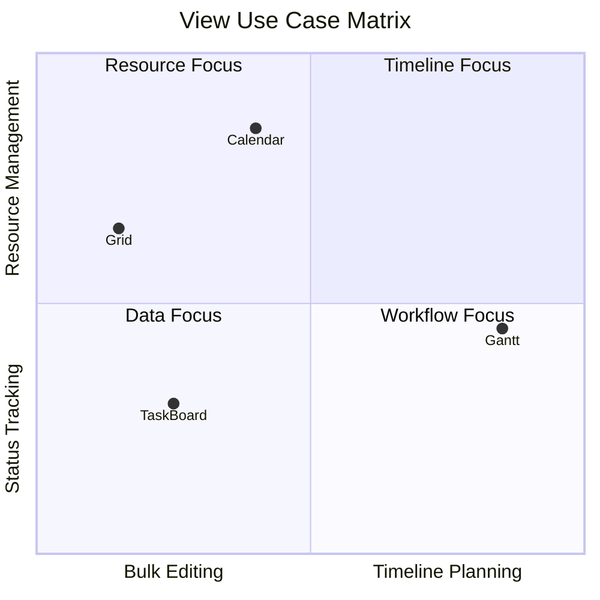
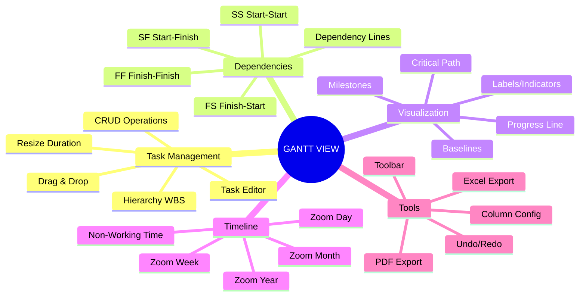
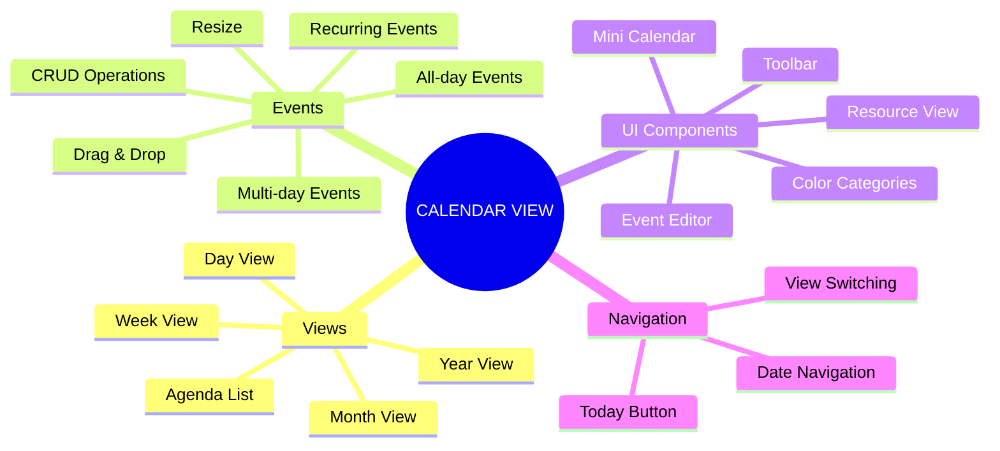
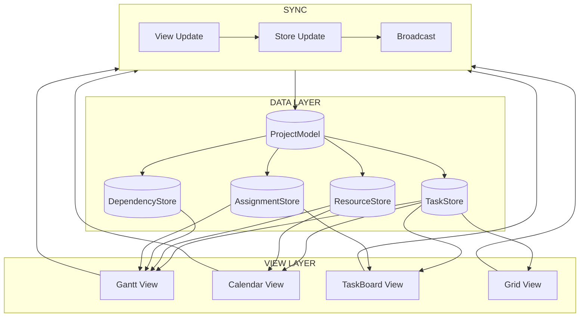
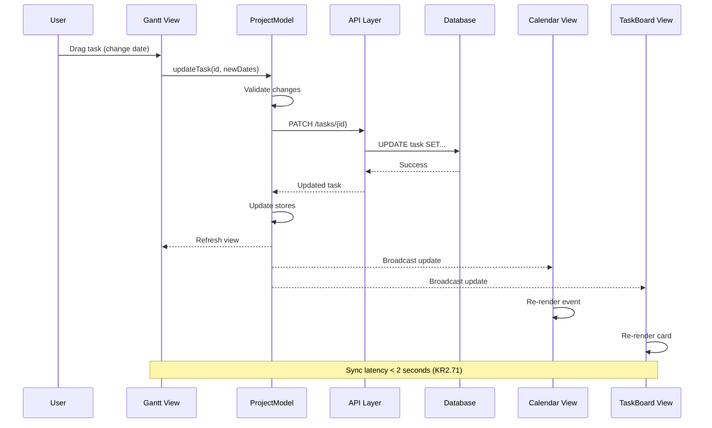

# M2: Unified View Board Specificatie

> **Outcome:** O2 - Unified Project View
> **Versie:** 1.0
> **Datum:** 2024-12-30
> **Status:** Specificatie voor Miro implementatie

---

## Board Overzicht

| Aspect | Waarde |
|--------|--------|
| **Board Naam** | O2: Unified Project View |
| **Doel** | Visualiseer 4 views (Gantt, Calendar, TaskBoard, Grid) en hun synchronisatie |
| **Frames** | 12 |
| **Key Results** | 74 |
| **Geschatte Breedte** | 12000px |
| **Geschatte Hoogte** | 8000px |

---

## Board Layout

```
+-------------------------------------------------------------------------------------------+
|                                                                                           |
|  [F1: Header & View Overview]                                                            |
|                                                                                           |
+-------------------------------------------------------------------------------------------+
|                                       |                                                   |
|  [F2: Gantt View Wireframes]          |  [F3: Gantt Features & Toolbar]                  |
|                                       |                                                   |
+---------------------------------------+---------------------------------------------------+
|                                       |                                                   |
|  [F4: Calendar View Wireframes]       |  [F5: Calendar Features & Modes]                 |
|                                       |                                                   |
+---------------------------------------+---------------------------------------------------+
|                                       |                                                   |
|  [F6: TaskBoard View Wireframes]      |  [F7: TaskBoard Features & Cards]                |
|                                       |                                                   |
+---------------------------------------+---------------------------------------------------+
|                                       |                                                   |
|  [F8: Grid View Wireframes]           |  [F9: Grid Features & Editing]                   |
|                                       |                                                   |
+-------------------------------------------------------------------------------------------+
|                                       |                                                   |
|  [F10: Data Flow Diagrams]            |  [F11: Sync Architecture]                        |
|                                       |                                                   |
+-------------------------------------------------------------------------------------------+
|                                                                                           |
|  [F12: Footer & Links]                                                                   |
|                                                                                           |
+-------------------------------------------------------------------------------------------+
```

---

## Frame 1: Header & View Overview

**Positie:** 0, 0 | **Grootte:** 12000 x 1000px

### Content

```
+-------------------------------------------------------------------------------------------+
|                                                                                           |
|    O2: UNIFIED PROJECT VIEW                                                              |
|    ====================================================================                  |
|                                                                                           |
|    "Projectinformatie beschikbaar in meerdere gesynchroniseerde views"                   |
|                                                                                           |
|    +---------------+    +---------------+    +---------------+    +---------------+      |
|    |    GANTT      |    |   CALENDAR    |    |   TASKBOARD   |    |     GRID      |      |
|    |               |    |               |    |               |    |               |      |
|    |  Timeline &   |    |  Scheduling   |    |   Workflow    |    |  Bulk Edit    |      |
|    |  Dependencies |    |  & Events     |    |   & Status    |    |  & Analysis   |      |
|    |               |    |               |    |               |    |               |      |
|    |  24 Features  |    |  19 Features  |    |  14 Features  |    |  12 Features  |      |
|    +---------------+    +---------------+    +---------------+    +---------------+      |
|                                                                                           |
|                         +---------------------------------------+                        |
|                         |          SHARED ProjectModel          |                        |
|                         |    Tasks | Resources | Dependencies   |                        |
|                         +---------------------------------------+                        |
|                                                                                           |
|    74 Key Results | Sync < 2 sec | Dashboard Integration                                |
|                                                                                           |
+-------------------------------------------------------------------------------------------+
```

### View Comparison Matrix



---

## Frame 2: Gantt View Wireframes

**Positie:** 0, 1100 | **Grootte:** 6000 x 2200px

### Wireframe: Gantt Toolbar

```
+-------------------------------------------------------------------------------------------+
|  GANTT TOOLBAR WIREFRAME                                                                 |
+-------------------------------------------------------------------------------------------+
|                                                                                           |
|  +-------------------------------------------------------------------------------------+ |
|  | [<] [Today] [>] | [Day] [Week] [Month] [Quarter] [Year] | [+Zoom] [-Zoom] [Fit]   | |
|  +-------------------------------------------------------------------------------------+ |
|  | [+ Add Task] [Import] [Export v] | [Undo] [Redo] | [Filter v] [Group v] [Settings] | |
|  +-------------------------------------------------------------------------------------+ |
|                                                                                           |
|  TOOLBAR SECTIONS:                                                                       |
|  +------------+  +------------+  +------------+  +------------+  +------------+          |
|  | Navigation |  | Zoom Level |  | Actions    |  | History    |  | View       |          |
|  | <Today>    |  | Day-Year   |  | Add/Import |  | Undo/Redo  |  | Filter     |          |
|  +------------+  +------------+  +------------+  +------------+  +------------+          |
|                                                                                           |
+-------------------------------------------------------------------------------------------+
```

### Wireframe: Gantt Columns (Left Panel)

```
+-------------------------------------------------------------------------------------------+
|  GANTT COLUMNS WIREFRAME                                                                 |
+-------------------------------------------------------------------------------------------+
|                                                                                           |
|  +-------------------------------------------------------------------+                   |
|  | [Drag] | WBS  | Task Name          | Start    | End      | %   |Progress            | |
|  +--------+------+--------------------+----------+----------+-----+--------------------+ |
|  | :::    | 1    | Project Alpha      | 01-01-25 | 31-03-25 | 45% | ████████░░░░░░░░  | |
|  | :::    | 1.1  |   Design Phase     | 01-01-25 | 31-01-25 | 80% | ████████████████  | |
|  | :::    | 1.1.1|     Wireframes     | 01-01-25 | 15-01-25 |100% | ████████████████  | |
|  | :::    | 1.1.2|     Mockups        | 16-01-25 | 31-01-25 | 60% | ████████████░░░░  | |
|  | :::    | 1.2  |   Development      | 01-02-25 | 28-02-25 | 20% | ████░░░░░░░░░░░░  | |
|  | :::    | 1.3  |   Testing          | 01-03-25 | 31-03-25 | 0%  | ░░░░░░░░░░░░░░░░  | |
|  | :::    | ◆    |   Milestone: Go-Live| 31-03-25 |    -     |  -  |         ◆         | |
|  +--------+------+--------------------+----------+----------+-----+--------------------+ |
|                                                                                           |
|  COLUMN FEATURES:                                                                        |
|  - Drag handle voor reorder                                                              |
|  - WBS (Work Breakdown Structure) auto-numbering                                         |
|  - Collapsible parent tasks (+ / -)                                                      |
|  - Inline editing op alle velden                                                         |
|  - Column resize via drag                                                                |
|  - Column hide/show via settings                                                         |
|                                                                                           |
+-------------------------------------------------------------------------------------------+
```

### Wireframe: Gantt Task Editor

```
+-------------------------------------------------------------------------------------------+
|  GANTT TASK EDITOR WIREFRAME (Modal/Panel)                                               |
+-------------------------------------------------------------------------------------------+
|                                                                                           |
|  +-----------------------------------------------------------------------+               |
|  | TASK BEWERKEN                                          [X] Sluiten   |               |
|  +-----------------------------------------------------------------------+               |
|  |                                                                       |               |
|  | ALGEMEEN                                                              |               |
|  | +-------------------------------------------------------------------+ |               |
|  | | Naam:        [Design Phase________________________]               | |               |
|  | | Start:       [01-01-2025] [v]                                     | |               |
|  | | Eind:        [31-01-2025] [v]                                     | |               |
|  | | Duur:        [31 dagen  ]                                         | |               |
|  | | Progress:    [====80%====] 80%                                    | |               |
|  | +-------------------------------------------------------------------+ |               |
|  |                                                                       |               |
|  | DEPENDENCIES                                                          |               |
|  | +-------------------------------------------------------------------+ |               |
|  | | Voorgangers: [+ Toevoegen]                                        | |               |
|  | | - Task 1.0 (FS - Finish-to-Start)                    [x]          | |               |
|  | |                                                                   | |               |
|  | | Opvolgers:   [+ Toevoegen]                                        | |               |
|  | | - Task 1.2 (FS)                                      [x]          | |               |
|  | +-------------------------------------------------------------------+ |               |
|  |                                                                       |               |
|  | RESOURCES                                                             |               |
|  | +-------------------------------------------------------------------+ |               |
|  | | Toegewezen:  [Jan D.] [x]  [Sara M.] [x]  [+ Toevoegen]           | |               |
|  | +-------------------------------------------------------------------+ |               |
|  |                                                                       |               |
|  | CONSTRAINTS                                                           |               |
|  | +-------------------------------------------------------------------+ |               |
|  | | Type:        [Start No Earlier Than] [v]                          | |               |
|  | | Datum:       [01-01-2025] [v]                                     | |               |
|  | +-------------------------------------------------------------------+ |               |
|  |                                                                       |               |
|  | NOTITIES                                                              |               |
|  | +-------------------------------------------------------------------+ |               |
|  | | [Notities tekstveld...                                           ]| |               |
|  | +-------------------------------------------------------------------+ |               |
|  |                                                                       |               |
|  |                              [Annuleren]  [Opslaan]                   |               |
|  +-----------------------------------------------------------------------+               |
|                                                                                           |
+-------------------------------------------------------------------------------------------+
```

---

## Frame 3: Gantt Features & Toolbar

**Positie:** 6100, 1100 | **Grootte:** 5900 x 2200px

### Mermaid Diagram: Gantt Feature Map



### Feature Matrix (KR2.1 - KR2.24)

```
+-------------------------------------------------------------------------------------------+
|  GANTT FEATURES (24 Key Results)                                                         |
+-------------------------------------------------------------------------------------------+
|                                                                                           |
|  TASK MANAGEMENT (KR2.2-2.14)                                                            |
|  +------------+  +------------+  +------------+  +------------+  +------------+          |
|  | KR2.2      |  | KR2.3      |  | KR2.4      |  | KR2.5      |  | KR2.6      |          |
|  | Task CRUD  |  | Hierarchy  |  | Depend.    |  | Dep Lines  |  | Critical   |          |
|  |            |  | WBS        |  | FS/SS/FF   |  | Rendering  |  | Path       |          |
|  +------------+  +------------+  +------------+  +------------+  +------------+          |
|                                                                                           |
|  +------------+  +------------+  +------------+  +------------+  +------------+          |
|  | KR2.7      |  | KR2.8      |  | KR2.9      |  | KR2.10     |  | KR2.11     |          |
|  | Baselines  |  | Progress % |  | Milestones |  | Drag/Drop  |  | Resize     |          |
|  |            |  |            |  | Diamond    |  |            |  | Duration   |          |
|  +------------+  +------------+  +------------+  +------------+  +------------+          |
|                                                                                           |
|  +------------+  +------------+  +------------+  +------------+                          |
|  | KR2.12     |  | KR2.13     |  | KR2.14     |  | KR2.18     |                          |
|  | Task Editor|  | Constraints|  | Resources  |  | Rollup     |                          |
|  | Dialog     |  | SNET etc   |  | Assignment |  | Summary    |                          |
|  +------------+  +------------+  +------------+  +------------+                          |
|                                                                                           |
|  TIMELINE (KR2.15-2.17)                                                                  |
|  +------------+  +------------+  +------------+                                          |
|  | KR2.15     |  | KR2.16     |  | KR2.17     |                                          |
|  | Zoom Levels|  | Non-Work   |  | Progress   |                                          |
|  | Day-Year   |  | Time       |  | Line       |                                          |
|  +------------+  +------------+  +------------+                                          |
|                                                                                           |
|  TOOLS (KR2.19-2.24)                                                                     |
|  +------------+  +------------+  +------------+  +------------+  +------------+          |
|  | KR2.19     |  | KR2.20     |  | KR2.21     |  | KR2.22     |  | KR2.23     |          |
|  | Labels     |  | Toolbar    |  | Column     |  | PDF Export |  | Excel      |          |
|  | Indicators |  |            |  | Config     |  |            |  | Export     |          |
|  +------------+  +------------+  +------------+  +------------+  +------------+          |
|                                                                                           |
|  +------------+                                                                          |
|  | KR2.24     |                                                                          |
|  | Undo/Redo  |                                                                          |
|  |            |                                                                          |
|  +------------+                                                                          |
|                                                                                           |
+-------------------------------------------------------------------------------------------+
```

---

## Frame 4: Calendar View Wireframes

**Positie:** 0, 3400 | **Grootte:** 6000 x 2200px

### Wireframe: Day/Week View

```
+-------------------------------------------------------------------------------------------+
|  CALENDAR DAY/WEEK VIEW WIREFRAME                                                        |
+-------------------------------------------------------------------------------------------+
|                                                                                           |
|  +-------------------------------------------------------------------------------------+ |
|  | [<] [Today] [>] |   Week 1, January 2025   | [Day] [Week] [Month] [Year] [Agenda]  | |
|  +-------------------------------------------------------------------------------------+ |
|  |              | Ma 6    | Di 7    | Wo 8    | Do 9    | Vr 10   | Za 11   | Zo 12   | |
|  +--------------+---------+---------+---------+---------+---------+---------+---------+ |
|  |              |         |         |         |         |         |         |         | |
|  | 08:00        | +-----+ |         |         |         |         |         |         | |
|  |              | |Meet | |         |         |         |         |         |         | |
|  | 09:00        | +-----+ | +-----+ |         |         |         |         |         | |
|  |              |         | |Dev  | |         | +-----+ |         |         |         | |
|  | 10:00        |         | |Work | | +-----+ | |Plan | |         |         |         | |
|  |              |         | +-----+ | |Test | | |Sess | |         |         |         | |
|  | 11:00        |         |         | +-----+ | +-----+ |         |         |         | |
|  |              |         |         |         |         |         |         |         | |
|  | 12:00        | LUNCH   | LUNCH   | LUNCH   | LUNCH   | LUNCH   |         |         | |
|  |              |         |         |         |         |         |         |         | |
|  | 13:00        | +---------------+ |         |         |         |         |         | |
|  |              | |  Multi-day    | |         |         |         |         |         | |
|  | 14:00        | |  Event        | | +-----+ |         |         |         |         | |
|  |              | +---------------+ | |Rev  | |         |         |         |         | |
|  | 15:00        |         |         | +-----+ |         |         |         |         | |
|  +--------------+---------+---------+---------+---------+---------+---------+---------+ |
|                                                                                           |
+-------------------------------------------------------------------------------------------+
```

### Wireframe: Month View

```
+-------------------------------------------------------------------------------------------+
|  CALENDAR MONTH VIEW WIREFRAME                                                           |
+-------------------------------------------------------------------------------------------+
|                                                                                           |
|  +-------------------------------------------------------------------------------------+ |
|  | [<] [Today] [>] |        January 2025         | [Day] [Week] [Month] [Year]        | |
|  +-------------------------------------------------------------------------------------+ |
|  |   Ma    |   Di    |   Wo    |   Do    |   Vr    |   Za    |   Zo    |             | |
|  +---------+---------+---------+---------+---------+---------+---------+             | |
|  |         |         |    1    |    2    |    3    |    4    |    5    |             | |
|  |         |         |[Event1] |         |         |         |         |             | |
|  +---------+---------+---------+---------+---------+---------+---------+             | |
|  |    6    |    7    |    8    |    9    |   10    |   11    |   12    |             | |
|  |[Mtg]    |[Dev]    |         |[Plann.] |         |         |         |             | |
|  |         |         |         |         |         |         |         |             | |
|  +---------+---------+---------+---------+---------+---------+---------+             | |
|  |   13    |   14    |   15    |   16    |   17    |   18    |   19    |             | |
|  |[Sprint] |[====Multi-day Event========]|         |         |         |             | |
|  +---------+---------+---------+---------+---------+---------+---------+             | |
|  |   20    |   21    |   22    |   23    |   24    |   25    |   26    |             | |
|  |         |         |[Rev]    |         |[Demo]   |         |         |             | |
|  +---------+---------+---------+---------+---------+---------+---------+             | |
|  |   27    |   28    |   29    |   30    |   31    |         |         |             | |
|  |         |         |         |         |[Release]|         |         |             | |
|  +---------+---------+---------+---------+---------+---------+---------+             | |
|                                                                                           |
+-------------------------------------------------------------------------------------------+
```

### Wireframe: Event Editor

```
+-------------------------------------------------------------------------------------------+
|  CALENDAR EVENT EDITOR WIREFRAME                                                         |
+-------------------------------------------------------------------------------------------+
|                                                                                           |
|  +-----------------------------------------------------------------------+               |
|  | NIEUW EVENT                                            [X] Sluiten   |               |
|  +-----------------------------------------------------------------------+               |
|  |                                                                       |               |
|  | Titel:       [Sprint Planning________________________]               |               |
|  |                                                                       |               |
|  | +-------------------------------------------------------------------+ |               |
|  | | [ ] Hele dag                                                      | |               |
|  | +-------------------------------------------------------------------+ |               |
|  |                                                                       |               |
|  | Start:       [06-01-2025] [v]  [09:00] [v]                           |               |
|  | Eind:        [06-01-2025] [v]  [10:30] [v]                           |               |
|  |                                                                       |               |
|  | +-------------------------------------------------------------------+ |               |
|  | | [ ] Herhalen:  [Geen herhaling] [v]                               | |               |
|  | |     Options: Dagelijks | Wekelijks | Maandelijks | Jaarlijks      | |               |
|  | +-------------------------------------------------------------------+ |               |
|  |                                                                       |               |
|  | Kleur/Categorie:  [Meeting] [v]                                      |               |
|  |                   [O] Blauw  [O] Groen  [O] Rood  [O] Paars          |               |
|  |                                                                       |               |
|  | Resource:    [Team Alpha] [v]                                        |               |
|  |                                                                       |               |
|  | Notities:    [_________________________________________]             |               |
|  |                                                                       |               |
|  |                              [Annuleren]  [Opslaan]                   |               |
|  +-----------------------------------------------------------------------+               |
|                                                                                           |
+-------------------------------------------------------------------------------------------+
```

---

## Frame 5: Calendar Features & Modes

**Positie:** 6100, 3400 | **Grootte:** 5900 x 2200px

### Mermaid Diagram: Calendar Feature Map



### Feature Matrix (KR2.25 - KR2.43)

```
+-------------------------------------------------------------------------------------------+
|  CALENDAR FEATURES (19 Key Results)                                                      |
+-------------------------------------------------------------------------------------------+
|                                                                                           |
|  VIEW MODES (KR2.25-2.30)                                                                |
|  +------------+  +------------+  +------------+  +------------+  +------------+          |
|  | KR2.25     |  | KR2.26     |  | KR2.27     |  | KR2.28     |  | KR2.29     |          |
|  | Calendar   |  | Day View   |  | Week View  |  | Month View |  | Year View  |          |
|  | Integrated |  |            |  |            |  |            |  |            |          |
|  +------------+  +------------+  +------------+  +------------+  +------------+          |
|                                                                                           |
|  +------------+                                                                          |
|  | KR2.30     |                                                                          |
|  | Agenda     |                                                                          |
|  | List View  |                                                                          |
|  +------------+                                                                          |
|                                                                                           |
|  EVENT MANAGEMENT (KR2.31-2.38)                                                          |
|  +------------+  +------------+  +------------+  +------------+  +------------+          |
|  | KR2.31     |  | KR2.32     |  | KR2.33     |  | KR2.34     |  | KR2.35     |          |
|  | Event CRUD |  | All-day    |  | Multi-day  |  | Recurring  |  | Drag/Drop  |          |
|  |            |  | Events     |  | Events     |  | Events     |  |            |          |
|  +------------+  +------------+  +------------+  +------------+  +------------+          |
|                                                                                           |
|  +------------+  +------------+  +------------+                                          |
|  | KR2.36     |  | KR2.37     |  | KR2.38     |                                          |
|  | Event      |  | Event      |  | Colors &   |                                          |
|  | Resize     |  | Editor     |  | Categories |                                          |
|  +------------+  +------------+  +------------+                                          |
|                                                                                           |
|  UI & NAVIGATION (KR2.39-2.43)                                                           |
|  +------------+  +------------+  +------------+  +------------+  +------------+          |
|  | KR2.39     |  | KR2.40     |  | KR2.41     |  | KR2.42     |  | KR2.43     |          |
|  | Mini Cal   |  | Resource   |  | Toolbar    |  | View       |  | Date       |          |
|  | Sidebar    |  | View       |  |            |  | Switching  |  | Navigation |          |
|  +------------+  +------------+  +------------+  +------------+  +------------+          |
|                                                                                           |
+-------------------------------------------------------------------------------------------+
```

---

## Frame 6: TaskBoard View Wireframes

**Positie:** 0, 5700 | **Grootte:** 6000 x 2200px

### Wireframe: TaskBoard Columns

```
+-------------------------------------------------------------------------------------------+
|  TASKBOARD VIEW WIREFRAME                                                                |
+-------------------------------------------------------------------------------------------+
|                                                                                           |
|  +-------------------------------------------------------------------------------------+ |
|  | [+ Add Task] | [Filter v] | [Group by: Status v] | [Search________] | [Settings]   | |
|  +-------------------------------------------------------------------------------------+ |
|                                                                                           |
|  +---------------+  +---------------+  +---------------+  +---------------+              |
|  | TODO (5)      |  | IN PROGRESS(3)|  | REVIEW (2)    |  | DONE (8)      |              |
|  | WIP: 8        |  | WIP: 4        |  | WIP: 3        |  | WIP: -        |              |
|  +---------------+  +---------------+  +---------------+  +---------------+              |
|  |               |  |               |  |               |  |               |              |
|  | +----------+  |  | +----------+  |  | +----------+  |  | +----------+  |              |
|  | | Task A   |  |  | | Task D   |  |  | | Task G   |  |  | | Task I   |  |              |
|  | | [======] |  |  | | [====  ] |  |  | | [======] |  |  | | [======] |  |              |
|  | | @Jan     |  |  | | @Sara    |  |  | | @Jan     |  |  | | @Team    |  |              |
|  | | [High]   |  |  | | [Medium] |  |  | | [High]   |  |  | | [Low]    |  |              |
|  | +----------+  |  | +----------+  |  | +----------+  |  | +----------+  |              |
|  |               |  |               |  |               |  |               |              |
|  | +----------+  |  | +----------+  |  | +----------+  |  | +----------+  |              |
|  | | Task B   |  |  | | Task E   |  |  | | Task H   |  |  | | Task J   |  |              |
|  | | [==    ] |  |  | | [====  ] |  |  | |          |  |  | |          |  |              |
|  | | @Mark    |  |  | | @Jan     |  |  | | @Sara    |  |  | | @Mark    |  |              |
|  | | [Medium] |  |  | | [High]   |  |  | | [Low]    |  |  | | [Medium] |  |              |
|  | +----------+  |  | +----------+  |  | +----------+  |  | +----------+  |              |
|  |               |  |               |  |               |  |               |              |
|  | +----------+  |  | +----------+  |  |               |  | +----------+  |              |
|  | | Task C   |  |  | | Task F   |  |  |               |  | | Task K   |  |              |
|  | |          |  |  | |          |  |  |               |  | |          |  |              |
|  | +----------+  |  | +----------+  |  |               |  | +----------+  |              |
|  |               |  |               |  |               |  |               |              |
|  | [+ Add Card] |  | [+ Add Card] |  | [+ Add Card] |  | [+ Add Card] |              |
|  +---------------+  +---------------+  +---------------+  +---------------+              |
|                                                                                           |
+-------------------------------------------------------------------------------------------+
```

### Wireframe: TaskBoard Card Detail

```
+-------------------------------------------------------------------------------------------+
|  TASKBOARD CARD WIREFRAME                                                                |
+-------------------------------------------------------------------------------------------+
|                                                                                           |
|  COMPACT CARD                        EXPANDED CARD                                       |
|  +------------------+                +---------------------------+                       |
|  | [Color Bar]      |                | [Color Bar]               |                       |
|  | Task Title       |                | Task Title with more      |                       |
|  | [======60%] Bar  |                | detailed description      |                       |
|  | [Tag1] [Tag2]    |                |                           |                       |
|  | @Assignee   Due  |                | +-------+                 |                       |
|  +------------------+                | |[=====]| 60% complete    |                       |
|  |                                   | +-------+                 |                       |
|  |                                   |                           |                       |
|  |                                   | Tags: [Feature] [Sprint1] |                       |
|  |                                   |                           |                       |
|  |                                   | Assignee: @Jan Jansen     |                       |
|  |                                   | Due: 15-01-2025           |                       |
|  |                                   | Priority: High            |                       |
|  |                                   |                           |                       |
|  |                                   | [Edit] [Move] [Archive]   |                       |
|  |                                   +---------------------------+                       |
|                                                                                           |
+-------------------------------------------------------------------------------------------+
```

### Wireframe: TaskBoard Swimlanes

```
+-------------------------------------------------------------------------------------------+
|  TASKBOARD SWIMLANES WIREFRAME                                                           |
+-------------------------------------------------------------------------------------------+
|                                                                                           |
|  Group by: [Resource v]                                                                  |
|                                                                                           |
|  +-------------------------------------------------------------------------------------+ |
|  | SWIMLANE: Jan Jansen                                              [Collapse]        | |
|  +-------------------------------------------------------------------------------------+ |
|  | +---------------+  +---------------+  +---------------+  +---------------+          | |
|  | | TODO          |  | IN PROGRESS   |  | REVIEW        |  | DONE          |          | |
|  | | [Card]        |  | [Card]        |  | [Card]        |  | [Card]        |          | |
|  | | [Card]        |  |               |  |               |  | [Card]        |          | |
|  | +---------------+  +---------------+  +---------------+  +---------------+          | |
|  +-------------------------------------------------------------------------------------+ |
|                                                                                           |
|  +-------------------------------------------------------------------------------------+ |
|  | SWIMLANE: Sara Mulder                                             [Collapse]        | |
|  +-------------------------------------------------------------------------------------+ |
|  | +---------------+  +---------------+  +---------------+  +---------------+          | |
|  | | TODO          |  | IN PROGRESS   |  | REVIEW        |  | DONE          |          | |
|  | | [Card]        |  | [Card]        |  |               |  | [Card]        |          | |
|  | +---------------+  +---------------+  +---------------+  +---------------+          | |
|  +-------------------------------------------------------------------------------------+ |
|                                                                                           |
+-------------------------------------------------------------------------------------------+
```

---

## Frame 7: TaskBoard Features & Cards

**Positie:** 6100, 5700 | **Grootte:** 5900 x 2200px

### Feature Matrix (KR2.44 - KR2.57)

```
+-------------------------------------------------------------------------------------------+
|  TASKBOARD FEATURES (14 Key Results)                                                     |
+-------------------------------------------------------------------------------------------+
|                                                                                           |
|  BOARD STRUCTURE (KR2.44-2.47)                                                           |
|  +------------+  +------------+  +------------+  +------------+                          |
|  | KR2.44     |  | KR2.45     |  | KR2.46     |  | KR2.47     |                          |
|  | TaskBoard  |  | Columns    |  | Column     |  | Card       |                          |
|  | Integrated |  | Config     |  | Headers    |  | Rendering  |                          |
|  +------------+  +------------+  +------------+  +------------+                          |
|                                                                                           |
|  CARD FEATURES (KR2.48-2.55)                                                             |
|  +------------+  +------------+  +------------+  +------------+  +------------+          |
|  | KR2.48     |  | KR2.49     |  | KR2.50     |  | KR2.51     |  | KR2.52     |          |
|  | Card Drag  |  | Card       |  | Card Tags  |  | Card       |  | Card       |          |
|  | & Drop     |  | Editor     |  | Labels     |  | Progress   |  | Colors     |          |
|  +------------+  +------------+  +------------+  +------------+  +------------+          |
|                                                                                           |
|  +------------+  +------------+  +------------+                                          |
|  | KR2.53     |  | KR2.54     |  | KR2.55     |                                          |
|  | WIP Limits |  | Column     |  | Quick Add  |                                          |
|  | per Column |  | Collapse   |  | New Card   |                                          |
|  +------------+  +------------+  +------------+                                          |
|                                                                                           |
|  TOOLS (KR2.56-2.57)                                                                     |
|  +------------+  +------------+                                                          |
|  | KR2.56     |  | KR2.57     |                                                          |
|  | Filter Bar |  | Toolbar    |                                                          |
|  |            |  |            |                                                          |
|  +------------+  +------------+                                                          |
|                                                                                           |
+-------------------------------------------------------------------------------------------+
```

---

## Frame 8: Grid View Wireframes

**Positie:** 0, 8000 | **Grootte:** 6000 x 2000px

### Wireframe: Grid Layout

```
+-------------------------------------------------------------------------------------------+
|  GRID VIEW WIREFRAME                                                                     |
+-------------------------------------------------------------------------------------------+
|                                                                                           |
|  +-------------------------------------------------------------------------------------+ |
|  | [+ Add Row] | [Export v] | [Filter v] | [Group v] | [Columns v] | [Search______]   | |
|  +-------------------------------------------------------------------------------------+ |
|                                                                                           |
|  +-------+-----------------+------------+------------+----------+--------+----------+   |
|  | [x]   | Task Name   [^v]| Start  [^v]| End    [^v]| Status[v]| % [^v] | Assignee |   |
|  +-------+-----------------+------------+------------+----------+--------+----------+   |
|  | [ ]   | Design Phase    | 01-01-25   | 31-01-25   | Active   | 80%    | @Jan     |   |
|  +-------+-----------------+------------+------------+----------+--------+----------+   |
|  | [ ]   |   Wireframes    | 01-01-25   | 15-01-25   | Done     | 100%   | @Sara    |   |
|  +-------+-----------------+------------+------------+----------+--------+----------+   |
|  | [x]   |   Mockups       | 16-01-25   | 31-01-25   | Active   | 60%    | @Jan     |   |
|  +-------+-----------------+------------+------------+----------+--------+----------+   |
|  | [ ]   | Development     | 01-02-25   | 28-02-25   | Pending  | 0%     | @Team    |   |
|  +-------+-----------------+------------+------------+----------+--------+----------+   |
|  | [ ]   |   Frontend      | 01-02-25   | 14-02-25   | Pending  | 0%     | @Mark    |   |
|  +-------+-----------------+------------+------------+----------+--------+----------+   |
|  | [ ]   |   Backend       | 01-02-25   | 21-02-25   | Pending  | 0%     | @Sara    |   |
|  +-------+-----------------+------------+------------+----------+--------+----------+   |
|  |       |                 |            |            |          |        |          |   |
|  |       | [Click to add new row...]                                                |   |
|  +-------+-----------------+------------+------------+----------+--------+----------+   |
|                                                                                           |
|  SELECTED: 1 row | TOTAL: 6 rows | [Delete Selected] [Bulk Edit] [Export Selected]      |
|                                                                                           |
+-------------------------------------------------------------------------------------------+
```

### Wireframe: Inline Cell Editing

```
+-------------------------------------------------------------------------------------------+
|  GRID INLINE EDITING WIREFRAME                                                           |
+-------------------------------------------------------------------------------------------+
|                                                                                           |
|  CELL TYPES & EDITORS                                                                    |
|                                                                                           |
|  TEXT CELL                    DATE CELL                   STATUS CELL                    |
|  +------------------+         +------------------+         +------------------+          |
|  | Design Phase   |x|         | [01-01-2025] [v] |         | [Active    ] [v] |          |
|  +------------------+         | +-------------+  |         | +-------------+  |          |
|  | [Input field___] |         | |  Jan 2025   |  |         | | Active      |  |          |
|  +------------------+         | | [Calendar]  |  |         | | Pending     |  |          |
|                               | +-------------+  |         | | Done        |  |          |
|                               +------------------+         | | On Hold     |  |          |
|                                                            | +-------------+  |          |
|  NUMBER CELL                  PROGRESS CELL                +------------------+          |
|  +------------------+         +------------------+                                        |
|  | 80            [+]|         | [====80%====]    |                                        |
|  |               [-]|         | +-------------+  |                                        |
|  +------------------+         | |  [Slider]   |  |                                        |
|                               | +-------------+  |                                        |
|  RESOURCE CELL                +------------------+                                        |
|  +------------------+                                                                    |
|  | [@Jan     ] [v] |                                                                    |
|  | +-------------+ |                                                                    |
|  | | [ ] Jan     | |                                                                    |
|  | | [x] Sara    | |                                                                    |
|  | | [ ] Mark    | |                                                                    |
|  | +-------------+ |                                                                    |
|  +------------------+                                                                    |
|                                                                                           |
+-------------------------------------------------------------------------------------------+
```

---

## Frame 9: Grid Features & Editing

**Positie:** 6100, 8000 | **Grootte:** 5900 x 2000px

### Feature Matrix (KR2.58 - KR2.69)

```
+-------------------------------------------------------------------------------------------+
|  GRID FEATURES (12 Key Results)                                                          |
+-------------------------------------------------------------------------------------------+
|                                                                                           |
|  COLUMN OPERATIONS (KR2.58-2.62)                                                         |
|  +------------+  +------------+  +------------+  +------------+  +------------+          |
|  | KR2.58     |  | KR2.59     |  | KR2.60     |  | KR2.61     |  | KR2.62     |          |
|  | Grid       |  | Column     |  | Column     |  | Column     |  | Column     |          |
|  | Integrated |  | Sorting    |  | Filtering  |  | Resize     |  | Reorder    |          |
|  +------------+  +------------+  +------------+  +------------+  +------------+          |
|                                                                                           |
|  ROW & CELL (KR2.63-2.66)                                                                |
|  +------------+  +------------+  +------------+  +------------+                          |
|  | KR2.63     |  | KR2.64     |  | KR2.65     |  | KR2.66     |                          |
|  | Row Select |  | Cell       |  | Row        |  | Virtual    |                          |
|  | Single/Mlt |  | Editing    |  | Grouping   |  | Scrolling  |                          |
|  +------------+  +------------+  +------------+  +------------+                          |
|                                                                                           |
|  ADVANCED (KR2.67-2.69)                                                                  |
|  +------------+  +------------+  +------------+                                          |
|  | KR2.67     |  | KR2.68     |  | KR2.69     |                                          |
|  | Locked     |  | Summary    |  | Grid       |                                          |
|  | Columns    |  | Rows       |  | Export     |                                          |
|  +------------+  +------------+  +------------+                                          |
|                                                                                           |
+-------------------------------------------------------------------------------------------+
```

---

## Frame 10: Data Flow Diagrams

**Positie:** 0, 10100 | **Grootte:** 6000 x 2000px

### Mermaid Diagram: ProjectModel to Views



### ASCII Layout

```
+-------------------------------------------------------------------------------------------+
|  DATA FLOW: ProjectModel -> Views                                                        |
+-------------------------------------------------------------------------------------------+
|                                                                                           |
|                        +---------------------------+                                      |
|                        |      ProjectModel         |                                      |
|                        |                           |                                      |
|                        |  +-------+ +----------+   |                                      |
|                        |  |TaskStr| |ResourceStr|  |                                      |
|                        |  +-------+ +----------+   |                                      |
|                        |  +-------+ +----------+   |                                      |
|                        |  |DepStr | |AssignStr |   |                                      |
|                        |  +-------+ +----------+   |                                      |
|                        +---------------------------+                                      |
|                                    |                                                      |
|                +-------------------+-------------------+                                  |
|                |                   |                   |                                  |
|                v                   v                   v                                  |
|        +-------------+     +-------------+     +-------------+                           |
|        |             |     |             |     |             |                           |
|        |   GANTT     |     |  CALENDAR   |     | TASKBOARD   |                           |
|        |             |     |             |     |             |                           |
|        | - Tasks     |     | - Events    |     | - Cards     |                           |
|        | - Deps      |     | - Calendar  |     | - Columns   |                           |
|        | - Resources |     | - Resources |     | - Status    |                           |
|        | - Timeline  |     | - Timeline  |     | - Priority  |                           |
|        |             |     |             |     |             |                           |
|        +-------------+     +-------------+     +-------------+                           |
|                |                   |                   |                                  |
|                +-------------------+-------------------+                                  |
|                                    |                                                      |
|                                    v                                                      |
|                        +---------------------------+                                      |
|                        |      GRID VIEW            |                                      |
|                        |                           |                                      |
|                        | - All data tabular        |                                      |
|                        | - Bulk editing            |                                      |
|                        | - Export                  |                                      |
|                        +---------------------------+                                      |
|                                                                                           |
+-------------------------------------------------------------------------------------------+
```

---

## Frame 11: Sync Architecture Diagram

**Positie:** 6100, 10100 | **Grootte:** 5900 x 2000px

### Mermaid Diagram: Sync Sequence



### Sync Rules & States

```
+-------------------------------------------------------------------------------------------+
|  SYNC ARCHITECTURE                                                                       |
+-------------------------------------------------------------------------------------------+
|                                                                                           |
|  SYNC RULES                                                                              |
|  +-----------------------------------------------------------------------+              |
|  |                                                                       |              |
|  |  1. Single Source of Truth: ProjectModel                             |              |
|  |  2. Optimistic Updates: View updates immediately, API async          |              |
|  |  3. Conflict Resolution: Last-write-wins (server timestamp)          |              |
|  |  4. Broadcast: All views receive update notifications                |              |
|  |  5. Latency Target: < 2 seconds (KR2.71)                            |              |
|  |                                                                       |              |
|  +-----------------------------------------------------------------------+              |
|                                                                                           |
|  SYNC STATES                                                                             |
|  +------------+  +------------+  +------------+  +------------+                          |
|  | SYNCED     |  | PENDING    |  | SYNCING    |  | ERROR      |                          |
|  |            |  |            |  |            |  |            |                          |
|  | [Check]    |  | [Clock]    |  | [Spinner]  |  | [Warning]  |                          |
|  | All data   |  | Changes    |  | API call   |  | Retry or   |                          |
|  | up-to-date |  | queued     |  | in flight  |  | rollback   |                          |
|  +------------+  +------------+  +------------+  +------------+                          |
|                                                                                           |
|  STATE TRANSITIONS                                                                       |
|  SYNCED --> PENDING --> SYNCING --> SYNCED                                              |
|                    \              /                                                       |
|                     \--> ERROR --/                                                        |
|                                                                                           |
+-------------------------------------------------------------------------------------------+
```

---

## Frame 12: Footer & Links

**Positie:** 0, 12200 | **Grootte:** 12000 x 800px

### Content

```
+-------------------------------------------------------------------------------------------+
|  GERELATEERDE DOCUMENTEN & LINKS                                                         |
+-------------------------------------------------------------------------------------------+
|                                                                                           |
|  MIRO BOARDS                                                                             |
|  +------------+  +------------+  +------------+  +------------+  +------------+          |
|  | M1         |  | M3         |  | M4         |  | M5         |  | M6         |          |
|  | Samenwk.   |  | Toegang    |  | Security   |  | Export     |  | Visual     |          |
|  | [Link ->]  |  | [Link ->]  |  | [Link ->]  |  | [Link ->]  |  | [Link ->]  |          |
|  +------------+  +------------+  +------------+  +------------+  +------------+          |
|                                                                                           |
|  DELIVERABLES                                                                            |
|  +------------+  +------------+  +------------+  +------------+  +------------+          |
|  | D2         |  | D3         |  | D4         |  | D5         |  | D6         |          |
|  | Gantt Mod  |  | Cal Module |  | Board Mod  |  | Grid Mod   |  | Dashboard  |          |
|  +------------+  +------------+  +------------+  +------------+  +------------+          |
|                                                                                           |
|  KEY RESULTS: 74 | Gantt: 24 | Calendar: 19 | TaskBoard: 14 | Grid: 12 | Sync: 5        |
|                                                                                           |
|  VERSIE HISTORIE                                                                         |
|  +----------------------------------------------------------+                            |
|  | Versie | Datum      | Auteur | Wijzigingen               |                            |
|  +--------+------------+--------+---------------------------+                            |
|  | 1.0    | 2024-12-30 | A9     | Initiele specificatie     |                            |
|  +----------------------------------------------------------+                            |
|                                                                                           |
+-------------------------------------------------------------------------------------------+
```

---

## Kleuren & Stijl Specificatie

### View-specifieke Kleuren

| View | Primary Color | Hex | Gebruik |
|------|--------------|-----|---------|
| Gantt | Blue | #2196F3 | Timeline, bars |
| Calendar | Purple | #9C27B0 | Events, headers |
| TaskBoard | Orange | #FF9800 | Cards, columns |
| Grid | Green | #4CAF50 | Cells, selection |

### Feature Status Kleuren

| Status | Kleur | Hex |
|--------|-------|-----|
| Implemented | Green | #4CAF50 |
| In Progress | Orange | #FF9800 |
| Planned | Blue | #2196F3 |
| Blocked | Red | #F44336 |

---

## Implementation Checklist

### Pre-flight

- [ ] Miro board aangemaakt met correcte naam
- [ ] Board sharing ingesteld
- [ ] Template elementen voorbereid

### Frames

- [ ] F1: Header & View Overview
- [ ] F2: Gantt View Wireframes
- [ ] F3: Gantt Features & Toolbar
- [ ] F4: Calendar View Wireframes
- [ ] F5: Calendar Features & Modes
- [ ] F6: TaskBoard View Wireframes
- [ ] F7: TaskBoard Features & Cards
- [ ] F8: Grid View Wireframes
- [ ] F9: Grid Features & Editing
- [ ] F10: Data Flow Diagrams
- [ ] F11: Sync Architecture Diagram
- [ ] F12: Footer & Links

### Post-flight

- [ ] Alle frames gelinkt
- [ ] Navigatie toegevoegd
- [ ] View comparison matrix compleet
- [ ] Stakeholder review scheduled

---

## Referenties

| Document | Locatie | Relatie |
|----------|---------|---------|
| OUTCOMES.md | `/OUTCOMES.md` | O2 Key Results (74) |
| D2 Gantt Module | `/docs/deliverables/D2.md` | Gantt specs |
| D3 Calendar Module | `/docs/deliverables/D3.md` | Calendar specs |
| D4 TaskBoard Module | `/docs/deliverables/D4.md` | TaskBoard specs |
| D5 Grid Module | `/docs/deliverables/D5.md` | Grid specs |

---

*Specificatie versie: 1.0*
*Gemaakt door: Agent A9 (Visual Designer)*
*Datum: 2024-12-30*
