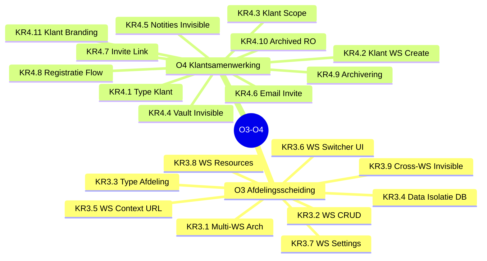
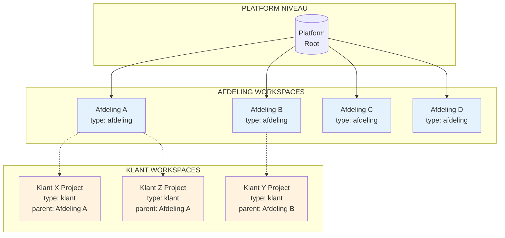
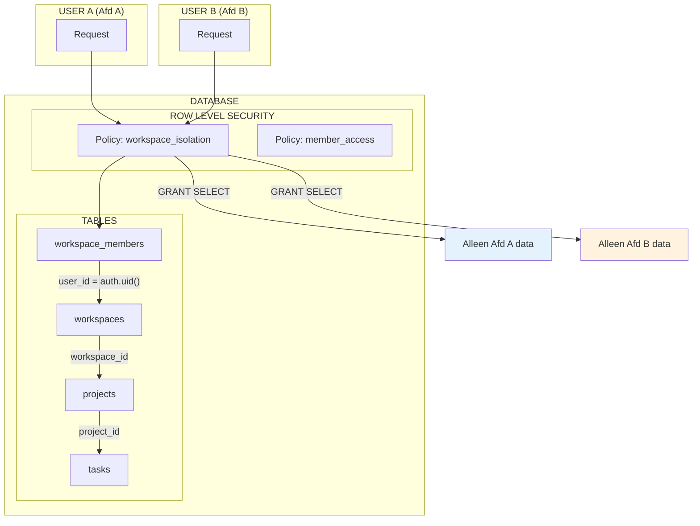
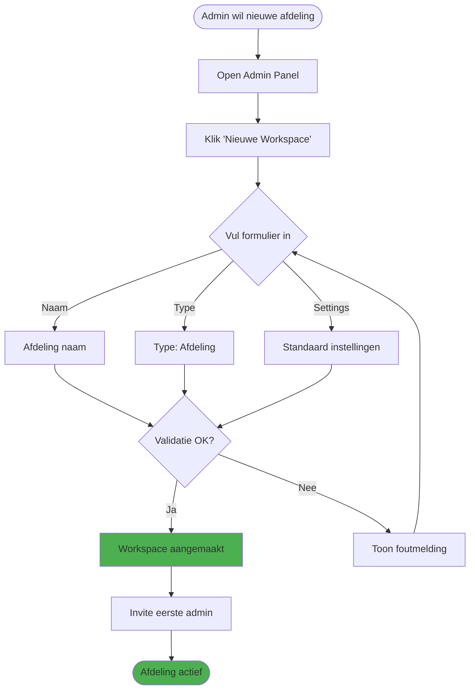
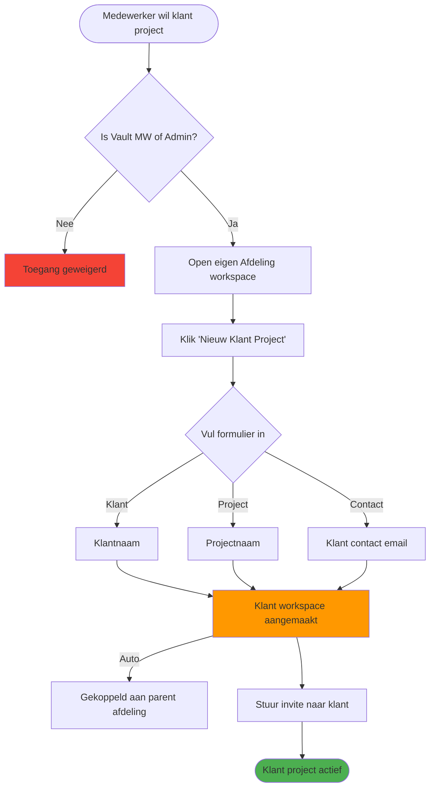
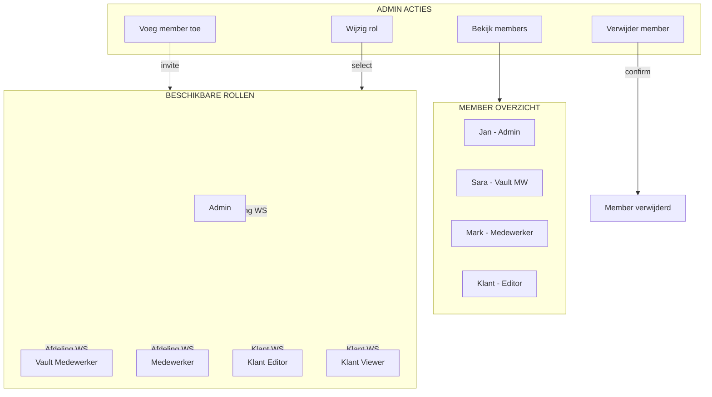
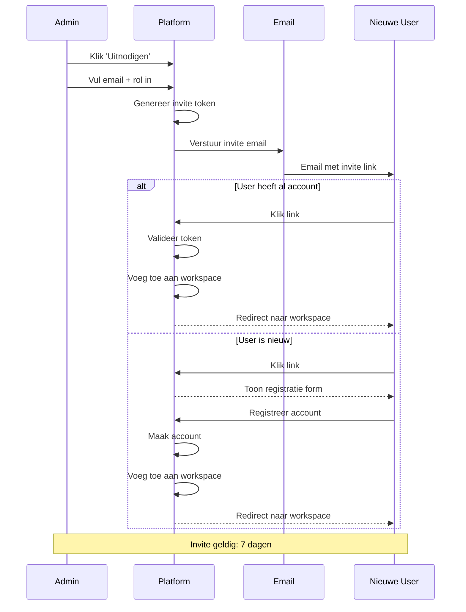
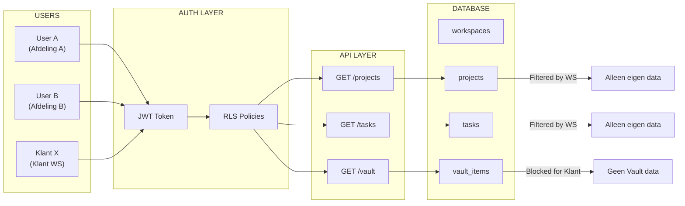
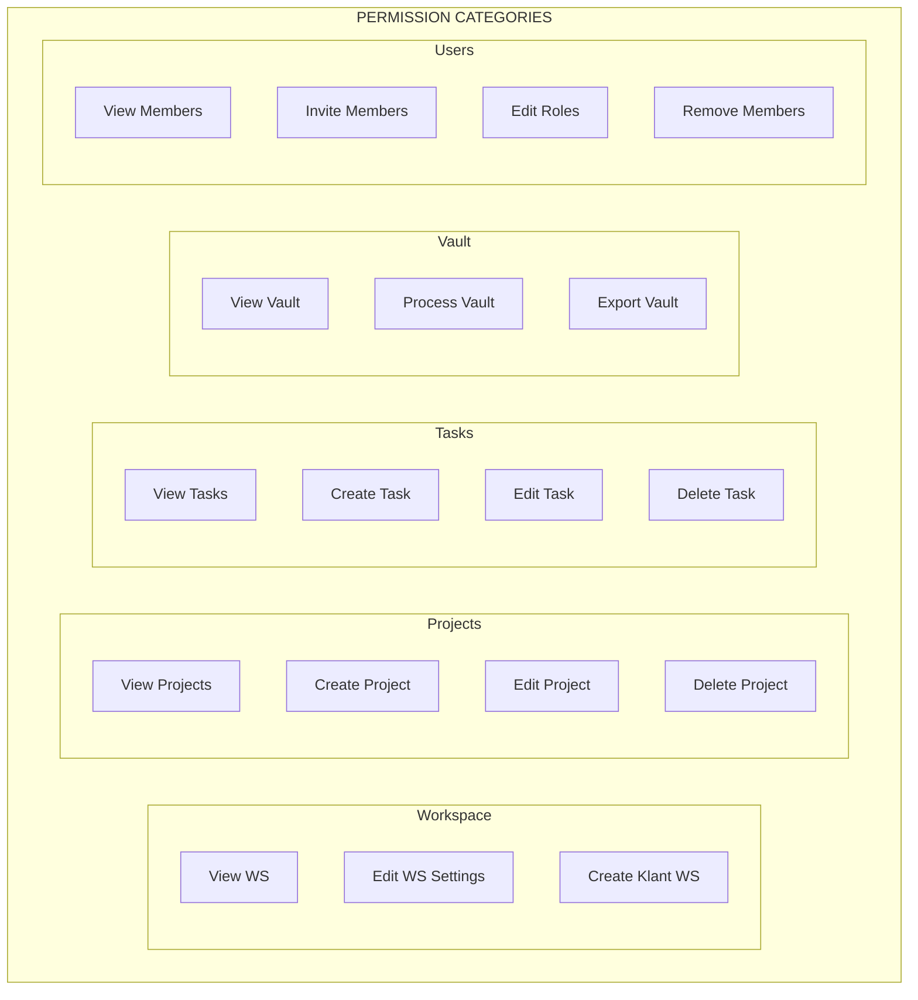

# M3: Toegang Board Specificatie

> **Outcomes:** O3 - Afdelingsscheiding & O4 - Veilige Klantsamenwerking
> **Versie:** 1.0
> **Datum:** 2024-12-30
> **Status:** Specificatie voor Miro implementatie

---

## Board Overzicht

| Aspect | Waarde |
|--------|--------|
| **Board Naam** | O3-O4: Afdelingsscheiding & Klantsamenwerking |
| **Doel** | Visualiseer workspace isolatie, klant toegang en member management |
| **Frames** | 10 |
| **Key Results** | 20 (O3: 9, O4: 11) |
| **Geschatte Breedte** | 10000px |
| **Geschatte Hoogte** | 8000px |

---

## Board Layout

```
+-------------------------------------------------------------------------------------------+
|                                                                                           |
|  [F1: Header & Outcomes Overview]                                                        |
|                                                                                           |
+-------------------------------------------------------------------------------------------+
|                                       |                                                   |
|  [F2: Workspace Hierarchy Diagram]    |  [F3: Data Isolation Diagram]                    |
|                                       |                                                   |
+---------------------------------------+---------------------------------------------------+
|                                       |                                                   |
|  [F4: Afdeling Workspace Flows]       |  [F5: Klant Workspace Flows]                     |
|                                       |                                                   |
+---------------------------------------+---------------------------------------------------+
|                                       |                                                   |
|  [F6: Member Management Flows]        |  [F7: Invite Flows]                              |
|                                       |                                                   |
+---------------------------------------+---------------------------------------------------+
|                                                                                           |
|  [F8: Data Isolation Architecture]                                                       |
|                                                                                           |
+-------------------------------------------------------------------------------------------+
|                                       |                                                   |
|  [F9: Access Control Matrix]          |  [F10: Footer & Links]                           |
|                                       |                                                   |
+-------------------------------------------------------------------------------------------+
```

---

## Frame 1: Header & Outcomes Overview

**Positie:** 0, 0 | **Grootte:** 10000 x 1000px

### Content

```
+-------------------------------------------------------------------------------------------+
|                                                                                           |
|    O3-O4: AFDELINGSSCHEIDING & KLANTSAMENWERKING                                         |
|    ===========================================================================           |
|                                                                                           |
|    +------------------------------------------+   +----------------------------------+   |
|    | O3: AFDELINGSSCHEIDING                   |   | O4: VEILIGE KLANTSAMENWERKING   |   |
|    |                                          |   |                                  |   |
|    | "Elke afdeling heeft een eigen          |   | "Externe klanten kunnen          |   |
|    |  werkruimte waarin hun data             |   |  samenwerken zonder toegang      |   |
|    |  gescheiden blijft"                     |   |  tot interne informatie"         |   |
|    |                                          |   |                                  |   |
|    | Key Results: 9                          |   | Key Results: 11                  |   |
|    +------------------------------------------+   +----------------------------------+   |
|                                                                                           |
|    KERNCONCEPTEN                                                                         |
|    +------------+  +------------+  +------------+  +------------+  +------------+        |
|    | Workspace  |  | Isolatie   |  | Klant WS   |  | Invite     |  | Archiveren |        |
|    | Hierarchy  |  | RLS/Policy |  | Beperkt    |  | Flow       |  | Read-only  |        |
|    +------------+  +------------+  +------------+  +------------+  +------------+        |
|                                                                                           |
|    [Legenda]  [Versie: 1.0]  [Laatst bijgewerkt: 2024-12-30]                            |
|                                                                                           |
+-------------------------------------------------------------------------------------------+
```

### Key Results Overview



---

## Frame 2: Workspace Hierarchy Diagram

**Positie:** 0, 1100 | **Grootte:** 5000 x 2200px

### Mermaid Diagram: Complete Hierarchy



### ASCII Layout voor Miro

```
+-------------------------------------------------------------------------------------------+
|  WORKSPACE HIERARCHY                                                                     |
+-------------------------------------------------------------------------------------------+
|                                                                                           |
|                              +---------------------------+                                |
|                              |        PLATFORM           |                                |
|                              |         (Root)            |                                |
|                              +-------------+-------------+                                |
|                                            |                                              |
|            +---------------+---------------+---------------+---------------+              |
|            |               |               |               |               |              |
|            v               v               v               v               |              |
|     +-----------+   +-----------+   +-----------+   +-----------+         |              |
|     |AFDELING A |   |AFDELING B |   |AFDELING C |   |AFDELING D |         |              |
|     |           |   |           |   |           |   |           |         |              |
|     |type:      |   |type:      |   |type:      |   |type:      |         |              |
|     |afdeling   |   |afdeling   |   |afdeling   |   |afdeling   |         |              |
|     +-----------+   +-----------+   +-----------+   +-----------+         |              |
|          |               |                                                |              |
|          |               |                                                |              |
|     +----+----+          |                                                |              |
|     |         |          |                                                |              |
|     v         v          v                                                |              |
| +-------+ +-------+ +-------+                                             |              |
| |KLANT X| |KLANT Z| |KLANT Y|                                             |              |
| |       | |       | |       |                                             |              |
| |type:  | |type:  | |type:  |                                             |              |
| |klant  | |klant  | |klant  |                                             |              |
| |parent:| |parent:| |parent:|                                             |              |
| |Afd A  | |Afd A  | |Afd B  |                                             |              |
| +-------+ +-------+ +-------+                                             |              |
|                                                                           |              |
|  LEGENDA:                                                                 |              |
|  [Blauw] = Afdeling Workspace (intern)                                    |              |
|  [Oranje] = Klant Workspace (extern, beperkt)                             |              |
|  -----> = Ownership relatie                                               |              |
|                                                                           |              |
+-------------------------------------------------------------------------------------------+
```

### Workspace Types Tabel

```
+-------------------------------------------------------------------------------------------+
|  WORKSPACE TYPES                                                                         |
+-------------------------------------------------------------------------------------------+
|                                                                                           |
|  +----------------+-------------------+-------------------+                               |
|  | Eigenschap     | TYPE: AFDELING    | TYPE: KLANT       |                               |
|  +----------------+-------------------+-------------------+                               |
|  | Aanmaken door  | Platform Admin    | Afdeling Admin    |                               |
|  | Members        | Interne users     | Externe + Intern  |                               |
|  | Vault toegang  | Ja (Vault MW)     | NEE               |                               |
|  | Data scope     | Volledig          | Beperkt project   |                               |
|  | Kan archiveren | Nee               | Ja                |                               |
|  | Branding       | Platform default  | Optioneel custom  |                               |
|  | Levensduur     | Permanent         | Project-gebonden  |                               |
|  +----------------+-------------------+-------------------+                               |
|                                                                                           |
+-------------------------------------------------------------------------------------------+
```

---

## Frame 3: Data Isolation Diagram

**Positie:** 5100, 1100 | **Grootte:** 4900 x 2200px

### Mermaid Diagram: RLS Data Isolation



### ASCII Layout: Data Boundaries

```
+-------------------------------------------------------------------------------------------+
|  DATA ISOLATION ARCHITECTURE                                                             |
+-------------------------------------------------------------------------------------------+
|                                                                                           |
|  +----------------------------------+    +----------------------------------+             |
|  |         WORKSPACE A              |    |         WORKSPACE B              |             |
|  |                                  |    |                                  |             |
|  |  +------------+  +------------+  |    |  +------------+  +------------+  |             |
|  |  | Projects A |  | Tasks A    |  |    |  | Projects B |  | Tasks B    |  |             |
|  |  +------------+  +------------+  |    |  +------------+  +------------+  |             |
|  |                                  |    |                                  |             |
|  |  +------------+  +------------+  |    |  +------------+  +------------+  |             |
|  |  | Resources A|  | Events A   |  |    |  | Resources B|  | Events B   |  |             |
|  |  +------------+  +------------+  |    |  +------------+  +------------+  |             |
|  |                                  |    |                                  |             |
|  +----------------------------------+    +----------------------------------+             |
|                   |                                       |                              |
|                   |          GEEN TOEGANG                 |                              |
|                   +------------ X X X X X ----------------+                              |
|                                                                                           |
|  RLS POLICY                                                                              |
|  +-----------------------------------------------------------------------+               |
|  | CREATE POLICY workspace_isolation ON projects                         |               |
|  | FOR ALL                                                               |               |
|  | USING (                                                               |               |
|  |   workspace_id IN (                                                   |               |
|  |     SELECT workspace_id FROM workspace_members                        |               |
|  |     WHERE user_id = auth.uid()                                        |               |
|  |   )                                                                   |               |
|  | );                                                                    |               |
|  +-----------------------------------------------------------------------+               |
|                                                                                           |
|  ISOLATIE GARANTIES:                                                                     |
|  [X] Query naar andere workspace -> Lege result set                                      |
|  [X] JOIN over workspaces -> Gefilterd op eigen workspace                               |
|  [X] Direct ID access -> Blocked als niet in workspace                                   |
|                                                                                           |
+-------------------------------------------------------------------------------------------+
```

---

## Frame 4: Afdeling Workspace Flows

**Positie:** 0, 3400 | **Grootte:** 5000 x 2000px

### Mermaid Diagram: Afdeling Workspace Creation



### Afdeling Workspace Flow Details

```
+-------------------------------------------------------------------------------------------+
|  AFDELING WORKSPACE FLOWS                                                                |
+-------------------------------------------------------------------------------------------+
|                                                                                           |
|  FLOW 1: NIEUWE AFDELING WORKSPACE AANMAKEN                                              |
|  +-----------------------------------------------------------------------+               |
|  |                                                                       |               |
|  |  [Admin]                                                              |               |
|  |     |                                                                 |               |
|  |     v                                                                 |               |
|  |  [Open Admin Panel] -> [Workspaces] -> [+ Nieuwe Workspace]          |               |
|  |     |                                                                 |               |
|  |     v                                                                 |               |
|  |  +-----------------------------------------------------------+       |               |
|  |  | FORMULIER                                                 |       |               |
|  |  | +-------------------------------------------------+       |       |               |
|  |  | | Naam:        [Afdeling E__________________]     |       |       |               |
|  |  | | Type:        [Afdeling] [v]                     |       |       |               |
|  |  | | Beschrijving:[________________________]         |       |       |               |
|  |  | +-------------------------------------------------+       |       |               |
|  |  |                                                           |       |               |
|  |  |                        [Annuleren] [Aanmaken]             |       |               |
|  |  +-----------------------------------------------------------+       |               |
|  |     |                                                                 |               |
|  |     v                                                                 |               |
|  |  [Workspace aangemaakt] -> [Invite Admin(s)] -> [Afdeling actief]    |               |
|  |                                                                       |               |
|  +-----------------------------------------------------------------------+               |
|                                                                                           |
|  FLOW 2: AFDELING WORKSPACE SETTINGS WIJZIGEN                                            |
|  +-----------------------------------------------------------------------+               |
|  |                                                                       |               |
|  |  [Afdeling Admin]                                                     |               |
|  |     |                                                                 |               |
|  |     v                                                                 |               |
|  |  [Workspace Switcher] -> [Selecteer workspace] -> [Settings icon]    |               |
|  |     |                                                                 |               |
|  |     v                                                                 |               |
|  |  +-----------------------------------------------------------+       |               |
|  |  | WORKSPACE SETTINGS                                        |       |               |
|  |  | +-------------------------------------------------+       |       |               |
|  |  | | [Algemeen] [Members] [Templates] [Integraties]  |       |       |               |
|  |  | +-------------------------------------------------+       |       |               |
|  |  | |                                                 |       |       |               |
|  |  | | Naam:        [Afdeling A__________________]     |       |       |               |
|  |  | | Beschrijving:[________________________]         |       |       |               |
|  |  | | Standaard project template: [Template 1] [v]    |       |       |               |
|  |  | |                                                 |       |       |               |
|  |  | +-------------------------------------------------+       |       |               |
|  |  +-----------------------------------------------------------+       |               |
|  |                                                                       |               |
|  +-----------------------------------------------------------------------+               |
|                                                                                           |
+-------------------------------------------------------------------------------------------+
```

---

## Frame 5: Klant Workspace Flows

**Positie:** 5100, 3400 | **Grootte:** 4900 x 2000px

### Mermaid Diagram: Klant Workspace Creation



### Klant Workspace Restrictions

```
+-------------------------------------------------------------------------------------------+
|  KLANT WORKSPACE FLOWS                                                                   |
+-------------------------------------------------------------------------------------------+
|                                                                                           |
|  FLOW: KLANT WORKSPACE AANMAKEN                                                          |
|  +-----------------------------------------------------------------------+               |
|  |                                                                       |               |
|  |  [Afdeling Admin / Vault MW]                                          |               |
|  |     |                                                                 |               |
|  |     v                                                                 |               |
|  |  [In eigen Afdeling WS] -> [+ Nieuw Klant Project]                   |               |
|  |     |                                                                 |               |
|  |     v                                                                 |               |
|  |  +-----------------------------------------------------------+       |               |
|  |  | NIEUW KLANT PROJECT                                       |       |               |
|  |  | +-------------------------------------------------+       |       |               |
|  |  | | Klantnaam:   [Bedrijf XYZ_________________]     |       |       |               |
|  |  | | Projectnaam: [Website Redesign___________]     |       |       |               |
|  |  | | Contact:     [jan@bedrijfxyz.nl__________]     |       |       |               |
|  |  | |                                                 |       |       |               |
|  |  | | [ ] Direct invite versturen                     |       |       |               |
|  |  | +-------------------------------------------------+       |       |               |
|  |  |                                                           |       |               |
|  |  |                        [Annuleren] [Aanmaken]             |       |               |
|  |  +-----------------------------------------------------------+       |               |
|  |     |                                                                 |               |
|  |     v                                                                 |               |
|  |  [Klant workspace aangemaakt]                                         |               |
|  |  [Parent: Afdeling A]                                                 |               |
|  |  [Type: klant]                                                        |               |
|  |     |                                                                 |               |
|  |     v                                                                 |               |
|  |  [Email invite verstuurd naar klant]                                  |               |
|  |                                                                       |               |
|  +-----------------------------------------------------------------------+               |
|                                                                                           |
|  KLANT WORKSPACE BEPERKINGEN                                                             |
|  +-----------------------------------------------------------------------+               |
|  |                                                                       |               |
|  |  WAT KLANT WEL ZIET:                WAT KLANT NIET ZIET:             |               |
|  |  +---------------------------+      +---------------------------+     |               |
|  |  | [V] Eigen project data    |      | [X] Vault systeem         |     |               |
|  |  | [V] Taken & planning      |      | [X] Andere workspaces     |     |               |
|  |  | [V] Calendar events       |      | [X] Interne notities      |     |               |
|  |  | [V] Project voortgang     |      | [X] Admin functies        |     |               |
|  |  | [V] Toegewezen resources  |      | [X] User management       |     |               |
|  |  +---------------------------+      +---------------------------+     |               |
|  |                                                                       |               |
|  +-----------------------------------------------------------------------+               |
|                                                                                           |
+-------------------------------------------------------------------------------------------+
```

---

## Frame 6: Member Management Flows

**Positie:** 0, 5500 | **Grootte:** 5000 x 2000px

### Mermaid Diagram: Member Management



### Member Management UI Wireframes

```
+-------------------------------------------------------------------------------------------+
|  MEMBER MANAGEMENT FLOWS                                                                 |
+-------------------------------------------------------------------------------------------+
|                                                                                           |
|  MEMBER LIST VIEW                                                                        |
|  +-----------------------------------------------------------------------+               |
|  | WORKSPACE MEMBERS                            [+ Uitnodigen] [Filter]  |               |
|  +-----------------------------------------------------------------------+               |
|  |                                                                       |               |
|  | +-------------------------------------------------------------------+ |               |
|  | | [Avatar] Jan Jansen           | Admin           | [Edit] [Remove] | |               |
|  | |          jan@company.nl       | Sinds: 01-2025  |                 | |               |
|  | +-------------------------------------------------------------------+ |               |
|  | | [Avatar] Sara Mulder          | Vault MW        | [Edit] [Remove] | |               |
|  | |          sara@company.nl      | Sinds: 01-2025  |                 | |               |
|  | +-------------------------------------------------------------------+ |               |
|  | | [Avatar] Mark de Vries        | Medewerker      | [Edit] [Remove] | |               |
|  | |          mark@company.nl      | Sinds: 02-2025  |                 | |               |
|  | +-------------------------------------------------------------------+ |               |
|  | | [Avatar] Klant Contact        | Klant Editor    | [Edit] [Remove] | |               |
|  | |          contact@klant.nl     | Sinds: 03-2025  |                 | |               |
|  | +-------------------------------------------------------------------+ |               |
|  |                                                                       |               |
|  | Totaal: 4 members | Admins: 1 | Vault MW: 1 | Medewerkers: 1 | Klant: 1              |
|  +-----------------------------------------------------------------------+               |
|                                                                                           |
|  MEMBER EDIT MODAL                                                                       |
|  +-----------------------------------------------------------------------+               |
|  | MEMBER BEWERKEN                                         [X]           |               |
|  +-----------------------------------------------------------------------+               |
|  |                                                                       |               |
|  | Naam:     Jan Jansen                                                  |               |
|  | Email:    jan@company.nl                                              |               |
|  |                                                                       |               |
|  | Rol:      [Admin__________] [v]                                       |               |
|  |           +-------------------+                                       |               |
|  |           | Admin             |                                       |               |
|  |           | Vault Medewerker  |                                       |               |
|  |           | Medewerker        |                                       |               |
|  |           +-------------------+                                       |               |
|  |                                                                       |               |
|  |                               [Annuleren] [Opslaan]                   |               |
|  +-----------------------------------------------------------------------+               |
|                                                                                           |
+-------------------------------------------------------------------------------------------+
```

---

## Frame 7: Invite Flows

**Positie:** 5100, 5500 | **Grootte:** 4900 x 2000px

### Mermaid Diagram: Complete Invite Flow



### Invite Flow Wireframes

```
+-------------------------------------------------------------------------------------------+
|  INVITE FLOWS                                                                            |
+-------------------------------------------------------------------------------------------+
|                                                                                           |
|  STAP 1: INVITE VERSTUREN                                                                |
|  +-----------------------------------------------------------------------+               |
|  | NIEUWE MEMBER UITNODIGEN                                [X]           |               |
|  +-----------------------------------------------------------------------+               |
|  |                                                                       |               |
|  | Email(s):    [jan@example.com, sara@example.com________]             |               |
|  |              Meerdere emails gescheiden door komma                    |               |
|  |                                                                       |               |
|  | Rol:         [Medewerker______] [v]                                   |               |
|  |                                                                       |               |
|  | Bericht:     [Welkom bij ons project!___________________]            |               |
|  |              [__________________________________________]            |               |
|  |                                                                       |               |
|  | [ ] Stuur kopie naar mijzelf                                          |               |
|  |                                                                       |               |
|  |                               [Annuleren] [Versturen]                 |               |
|  +-----------------------------------------------------------------------+               |
|                                                                                           |
|  STAP 2: EMAIL ONTVANGST                                                                 |
|  +-----------------------------------------------------------------------+               |
|  |                                                                       |               |
|  | Van: noreply@platform.nl                                              |               |
|  | Aan: jan@example.com                                                  |               |
|  | Onderwerp: Je bent uitgenodigd voor Afdeling A                        |               |
|  |                                                                       |               |
|  | +-----------------------------------------------------------+         |               |
|  | |                                                           |         |               |
|  | |  [Logo]                                                   |         |               |
|  | |                                                           |         |               |
|  | |  Hallo Jan,                                               |         |               |
|  | |                                                           |         |               |
|  | |  Je bent uitgenodigd om deel te nemen aan                |         |               |
|  | |  workspace "Afdeling A" als Medewerker.                  |         |               |
|  | |                                                           |         |               |
|  | |  Bericht van Admin:                                       |         |               |
|  | |  "Welkom bij ons project!"                               |         |               |
|  | |                                                           |         |               |
|  | |           [ ACCEPTEER UITNODIGING ]                       |         |               |
|  | |                                                           |         |               |
|  | |  Link geldig tot: 07-01-2025                             |         |               |
|  | |                                                           |         |               |
|  | +-----------------------------------------------------------+         |               |
|  |                                                                       |               |
|  +-----------------------------------------------------------------------+               |
|                                                                                           |
|  STAP 3A: BESTAANDE USER                  STAP 3B: NIEUWE USER                          |
|  +-----------------------------+          +-----------------------------+                |
|  |                             |          |                             |                |
|  | Welkom terug, Jan!          |          | REGISTREREN                 |                |
|  |                             |          |                             |                |
|  | Je bent toegevoegd aan      |          | Naam:    [____________]     |                |
|  | workspace "Afdeling A"      |          | Email:   jan@example.com    |                |
|  | als Medewerker.             |          | Wachtw:  [____________]     |                |
|  |                             |          | Herhaal: [____________]     |                |
|  | [ NAAR WORKSPACE ]          |          |                             |                |
|  |                             |          | [ REGISTREREN ]             |                |
|  +-----------------------------+          +-----------------------------+                |
|                                                                                           |
+-------------------------------------------------------------------------------------------+
```

### Invite Link Generation

```
+-------------------------------------------------------------------------------------------+
|  INVITE LINK FLOW (KR4.7)                                                                |
+-------------------------------------------------------------------------------------------+
|                                                                                           |
|  USE CASE: Admin wil eenmalige link delen (niet via email)                               |
|                                                                                           |
|  +-----------------------------------------------------------------------+               |
|  | INVITE LINK GENEREREN                                   [X]           |               |
|  +-----------------------------------------------------------------------+               |
|  |                                                                       |               |
|  | Rol voor nieuwe members:  [Klant Viewer___] [v]                       |               |
|  |                                                                       |               |
|  | Link geldigheid:          [7 dagen________] [v]                       |               |
|  |                                                                       |               |
|  | Max. aantal gebruikers:   [10_____________]                           |               |
|  |                                                                       |               |
|  |                               [Genereer Link]                         |               |
|  |                                                                       |               |
|  | +-----------------------------------------------------------+         |               |
|  | | https://platform.nl/invite/abc123xyz...                   | [Copy] |               |
|  | +-----------------------------------------------------------+         |               |
|  |                                                                       |               |
|  | [!] Let op: Iedereen met deze link kan toetreden                     |               |
|  |                                                                       |               |
|  +-----------------------------------------------------------------------+               |
|                                                                                           |
+-------------------------------------------------------------------------------------------+
```

---

## Frame 8: Data Isolation Architecture

**Positie:** 0, 7600 | **Grootte:** 10000 x 1800px

### Mermaid Diagram: Complete Data Flow



### Data Isolation Matrix

```
+-------------------------------------------------------------------------------------------+
|  DATA ISOLATION MATRIX                                                                   |
+-------------------------------------------------------------------------------------------+
|                                                                                           |
|  +---------------+---------------+---------------+---------------+---------------+        |
|  | DATA TYPE     | ADMIN         | VAULT MW      | MEDEWERKER    | KLANT         |        |
|  +---------------+---------------+---------------+---------------+---------------+        |
|  | Projecten     | Eigen WS      | Eigen WS      | Eigen WS      | Eigen Klant WS|        |
|  | Taken         | Eigen WS      | Eigen WS      | Eigen WS      | Eigen Klant WS|        |
|  | Resources     | Eigen WS      | Eigen WS      | Eigen WS      | Toegewezen    |        |
|  | Vault         | Eigen WS      | Eigen WS      | GEEN          | GEEN          |        |
|  | Andere WS     | GEEN          | GEEN          | GEEN          | GEEN          |        |
|  | Admin Panel   | JA            | BEPERKT       | GEEN          | GEEN          |        |
|  | User Mgmt     | JA            | GEEN          | GEEN          | GEEN          |        |
|  +---------------+---------------+---------------+---------------+---------------+        |
|                                                                                           |
|  ISOLATIE IMPLEMENTATIE                                                                  |
|  +-----------------------------------------------------------------------+               |
|  |                                                                       |               |
|  | LAAG 1: Authentication                                                |               |
|  | - Supabase Auth (JWT tokens)                                          |               |
|  | - Session management                                                  |               |
|  |                                                                       |               |
|  | LAAG 2: Authorization (RLS)                                           |               |
|  | - Row Level Security policies                                         |               |
|  | - workspace_members join check                                        |               |
|  |                                                                       |               |
|  | LAAG 3: Application                                                   |               |
|  | - Workspace context in URL                                            |               |
|  | - Frontend route guards                                               |               |
|  | - API middleware validation                                           |               |
|  |                                                                       |               |
|  +-----------------------------------------------------------------------+               |
|                                                                                           |
+-------------------------------------------------------------------------------------------+
```

---

## Frame 9: Access Control Matrix

**Positie:** 0, 9500 | **Grootte:** 5000 x 1500px

### Mermaid Diagram: Role Permissions



### Permission Matrix Table

```
+-------------------------------------------------------------------------------------------+
|  ACCESS CONTROL MATRIX (DETAILED)                                                        |
+-------------------------------------------------------------------------------------------+
|                                                                                           |
|  +-------------------+-------+----------+------------+-------------+-------------+       |
|  | PERMISSION        | ADMIN | VAULT MW | MEDEWERKER | KLANT EDIT  | KLANT VIEW  |       |
|  +-------------------+-------+----------+------------+-------------+-------------+       |
|  | WORKSPACE                                                                     |       |
|  | View workspace    |   V   |    V     |     V      |     V       |     V       |       |
|  | Edit WS settings  |   V   |    -     |     -      |     -       |     -       |       |
|  | Create klant WS   |   V   |    V     |     -      |     -       |     -       |       |
|  | Archive WS        |   V   |    -     |     -      |     -       |     -       |       |
|  +-------------------+-------+----------+------------+-------------+-------------+       |
|  | PROJECTS                                                                      |       |
|  | View projects     |   V   |    V     |     V      |     V       |     V       |       |
|  | Create project    |   V   |    V     |     V      |     -       |     -       |       |
|  | Edit project      |   V   |    V     |     V      |     V       |     -       |       |
|  | Delete project    |   V   |    -     |     -      |     -       |     -       |       |
|  | Mark "klaar"      |   V   |    V     |     V      |     -       |     -       |       |
|  +-------------------+-------+----------+------------+-------------+-------------+       |
|  | TASKS                                                                         |       |
|  | View tasks        |   V   |    V     |     V      |     V       |     V       |       |
|  | Create task       |   V   |    V     |     V      |     V       |     -       |       |
|  | Edit task         |   V   |    V     |     V      |     V       |     -       |       |
|  | Delete task       |   V   |    V     |     V      |     -       |     -       |       |
|  +-------------------+-------+----------+------------+-------------+-------------+       |
|  | VAULT                                                                         |       |
|  | View vault        |   V   |    V     |     -      |     -       |     -       |       |
|  | Process items     |   V   |    V     |     -      |     -       |     -       |       |
|  | Export data       |   V   |    V     |     -      |     -       |     -       |       |
|  +-------------------+-------+----------+------------+-------------+-------------+       |
|  | USERS                                                                         |       |
|  | View members      |   V   |    V     |     V      |     -       |     -       |       |
|  | Invite members    |   V   |    -     |     -      |     -       |     -       |       |
|  | Edit roles        |   V   |    -     |     -      |     -       |     -       |       |
|  | Remove members    |   V   |    -     |     -      |     -       |     -       |       |
|  +-------------------+-------+----------+------------+-------------+-------------+       |
|                                                                                           |
|  V = Toegestaan  |  - = Niet toegestaan                                                 |
|                                                                                           |
+-------------------------------------------------------------------------------------------+
```

---

## Frame 10: Footer & Links

**Positie:** 5100, 9500 | **Grootte:** 4900 x 1500px

### Content

```
+-------------------------------------------------------------------------------------------+
|  GERELATEERDE DOCUMENTEN & LINKS                                                         |
+-------------------------------------------------------------------------------------------+
|                                                                                           |
|  MIRO BOARDS                                                                             |
|  +------------+  +------------+  +------------+  +------------+                          |
|  | M1         |  | M2         |  | M4         |  | M7         |                          |
|  | Samenwk.   |  | Unified    |  | Security   |  | Rollen     |                          |
|  | [Link ->]  |  | [Link ->]  |  | [Link ->]  |  | [Link ->]  |                          |
|  +------------+  +------------+  +------------+  +------------+                          |
|                                                                                           |
|  DELIVERABLES                                                                            |
|  +------------+  +------------+  +------------+                                          |
|  | D7         |  | D8         |  | D11        |                                          |
|  | Workspace  |  | Auth/RBAC  |  | Database   |                                          |
|  | Module     |  | Module     |  | Schema     |                                          |
|  +------------+  +------------+  +------------+                                          |
|                                                                                           |
|  KEY RESULTS SUMMARY                                                                     |
|  +-----------------------------------------------------------------------+               |
|  | O3: Afdelingsscheiding        | 9 Key Results  | KR3.1 - KR3.9      |               |
|  | O4: Veilige Klantsamenwerking | 11 Key Results | KR4.1 - KR4.11     |               |
|  | TOTAAL                        | 20 Key Results |                    |               |
|  +-----------------------------------------------------------------------+               |
|                                                                                           |
|  VERSIE HISTORIE                                                                         |
|  +----------------------------------------------------------+                            |
|  | Versie | Datum      | Auteur | Wijzigingen               |                            |
|  +--------+------------+--------+---------------------------+                            |
|  | 1.0    | 2024-12-30 | A9     | Initiele specificatie     |                            |
|  +----------------------------------------------------------+                            |
|                                                                                           |
+-------------------------------------------------------------------------------------------+
```

---

## Kleuren & Stijl Specificatie

### Workspace Type Kleuren

| Type | Color | Hex | Gebruik |
|------|-------|-----|---------|
| Platform | Grey | #9E9E9E | Platform level |
| Afdeling | Blue | #E3F2FD | Afdeling workspaces |
| Klant | Orange | #FFF3E0 | Klant workspaces |

### Access Level Kleuren

| Level | Color | Hex |
|-------|-------|-----|
| Full Access | Green | #4CAF50 |
| Limited Access | Orange | #FF9800 |
| No Access | Red | #F44336 |
| Conditional | Yellow | #FFEB3B |

### Flow Diagram Kleuren

| Element | Color | Hex |
|---------|-------|-----|
| Start/End | Green | #4CAF50 |
| Process | Blue | #2196F3 |
| Decision | Orange | #FF9800 |
| Error | Red | #F44336 |

---

## Implementation Checklist

### Pre-flight

- [ ] Miro board aangemaakt met correcte naam
- [ ] Board sharing ingesteld
- [ ] Template elementen voorbereid

### Frames

- [ ] F1: Header & Outcomes Overview
- [ ] F2: Workspace Hierarchy Diagram
- [ ] F3: Data Isolation Diagram
- [ ] F4: Afdeling Workspace Flows
- [ ] F5: Klant Workspace Flows
- [ ] F6: Member Management Flows
- [ ] F7: Invite Flows
- [ ] F8: Data Isolation Architecture
- [ ] F9: Access Control Matrix
- [ ] F10: Footer & Links

### Post-flight

- [ ] Alle frames gelinkt
- [ ] Navigatie toegevoegd
- [ ] Mermaid diagrams gerenderd
- [ ] Stakeholder review scheduled

---

## Referenties

| Document | Locatie | Relatie |
|----------|---------|---------|
| OUTCOMES.md | `/OUTCOMES.md` | O3-O4 Key Results |
| D7 Workspace Module | `/docs/deliverables/D7.md` | Workspace implementatie |
| D8 Auth/RBAC Module | `/docs/deliverables/D8.md` | Auth implementatie |
| D11 Database Schema | `/docs/deliverables/D11.md` | RLS policies |
| M4 Security Board | `M4-SECURITY-BOARD.md` | RBAC details |

---

*Specificatie versie: 1.0*
*Gemaakt door: Agent A9 (Visual Designer)*
*Datum: 2024-12-30*
