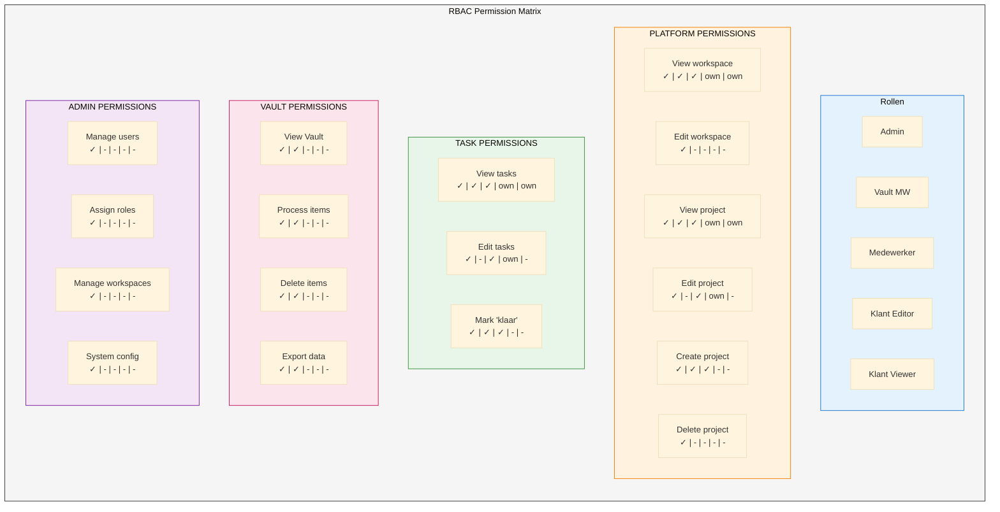
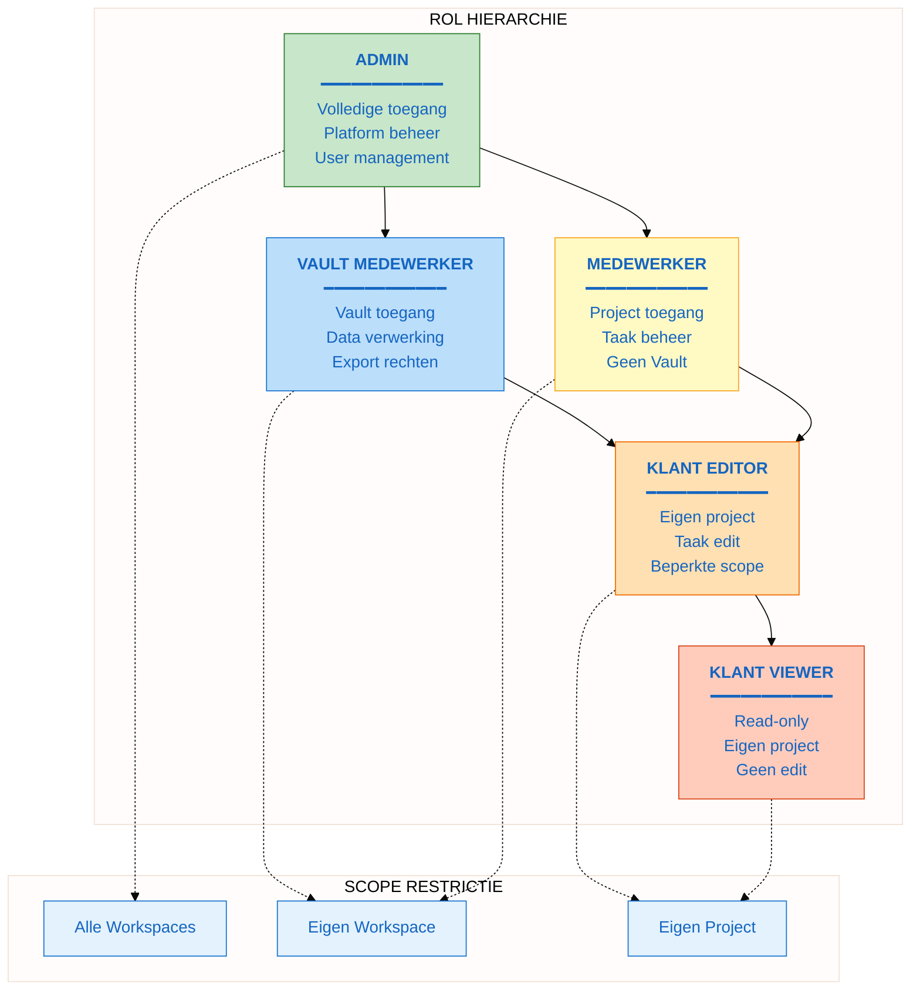
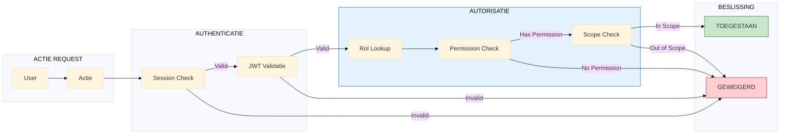
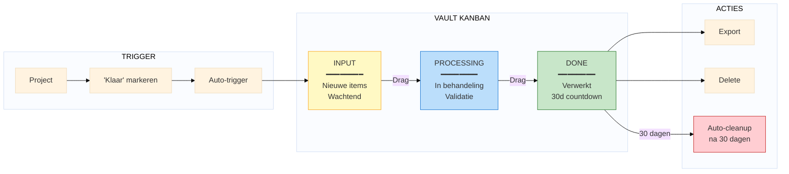
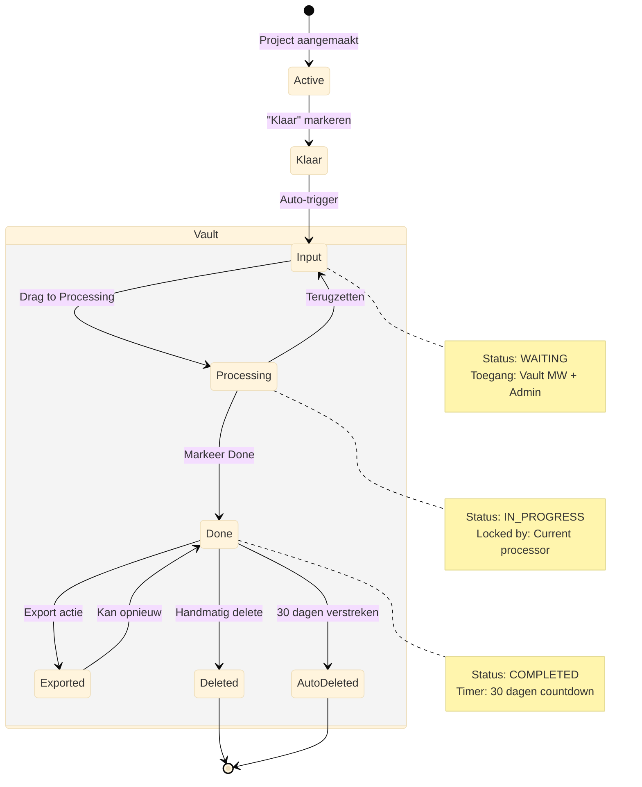
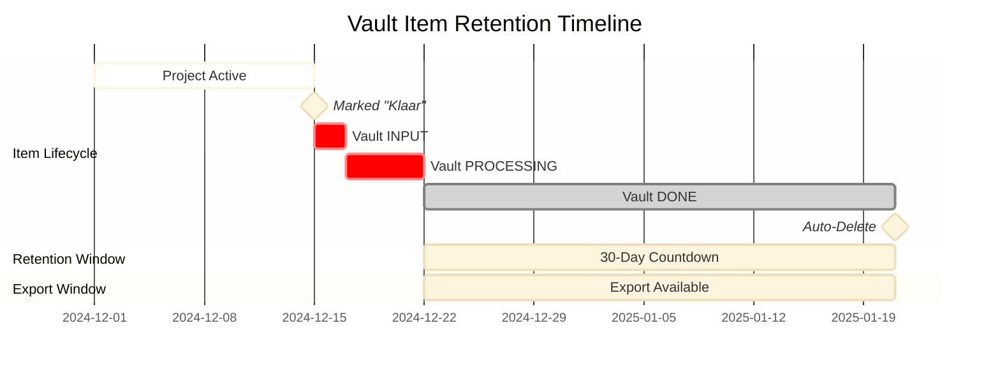
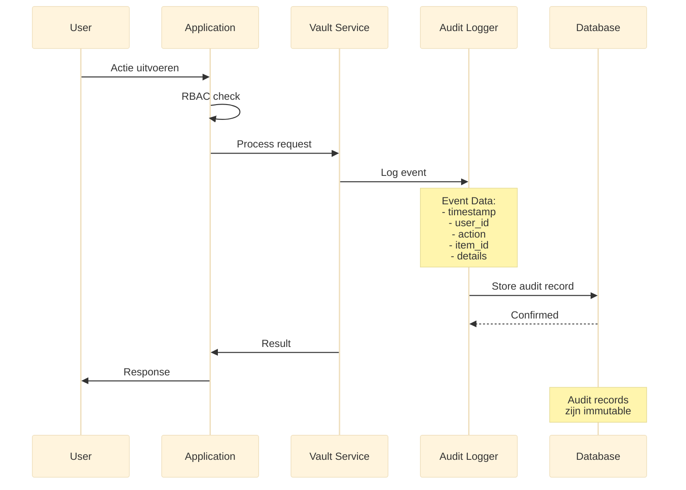

# M4: O5-O6 Security Board Specificatie

> **Miro Board Specificatie voor Toegangscontrole & Vault**
> **Versie:** 1.0
> **Datum:** 2024-12-30
> **Agent:** A9 (Visual Designer)

---

## Overzicht

Dit document bevat de volledige specificatie voor het M4 Miro Board dat de volgende outcomes visualiseert:

| Outcome | Beschrijving | Key Results |
|---------|--------------|-------------|
| **O5** | Toegangscontrole | KR5.1-5.20 (20 KRs) |
| **O6** | Gecontroleerde Dataverwerking (Vault) | KR6.1-6.19 (19 KRs) |

---

## Board Structuur

```
M4-SECURITY-BOARD
├── Frame 1: Header & Overview
├── Frame 2: RBAC Matrix Visualisatie
├── Frame 3: Role Hierarchy Diagram
├── Frame 4: Permission Flows per Actie
├── Frame 5: Vault Workflow Diagram
├── Frame 6: Vault States & Transitions
├── Frame 7: 30-Dagen Retention Timeline
├── Frame 8: Audit Trail Flow
└── Frame 9: Decisions & Notes
```

---

## Frame 1: Header & Overview

### Layout
```
┌─────────────────────────────────────────────────────────────────────────────┐
│                                                                              │
│   ╔══════════════════════════════════════════════════════════════════════╗  │
│   ║  M4: SECURITY BOARD                                                   ║  │
│   ║  O5: Toegangscontrole | O6: Gecontroleerde Dataverwerking            ║  │
│   ╚══════════════════════════════════════════════════════════════════════╝  │
│                                                                              │
│   ┌─────────────────────────────────────────────────────────────────────┐   │
│   │  SCOPE                                                               │   │
│   │                                                                      │   │
│   │  O5: "Gebruikers zien en doen alleen wat hun rol toestaat"          │   │
│   │      • 5 Rollen (Admin, Vault MW, Medewerker, Klant Editor/Viewer)  │   │
│   │      • 10 Permissions                                                │   │
│   │      • RBAC enforcement                                              │   │
│   │                                                                      │   │
│   │  O6: "Projectdata doorloopt validatiestap voordat het naar          │   │
│   │       permanente systemen gaat"                                      │   │
│   │      • Vault module met 3 columns                                    │   │
│   │      • 30-dagen retentie                                             │   │
│   │      • Audit trail                                                   │   │
│   └─────────────────────────────────────────────────────────────────────┘   │
│                                                                              │
│   ┌────────────────┐  ┌────────────────┐  ┌────────────────┐               │
│   │ Versie: 1.0    │  │ Datum: 30-12   │  │ Status: Draft  │               │
│   └────────────────┘  └────────────────┘  └────────────────┘               │
│                                                                              │
│   [LEGENDA]                                                                 │
│   ┌──────┐ ┌──────┐ ┌──────┐ ┌──────┐ ┌──────┐                            │
│   │ Geel │ │ Blauw│ │Groen │ │ Rood │ │ Grijs│                            │
│   │Notes │ │Require│ │Done  │ │Risk  │ │Frame │                            │
│   └──────┘ └──────┘ └──────┘ └──────┘ └──────┘                            │
│                                                                              │
└─────────────────────────────────────────────────────────────────────────────┘
```

---

## Frame 2: RBAC Matrix Visualisatie

### Mermaid Diagram - RBAC Matrix



### Uitgebreide Permission Tabel

```
┌─────────────────────────────────────────────────────────────────────────────┐
│  RBAC PERMISSION MATRIX - VOLLEDIG OVERZICHT                                │
├─────────────────────────────────────────────────────────────────────────────┤
│                                                                              │
│  LEGENDE:  ✓ = Volledige toegang                                            │
│            ○ = Alleen eigen workspace/afdeling                              │
│            - = Geen toegang                                                 │
│                                                                              │
│  ┌────────────────────────┬───────┬────────┬─────────┬────────┬────────┐  │
│  │ Permission             │ Admin │Vault MW│Medewrkr │Kl.Edit │Kl.View │  │
│  ├────────────────────────┼───────┼────────┼─────────┼────────┼────────┤  │
│  │ PLATFORM               │       │        │         │        │        │  │
│  ├────────────────────────┼───────┼────────┼─────────┼────────┼────────┤  │
│  │ Projecten bekijken     │   ✓   │   ○    │    ○    │   ○    │   ○    │  │
│  │ Project aanmaken       │   ✓   │   ✓    │    ✓    │   -    │   -    │  │
│  │ Project bewerken       │   ✓   │   -    │    ✓    │   ○    │   -    │  │
│  │ Project verwijderen    │   ✓   │   -    │    -    │   -    │   -    │  │
│  │ Project "klaar"        │   ✓   │   ✓    │    ✓    │   -    │   -    │  │
│  ├────────────────────────┼───────┼────────┼─────────┼────────┼────────┤  │
│  │ TAKEN                  │       │        │         │        │        │  │
│  ├────────────────────────┼───────┼────────┼─────────┼────────┼────────┤  │
│  │ Taken bekijken         │   ✓   │   ○    │    ○    │   ○    │   ○    │  │
│  │ Taken bewerken         │   ✓   │   -    │    ✓    │   ○    │   -    │  │
│  │ Resources toewijzen    │   ✓   │   -    │    ✓    │   -    │   -    │  │
│  ├────────────────────────┼───────┼────────┼─────────┼────────┼────────┤  │
│  │ VAULT                  │       │        │         │        │        │  │
│  ├────────────────────────┼───────┼────────┼─────────┼────────┼────────┤  │
│  │ Vault bekijken         │   ✓   │   ○    │    -    │   -    │   -    │  │
│  │ Items verwerken        │   ✓   │   ○    │    -    │   -    │   -    │  │
│  │ Items verwijderen      │   ✓   │   ○    │    -    │   -    │   -    │  │
│  │ Data exporteren        │   ✓   │   ○    │    -    │   -    │   -    │  │
│  ├────────────────────────┼───────┼────────┼─────────┼────────┼────────┤  │
│  │ ADMINISTRATIE          │       │        │         │        │        │  │
│  ├────────────────────────┼───────┼────────┼─────────┼────────┼────────┤  │
│  │ Users beheren          │   ✓   │   -    │    -    │   -    │   -    │  │
│  │ Rollen toewijzen       │   ✓   │   -    │    -    │   -    │   -    │  │
│  │ Workspaces beheren     │   ✓   │   -    │    -    │   -    │   -    │  │
│  │ Klant WS aanmaken      │   ✓   │   ✓    │    -    │   -    │   -    │  │
│  │ Systeem configuratie   │   ✓   │   -    │    -    │   -    │   -    │  │
│  └────────────────────────┴───────┴────────┴─────────┴────────┴────────┘  │
│                                                                              │
└─────────────────────────────────────────────────────────────────────────────┘
```

---

## Frame 3: Role Hierarchy Diagram

### Mermaid Diagram - Role Hierarchy



### Role Descriptions

```
┌─────────────────────────────────────────────────────────────────────────────┐
│  ROL BESCHRIJVINGEN                                                         │
├─────────────────────────────────────────────────────────────────────────────┤
│                                                                              │
│  ┌───────────────────────────────────────────────────────────────────────┐ │
│  │  ADMIN                                                          [✓✓✓] │ │
│  │  ─────────────────────────────────────────────────────────────────── │ │
│  │  Verantwoordelijkheden:                                               │ │
│  │  • Platform-breed beheer en configuratie                              │ │
│  │  • Gebruikers- en rollenbeheer                                        │ │
│  │  • Workspace aanmaken en archiveren                                   │ │
│  │  • Systeeminstellingen en templates                                   │ │
│  │  • Escalatiepunt voor alle issues                                     │ │
│  │                                                                        │ │
│  │  Scope: ALLE workspaces en data                                       │ │
│  │  Reports to: Platform Owner                                           │ │
│  └───────────────────────────────────────────────────────────────────────┘ │
│                                                                              │
│  ┌───────────────────────────────────────────────────────────────────────┐ │
│  │  VAULT MEDEWERKER                                               [✓✓○] │ │
│  │  ─────────────────────────────────────────────────────────────────── │ │
│  │  Verantwoordelijkheden:                                               │ │
│  │  • Vault items beoordelen en verwerken                                │ │
│  │  • Data validatie en kwaliteitscontrole                               │ │
│  │  • Export naar externe systemen                                       │ │
│  │  • Processing notes bijhouden                                         │ │
│  │  • Klant-workspace aanmaken                                           │ │
│  │                                                                        │ │
│  │  Scope: EIGEN afdeling                                                │ │
│  │  Reports to: Admin / Afdelingshoofd                                   │ │
│  └───────────────────────────────────────────────────────────────────────┘ │
│                                                                              │
│  ┌───────────────────────────────────────────────────────────────────────┐ │
│  │  MEDEWERKER                                                     [✓○○] │ │
│  │  ─────────────────────────────────────────────────────────────────── │ │
│  │  Verantwoordelijkheden:                                               │ │
│  │  • Projecten aanmaken en beheren                                      │ │
│  │  • Taken plannen in Gantt/Calendar/Board                              │ │
│  │  • Resources toewijzen                                                │ │
│  │  • Projecten "klaar" markeren                                         │ │
│  │  • Dagelijkse projectuitvoering                                       │ │
│  │                                                                        │ │
│  │  Scope: EIGEN afdeling                                                │ │
│  │  Reports to: Vault MW / Afdelingshoofd                                │ │
│  │  GEEN Vault toegang                                                   │ │
│  └───────────────────────────────────────────────────────────────────────┘ │
│                                                                              │
│  ┌───────────────────────────────────────────────────────────────────────┐ │
│  │  KLANT EDITOR                                                   [○○○] │ │
│  │  ─────────────────────────────────────────────────────────────────── │ │
│  │  Verantwoordelijkheden:                                               │ │
│  │  • Eigen taken bijwerken                                              │ │
│  │  • Status updates geven                                               │ │
│  │  • Feedback plaatsen                                                  │ │
│  │  • Project voortgang monitoren                                        │ │
│  │                                                                        │ │
│  │  Scope: ALLEEN eigen klant-project                                    │ │
│  │  Reports to: Klant Contact Person                                     │ │
│  │  GEEN Vault, GEEN interne notities                                    │ │
│  └───────────────────────────────────────────────────────────────────────┘ │
│                                                                              │
│  ┌───────────────────────────────────────────────────────────────────────┐ │
│  │  KLANT VIEWER                                                   [read] │ │
│  │  ─────────────────────────────────────────────────────────────────── │ │
│  │  Verantwoordelijkheden:                                               │ │
│  │  • Project voortgang bekijken                                         │ │
│  │  • Rapporten inzien                                                   │ │
│  │  • Stakeholder awareness                                              │ │
│  │                                                                        │ │
│  │  Scope: ALLEEN eigen klant-project (read-only)                        │ │
│  │  Reports to: Klant Editor                                             │ │
│  │  GEEN edit rechten                                                    │ │
│  └───────────────────────────────────────────────────────────────────────┘ │
│                                                                              │
└─────────────────────────────────────────────────────────────────────────────┘
```

---

## Frame 4: Permission Flows per Actie

### Mermaid Diagram - Permission Flow



### Permission Flow per Actie Type

```mermaid
%%{init: {'theme': 'base'}}%%
flowchart TB
    subgraph ViewProject["VIEW PROJECT FLOW"]
        VP1[Request: View Project]
        VP2{Authenticated?}
        VP3{Has view_project?}
        VP4{In workspace scope?}
        VP5[Show Project]
        VP6[403 Forbidden]

        VP1 --> VP2
        VP2 -->|Ja| VP3
        VP2 -->|Nee| VP6
        VP3 -->|Ja| VP4
        VP3 -->|Nee| VP6
        VP4 -->|Ja| VP5
        VP4 -->|Nee| VP6
    end

    subgraph EditTask["EDIT TASK FLOW"]
        ET1[Request: Edit Task]
        ET2{Authenticated?}
        ET3{Has edit_tasks?}
        ET4{Owns task/project?}
        ET5[Allow Edit]
        ET6[403 Forbidden]

        ET1 --> ET2
        ET2 -->|Ja| ET3
        ET2 -->|Nee| ET6
        ET3 -->|Ja| ET4
        ET3 -->|Nee| ET6
        ET4 -->|Ja| ET5
        ET4 -->|Nee| ET6
    end

    subgraph VaultAccess["VAULT ACCESS FLOW"]
        VA1[Request: Vault Access]
        VA2{Authenticated?}
        VA3{Role = Admin OR Vault MW?}
        VA4{Eigen afdeling?}
        VA5[Show Vault]
        VA6[403 Forbidden]

        VA1 --> VA2
        VA2 -->|Ja| VA3
        VA2 -->|Nee| VA6
        VA3 -->|Ja| VA4
        VA3 -->|Nee| VA6
        VA4 -->|Ja| VA5
        VA4 -->|Admin: alle| VA5
        VA4 -->|Nee| VA6
    end

    style VP5 fill:#c8e6c9,stroke:#2e7d32
    style ET5 fill:#c8e6c9,stroke:#2e7d32
    style VA5 fill:#c8e6c9,stroke:#2e7d32
    style VP6 fill:#ffcdd2,stroke:#c62828
    style ET6 fill:#ffcdd2,stroke:#c62828
    style VA6 fill:#ffcdd2,stroke:#c62828
```



---

## Frame 5: Vault Workflow Diagram

### Mermaid Diagram - Vault Workflow



### Vault Workflow Detail

```
┌─────────────────────────────────────────────────────────────────────────────┐
│  VAULT WORKFLOW - STAP VOOR STAP                                            │
├─────────────────────────────────────────────────────────────────────────────┤
│                                                                              │
│  ┌───────────────────────────────────────────────────────────────────────┐ │
│  │  STAP 1: TRIGGER                                                       │ │
│  │  ─────────────────────────────────────────────────────────────────── │ │
│  │                                                                        │ │
│  │   [Project View]                                                       │ │
│  │        │                                                               │ │
│  │        ▼                                                               │ │
│  │   ┌─────────────────┐                                                 │ │
│  │   │ "Klaar" Button  │ ◄── Medewerker/Vault MW/Admin                  │ │
│  │   └────────┬────────┘                                                 │ │
│  │            │                                                           │ │
│  │            ▼                                                           │ │
│  │   ┌─────────────────┐                                                 │ │
│  │   │ Confirmatie     │ "Weet je zeker dat dit project klaar is?"       │ │
│  │   │ Dialog          │                                                  │ │
│  │   └────────┬────────┘                                                 │ │
│  │            │                                                           │ │
│  │            ▼                                                           │ │
│  │   AUTO-TRIGGER: Project data → Vault INPUT column                     │ │
│  │                                                                        │ │
│  └───────────────────────────────────────────────────────────────────────┘ │
│                                                                              │
│  ┌───────────────────────────────────────────────────────────────────────┐ │
│  │  STAP 2: INPUT COLUMN                                                  │ │
│  │  ─────────────────────────────────────────────────────────────────── │ │
│  │                                                                        │ │
│  │   Vault Item Card:                                                     │ │
│  │   ┌─────────────────────────────────────────────────────────────────┐ │ │
│  │   │ [Project Naam]                                    [Afdeling]    │ │ │
│  │   │ ─────────────────────────────────────────────────────────────── │ │ │
│  │   │ Ontvangen: 30-12-2024 14:32                                     │ │ │
│  │   │ Source: Medewerker X                                            │ │ │
│  │   │ Items: 15 taken, 3 milestones, 8 resources                      │ │ │
│  │   │ ─────────────────────────────────────────────────────────────── │ │ │
│  │   │ [Bekijk Details]                              Status: NIEUW     │ │ │
│  │   └─────────────────────────────────────────────────────────────────┘ │ │
│  │                                                                        │ │
│  │   Toegang: Admin + Vault Medewerker (eigen afdeling)                  │ │
│  │                                                                        │ │
│  └───────────────────────────────────────────────────────────────────────┘ │
│                                                                              │
│  ┌───────────────────────────────────────────────────────────────────────┐ │
│  │  STAP 3: PROCESSING COLUMN                                             │ │
│  │  ─────────────────────────────────────────────────────────────────── │ │
│  │                                                                        │ │
│  │   Actie: Drag card van INPUT naar PROCESSING                          │ │
│  │                                                                        │ │
│  │   Processing View:                                                     │ │
│  │   ┌─────────────────────────────────────────────────────────────────┐ │ │
│  │   │ [Project Naam] - IN BEHANDELING                                 │ │ │
│  │   │ ─────────────────────────────────────────────────────────────── │ │ │
│  │   │                                                                  │ │ │
│  │   │ Verwerker: [Huidige User]                                       │ │ │
│  │   │ Gestart: 30-12-2024 15:00                                       │ │ │
│  │   │                                                                  │ │ │
│  │   │ Processing Notes:                                                │ │ │
│  │   │ ┌─────────────────────────────────────────────────────────────┐ │ │ │
│  │   │ │ [Notities invoerveld]                                       │ │ │ │
│  │   │ │                                                              │ │ │ │
│  │   │ └─────────────────────────────────────────────────────────────┘ │ │ │
│  │   │                                                                  │ │ │
│  │   │ Validatie Checklist:                                            │ │ │
│  │   │ □ Alle taken compleet                                           │ │ │
│  │   │ □ Resources correct toegewezen                                  │ │ │
│  │   │ □ Dependencies in orde                                          │ │ │
│  │   │ □ Geen openstaande issues                                       │ │ │
│  │   │                                                                  │ │ │
│  │   │ [Terug naar Input] [Markeer als Done]                           │ │ │
│  │   └─────────────────────────────────────────────────────────────────┘ │ │
│  │                                                                        │ │
│  └───────────────────────────────────────────────────────────────────────┘ │
│                                                                              │
│  ┌───────────────────────────────────────────────────────────────────────┐ │
│  │  STAP 4: DONE COLUMN                                                   │ │
│  │  ─────────────────────────────────────────────────────────────────── │ │
│  │                                                                        │ │
│  │   Done Card:                                                          │ │
│  │   ┌─────────────────────────────────────────────────────────────────┐ │ │
│  │   │ [Project Naam]                                        ✓ DONE    │ │ │
│  │   │ ─────────────────────────────────────────────────────────────── │ │ │
│  │   │ Verwerkt door: User Y                                           │ │ │
│  │   │ Verwerkt op: 30-12-2024 16:30                                   │ │ │
│  │   │                                                                  │ │ │
│  │   │ ⏱ Verwijderd over: 29 dagen 7 uur                               │ │ │
│  │   │                                                                  │ │ │
│  │   │ [Export JSON] [Export CSV] [Export Excel] [Verwijder Nu]        │ │ │
│  │   └─────────────────────────────────────────────────────────────────┘ │ │
│  │                                                                        │ │
│  │   Na 30 dagen: Automatische verwijdering + audit log entry            │ │
│  │                                                                        │ │
│  └───────────────────────────────────────────────────────────────────────┘ │
│                                                                              │
└─────────────────────────────────────────────────────────────────────────────┘
```

---

## Frame 6: Vault States & Transitions

### Mermaid State Diagram



### State Transition Tabel

```
┌─────────────────────────────────────────────────────────────────────────────┐
│  VAULT STATE TRANSITIONS                                                    │
├─────────────────────────────────────────────────────────────────────────────┤
│                                                                              │
│  ┌────────────┬────────────┬──────────────────┬─────────────────────────┐  │
│  │ From State │ To State   │ Trigger          │ Wie mag?                │  │
│  ├────────────┼────────────┼──────────────────┼─────────────────────────┤  │
│  │ Active     │ Klaar      │ "Klaar" button   │ Admin, Vault MW, Mdw    │  │
│  │ Klaar      │ Input      │ Auto             │ System                  │  │
│  │ Input      │ Processing │ Drag             │ Admin, Vault MW         │  │
│  │ Processing │ Input      │ Terugzetten      │ Admin, Vault MW         │  │
│  │ Processing │ Done       │ Markeer Done     │ Admin, Vault MW         │  │
│  │ Done       │ Exported   │ Export actie     │ Admin, Vault MW         │  │
│  │ Done       │ Deleted    │ Handmatig delete │ Admin, Vault MW         │  │
│  │ Done       │ AutoDelete │ 30 dagen timer   │ System                  │  │
│  └────────────┴────────────┴──────────────────┴─────────────────────────┘  │
│                                                                              │
│  VALIDATIE REGELS:                                                          │
│  • Item kan alleen naar Processing als het niet locked is                   │
│  • Processing items zijn locked voor de huidige verwerker                   │
│  • Done items kunnen meerdere keren geëxporteerd worden                    │
│  • Handmatig verwijderen vraagt confirmatie                                 │
│  • Auto-delete is onomkeerbaar                                              │
│                                                                              │
└─────────────────────────────────────────────────────────────────────────────┘
```

---

## Frame 7: 30-Dagen Retention Timeline

### Mermaid Timeline Diagram



### Retention Visualisatie

```
┌─────────────────────────────────────────────────────────────────────────────┐
│  30-DAGEN RETENTION TIMELINE                                                │
├─────────────────────────────────────────────────────────────────────────────┤
│                                                                              │
│  ┌─────────────────────────────────────────────────────────────────────┐   │
│  │                                                                      │   │
│  │  DAG 0          DAG 10         DAG 20         DAG 30                │   │
│  │  │              │              │              │                      │   │
│  │  ▼              ▼              ▼              ▼                      │   │
│  │  ●──────────────●──────────────●──────────────●                     │   │
│  │  │              │              │              │                      │   │
│  │  │              │              │              │                      │   │
│  │  DONE           │              │              AUTO-DELETE            │   │
│  │  markering      │              │                                     │   │
│  │                 │              │                                     │   │
│  │           Export window                                             │   │
│  │           ════════════════════════════════════                       │   │
│  │                 │              │                                     │   │
│  │                 │         Warning: 7 dagen                          │   │
│  │                 │         ──────────────────                         │   │
│  │                 │                                                    │   │
│  │            Email reminder                                           │   │
│  │            dag 7 en dag 1                                           │   │
│  │                                                                      │   │
│  └─────────────────────────────────────────────────────────────────────┘   │
│                                                                              │
│  COUNTDOWN INDICATOREN:                                                     │
│                                                                              │
│  ┌────────────────────────────────────────────────────────────────────┐    │
│  │  30-20 dagen:  ████████████████████████████████████░░░░░░░░░░      │    │
│  │                Groen - Veilig                                       │    │
│  └────────────────────────────────────────────────────────────────────┘    │
│                                                                              │
│  ┌────────────────────────────────────────────────────────────────────┐    │
│  │  20-7 dagen:   ████████████████████████░░░░░░░░░░░░░░░░░░░░░░      │    │
│  │                Geel - Attentie                                      │    │
│  └────────────────────────────────────────────────────────────────────┘    │
│                                                                              │
│  ┌────────────────────────────────────────────────────────────────────┐    │
│  │  7-0 dagen:    ████████░░░░░░░░░░░░░░░░░░░░░░░░░░░░░░░░░░░░░░      │    │
│  │                Rood - Urgent, export nu!                            │    │
│  └────────────────────────────────────────────────────────────────────┘    │
│                                                                              │
│  NOTIFICATIES:                                                              │
│  • Dag 23: Email reminder "7 dagen tot auto-delete"                        │
│  • Dag 29: Email reminder "LAATSTE DAG - export nu"                        │
│  • Dag 30: Auto-delete + audit log entry                                   │
│                                                                              │
└─────────────────────────────────────────────────────────────────────────────┘
```

---

## Frame 8: Audit Trail Flow

### Mermaid Sequence Diagram



### Audit Trail Structuur

```
┌─────────────────────────────────────────────────────────────────────────────┐
│  AUDIT TRAIL STRUCTUUR                                                      │
├─────────────────────────────────────────────────────────────────────────────┤
│                                                                              │
│  AUDIT LOG ENTRY                                                            │
│  ┌─────────────────────────────────────────────────────────────────────┐   │
│  │ {                                                                    │   │
│  │   "id": "uuid",                                                      │   │
│  │   "timestamp": "2024-12-30T14:32:15.000Z",                          │   │
│  │   "user_id": "user-uuid",                                           │   │
│  │   "user_email": "user@company.com",                                 │   │
│  │   "user_role": "vault_medewerker",                                  │   │
│  │   "workspace_id": "ws-uuid",                                        │   │
│  │   "action": "VAULT_ITEM_PROCESSED",                                 │   │
│  │   "resource_type": "vault_item",                                    │   │
│  │   "resource_id": "item-uuid",                                       │   │
│  │   "details": {                                                       │   │
│  │     "from_state": "processing",                                     │   │
│  │     "to_state": "done",                                             │   │
│  │     "processing_notes": "Validated, ready for export"               │   │
│  │   },                                                                 │   │
│  │   "ip_address": "192.168.1.100",                                    │   │
│  │   "user_agent": "Mozilla/5.0..."                                    │   │
│  │ }                                                                    │   │
│  └─────────────────────────────────────────────────────────────────────┘   │
│                                                                              │
│  AUDIT ACTIES (te loggen):                                                  │
│                                                                              │
│  ┌──────────────────────────────────────────────────────────────────────┐  │
│  │ VAULT ACTIES                         │ ADMIN ACTIES                  │  │
│  │ ─────────────────────────────────────┼───────────────────────────── │  │
│  │ VAULT_ITEM_CREATED                   │ USER_CREATED                 │  │
│  │ VAULT_ITEM_MOVED_TO_PROCESSING       │ USER_ROLE_CHANGED            │  │
│  │ VAULT_ITEM_MOVED_TO_DONE             │ USER_DEACTIVATED             │  │
│  │ VAULT_ITEM_RETURNED_TO_INPUT         │ WORKSPACE_CREATED            │  │
│  │ VAULT_ITEM_EXPORTED                  │ WORKSPACE_ARCHIVED           │  │
│  │ VAULT_ITEM_DELETED_MANUAL            │ SYSTEM_CONFIG_CHANGED        │  │
│  │ VAULT_ITEM_DELETED_AUTO              │                               │  │
│  └──────────────────────────────────────┴───────────────────────────────┘  │
│                                                                              │
│  ┌──────────────────────────────────────────────────────────────────────┐  │
│  │ PROJECT ACTIES                       │ AUTH ACTIES                   │  │
│  │ ─────────────────────────────────────┼───────────────────────────── │  │
│  │ PROJECT_CREATED                      │ LOGIN_SUCCESS                │  │
│  │ PROJECT_MARKED_KLAAR                 │ LOGIN_FAILED                 │  │
│  │ PROJECT_EDITED                       │ LOGOUT                       │  │
│  │ TASK_CREATED                         │ SESSION_EXPIRED              │  │
│  │ TASK_EDITED                          │ PASSWORD_RESET               │  │
│  │ TASK_DELETED                         │ PERMISSION_DENIED            │  │
│  └──────────────────────────────────────┴───────────────────────────────┘  │
│                                                                              │
│  RETENTION:                                                                 │
│  • Audit logs worden NOOIT automatisch verwijderd                          │
│  • Minimum bewaarperiode: 7 jaar (ISO compliance)                          │
│  • Export mogelijk voor compliance reporting                                │
│                                                                              │
└─────────────────────────────────────────────────────────────────────────────┘
```

### Audit Trail View Wireframe

```
┌─────────────────────────────────────────────────────────────────────────────┐
│  AUDIT TRAIL VIEW (Admin only)                                              │
├─────────────────────────────────────────────────────────────────────────────┤
│                                                                              │
│  ┌─────────────────────────────────────────────────────────────────────┐   │
│  │ Filters: [Alle Users ▼] [Alle Acties ▼] [Datum: 01-12 tot 30-12]   │   │
│  │          [Workspace: Alle ▼]  [🔍 Zoeken...]                        │   │
│  └─────────────────────────────────────────────────────────────────────┘   │
│                                                                              │
│  ┌─────────────────────────────────────────────────────────────────────┐   │
│  │ Timestamp         │ User         │ Actie                │ Resource  │   │
│  │ ────────────────────────────────────────────────────────────────── │   │
│  │ 30-12 16:45      │ Jan Jansen   │ VAULT_ITEM_EXPORTED   │ Proj-001 │   │
│  │ 30-12 16:30      │ Jan Jansen   │ VAULT_ITEM_DONE       │ Proj-001 │   │
│  │ 30-12 15:00      │ Jan Jansen   │ VAULT_ITEM_PROCESSING │ Proj-001 │   │
│  │ 30-12 14:32      │ Piet Pieterse│ PROJECT_MARKED_KLAAR  │ Proj-001 │   │
│  │ 30-12 14:00      │ Piet Pieterse│ TASK_EDITED           │ Task-005 │   │
│  │ 30-12 13:45      │ Admin        │ USER_ROLE_CHANGED     │ User-003 │   │
│  │ ...              │ ...          │ ...                   │ ...      │   │
│  └─────────────────────────────────────────────────────────────────────┘   │
│                                                                              │
│  [< Vorige] Pagina 1 van 25 [Volgende >]        [Export CSV] [Export PDF]  │
│                                                                              │
└─────────────────────────────────────────────────────────────────────────────┘
```

---

## Frame 9: Decisions & Notes

```
┌─────────────────────────────────────────────────────────────────────────────┐
│  ARCHITECTUUR BESLISSINGEN - SECURITY                                       │
├─────────────────────────────────────────────────────────────────────────────┤
│                                                                              │
│  ┌─────────────────────────────────────────────────────────────────────┐   │
│  │  ✅ BESLUIT: 5 Rollen (geen custom roles)                           │   │
│  │  ─────────────────────────────────────────────────────────────────  │   │
│  │  Reden: Eenvoud, voorspelbaarheid, makkelijker te auditen           │   │
│  │  Alternatief: Custom roles per workspace (te complex voor MVP)      │   │
│  │  Status: DEFINITIEF                                                  │   │
│  └─────────────────────────────────────────────────────────────────────┘   │
│                                                                              │
│  ┌─────────────────────────────────────────────────────────────────────┐   │
│  │  ✅ BESLUIT: Supabase RLS voor data isolatie                        │   │
│  │  ─────────────────────────────────────────────────────────────────  │   │
│  │  Reden: Database-level security, geen app-level leaks mogelijk      │   │
│  │  Alternatief: App-level filtering (minder veilig)                   │   │
│  │  Status: DEFINITIEF                                                  │   │
│  └─────────────────────────────────────────────────────────────────────┘   │
│                                                                              │
│  ┌─────────────────────────────────────────────────────────────────────┐   │
│  │  ✅ BESLUIT: 30-dagen retention met auto-delete                     │   │
│  │  ─────────────────────────────────────────────────────────────────  │   │
│  │  Reden: Beperkt data accumulation, dwingt export                    │   │
│  │  Alternatief: Onbeperkt bewaren (storage issues, compliance)        │   │
│  │  Status: DEFINITIEF                                                  │   │
│  └─────────────────────────────────────────────────────────────────────┘   │
│                                                                              │
│  ┌─────────────────────────────────────────────────────────────────────┐   │
│  │  ✅ BESLUIT: Vault onzichtbaar voor klanten                         │   │
│  │  ─────────────────────────────────────────────────────────────────  │   │
│  │  Reden: Interne data processing, klant hoeft dit niet te zien       │   │
│  │  Alternatief: Beperkte view voor klanten (geen meerwaarde)          │   │
│  │  Status: DEFINITIEF                                                  │   │
│  └─────────────────────────────────────────────────────────────────────┘   │
│                                                                              │
│  ┌─────────────────────────────────────────────────────────────────────┐   │
│  │  ✅ BESLUIT: Audit logs 7 jaar bewaren                              │   │
│  │  ─────────────────────────────────────────────────────────────────  │   │
│  │  Reden: ISO compliance, juridische vereisten                        │   │
│  │  Alternatief: Kortere periode (niet compliant)                      │   │
│  │  Status: DEFINITIEF                                                  │   │
│  └─────────────────────────────────────────────────────────────────────┘   │
│                                                                              │
│  OPEN VRAGEN:                                                               │
│  ┌─────────────────────────────────────────────────────────────────────┐   │
│  │  ❓ Multi-factor authentication (MFA) voor Admin rol?               │   │
│  │  ❓ IP whitelisting voor bepaalde workspaces?                       │   │
│  │  ❓ Session timeout configureerbaar per workspace?                  │   │
│  └─────────────────────────────────────────────────────────────────────┘   │
│                                                                              │
└─────────────────────────────────────────────────────────────────────────────┘
```

---

## Gerelateerde Documenten

| Relatie | Document | Beschrijving |
|---------|----------|--------------|
| Visualizes | OUTCOMES.md | O5, O6 Key Results |
| References | D8 | Auth/RBAC Module |
| References | D9 | Vault Module |
| References | D11 | Database Schema (RLS) |
| Links to | P1 | ROLLEN.md |
| Links to | M3 | Toegang Board (workspace isolation) |

---

## Versie Historie

| Versie | Datum | Auteur | Wijzigingen |
|--------|-------|--------|-------------|
| 1.0 | 2024-12-30 | A9 | Initieel document |

---

*Document versie: 1.0*
*Laatst bijgewerkt: 30 December 2024*
*Frames: 9 | Mermaid Diagrams: 8*
