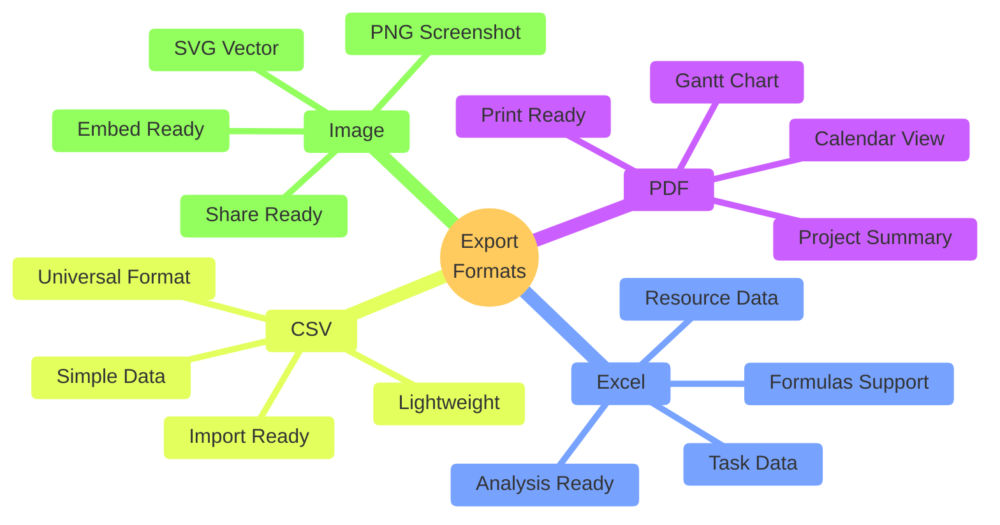
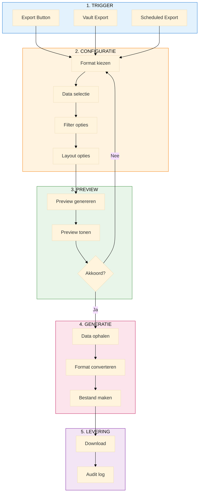
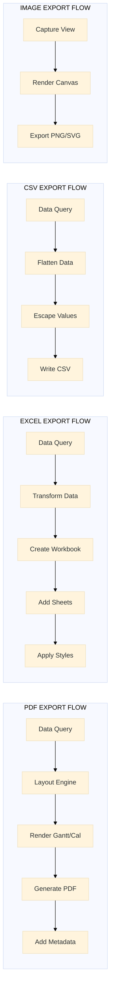
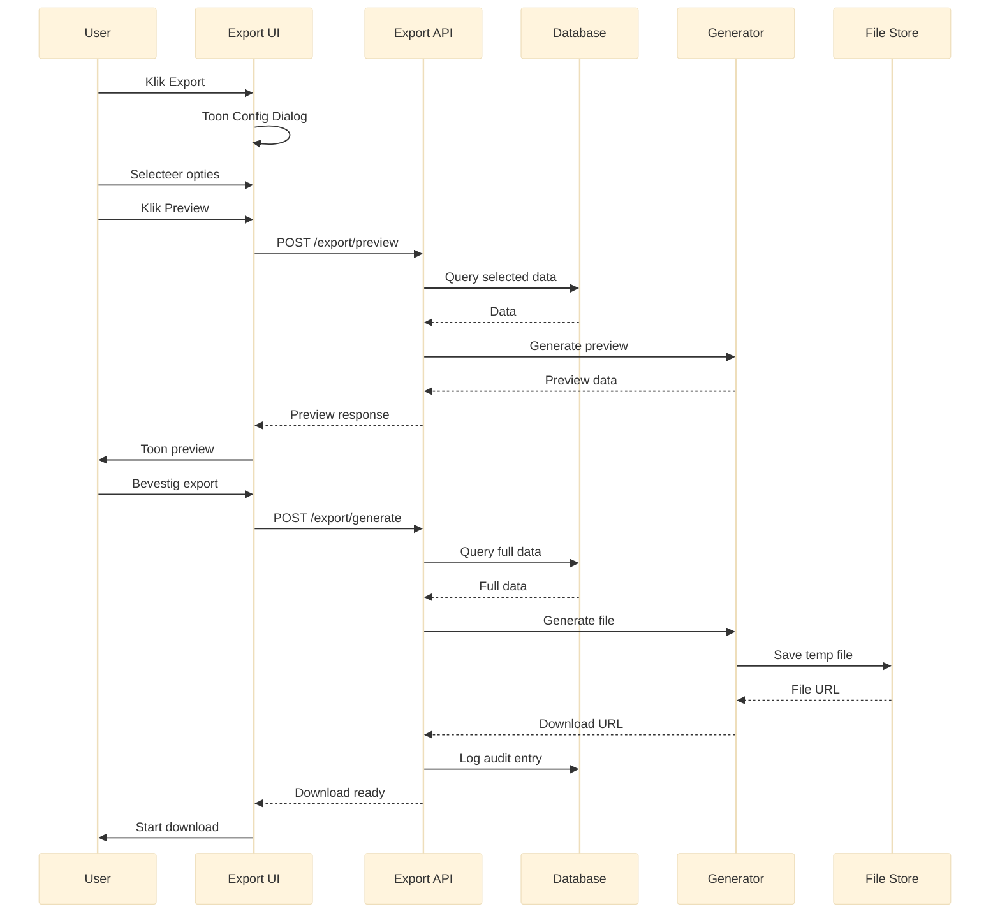

# M5: O7 Export Board Specificatie

> **Miro Board Specificatie voor Data Export**
> **Versie:** 1.0
> **Datum:** 2024-12-30
> **Agent:** A9 (Visual Designer)

---

## Overzicht

Dit document bevat de volledige specificatie voor het M5 Miro Board dat O7 (Data Export) visualiseert:

| Outcome | Beschrijving | Key Results |
|---------|--------------|-------------|
| **O7** | Data Export | KR7.1-7.12 (12 KRs) |

---

## Board Structuur

```
M5-EXPORT-BOARD
├── Frame 1: Header & Overview
├── Frame 2: Export Formats Overzicht
├── Frame 3: Export Flow Diagrams
├── Frame 4: PDF Layout Templates
├── Frame 5: Configuration UI Wireframes
├── Frame 6: Export Preview Mockups
└── Frame 7: Decisions & Future API
```

---

## Frame 1: Header & Overview

### Layout

```
┌─────────────────────────────────────────────────────────────────────────────┐
│                                                                              │
│   ╔══════════════════════════════════════════════════════════════════════╗  │
│   ║  M5: EXPORT BOARD                                                     ║  │
│   ║  O7: Data Export                                                      ║  │
│   ╚══════════════════════════════════════════════════════════════════════╝  │
│                                                                              │
│   ┌─────────────────────────────────────────────────────────────────────┐   │
│   │  OUTCOME                                                             │   │
│   │                                                                      │   │
│   │  O7: "Gevalideerde data kan geëxporteerd worden naar externe        │   │
│   │       systemen"                                                      │   │
│   │                                                                      │   │
│   │  Key Results:                                                        │   │
│   │  • KR7.1: Export module                                             │   │
│   │  • KR7.2-7.4: Export naar JSON, CSV, Excel                          │   │
│   │  • KR7.5-7.6: Export selectie en filter                             │   │
│   │  • KR7.7: Export preview                                            │   │
│   │  • KR7.8: Download als bestand                                      │   │
│   │  • KR7.9-7.12: Future-ready (API, webhooks)                         │   │
│   └─────────────────────────────────────────────────────────────────────┘   │
│                                                                              │
│   ┌────────────────┐  ┌────────────────┐  ┌────────────────┐               │
│   │ Versie: 1.0    │  │ Datum: 30-12   │  │ Status: Draft  │               │
│   └────────────────┘  └────────────────┘  └────────────────┘               │
│                                                                              │
│   EXPORT FORMATS:                                                           │
│   ┌────────┐  ┌────────┐  ┌────────┐  ┌────────┐                           │
│   │  PDF   │  │ Excel  │  │  CSV   │  │ Image  │                           │
│   │ 📄     │  │ 📊     │  │ 📋     │  │ 🖼️     │                           │
│   └────────┘  └────────┘  └────────┘  └────────┘                           │
│                                                                              │
└─────────────────────────────────────────────────────────────────────────────┘
```

---

## Frame 2: Export Formats Overzicht

### Mermaid Diagram - Format Comparison



### Format Comparison Matrix

```
┌─────────────────────────────────────────────────────────────────────────────┐
│  EXPORT FORMAT VERGELIJKING                                                 │
├─────────────────────────────────────────────────────────────────────────────┤
│                                                                              │
│  ┌────────────────────────────────────────────────────────────────────────┐ │
│  │ Aspect              │ PDF    │ Excel  │ CSV    │ Image  │              │ │
│  │ ────────────────────┼────────┼────────┼────────┼────────┤              │ │
│  │ DOEL                │        │        │        │        │              │ │
│  │ ────────────────────┼────────┼────────┼────────┼────────┤              │ │
│  │ Rapportage          │  ★★★   │  ★★    │   ★    │   ★    │              │ │
│  │ Data analyse        │   ★    │  ★★★   │  ★★★   │   -    │              │ │
│  │ Integratie          │   -    │  ★★    │  ★★★   │   -    │              │ │
│  │ Presentatie         │  ★★★   │   ★    │   -    │  ★★★   │              │ │
│  │ Archivering         │  ★★★   │  ★★    │  ★★    │  ★★    │              │ │
│  │ ────────────────────┼────────┼────────┼────────┼────────┤              │ │
│  │ CONTENT             │        │        │        │        │              │ │
│  │ ────────────────────┼────────┼────────┼────────┼────────┤              │ │
│  │ Gantt visualisatie  │   ✓    │   -    │   -    │   ✓    │              │ │
│  │ Calendar view       │   ✓    │   -    │   -    │   ✓    │              │ │
│  │ Task data           │   ✓    │   ✓    │   ✓    │   -    │              │ │
│  │ Resource data       │   ✓    │   ✓    │   ✓    │   -    │              │ │
│  │ Dependencies        │  vis   │  data  │  data  │  vis   │              │ │
│  │ Progress %          │   ✓    │   ✓    │   ✓    │   ✓    │              │ │
│  │ ────────────────────┼────────┼────────┼────────┼────────┤              │ │
│  │ TECHNISCH           │        │        │        │        │              │ │
│  │ ────────────────────┼────────┼────────┼────────┼────────┤              │ │
│  │ Bestandsgrootte     │ Medium │ Medium │ Klein  │ Groot  │              │ │
│  │ Generatie tijd      │ Medium │ Snel   │ Snel   │ Medium │              │ │
│  │ Offline bruikbaar   │   ✓    │   ✓    │   ✓    │   ✓    │              │ │
│  │ Editeerbaar         │   -    │   ✓    │   ✓    │   -    │              │ │
│  └────────────────────────────────────────────────────────────────────────┘ │
│                                                                              │
│  ★★★ = Beste keuze  ★★ = Geschikt  ★ = Mogelijk  - = Niet geschikt         │
│  vis = Visueel  data = Als data                                             │
│                                                                              │
└─────────────────────────────────────────────────────────────────────────────┘
```

### Use Cases per Format

```
┌─────────────────────────────────────────────────────────────────────────────┐
│  USE CASES PER EXPORT FORMAT                                                │
├─────────────────────────────────────────────────────────────────────────────┤
│                                                                              │
│  ┌───────────────────────────────────────────────────────────────────────┐ │
│  │  PDF                                                                   │ │
│  │  ─────────────────────────────────────────────────────────────────── │ │
│  │  • Klant rapportage: Project voortgang delen met stakeholders        │ │
│  │  • Print: Fysieke planning aan de muur                               │ │
│  │  • Archief: Eindstand project documenteren                           │ │
│  │  • Presentatie: Board meetings, status updates                        │ │
│  │  • ISO audit: Compliance documentatie                                │ │
│  └───────────────────────────────────────────────────────────────────────┘ │
│                                                                              │
│  ┌───────────────────────────────────────────────────────────────────────┐ │
│  │  EXCEL (.xlsx)                                                         │ │
│  │  ─────────────────────────────────────────────────────────────────── │ │
│  │  • Data analyse: Pivot tables, grafieken                             │ │
│  │  • Bulk bewerking: Wijzigingen voorbereiden voor import              │ │
│  │  • Resource planning: Uren analyse, capaciteit                       │ │
│  │  • Finance: Budget tracking, kosten overzicht                        │ │
│  │  • Custom reports: Management dashboards                              │ │
│  └───────────────────────────────────────────────────────────────────────┘ │
│                                                                              │
│  ┌───────────────────────────────────────────────────────────────────────┐ │
│  │  CSV                                                                   │ │
│  │  ─────────────────────────────────────────────────────────────────── │ │
│  │  • Tool integratie: Import in andere PM tools                        │ │
│  │  • Database import: ETL processen                                    │ │
│  │  • Scripting: Automatische verwerking                                │ │
│  │  • Backup: Simpele data backup                                       │ │
│  │  • Legacy systems: Oudere systemen zonder Excel support              │ │
│  └───────────────────────────────────────────────────────────────────────┘ │
│                                                                              │
│  ┌───────────────────────────────────────────────────────────────────────┐ │
│  │  IMAGE (PNG/SVG)                                                       │ │
│  │  ─────────────────────────────────────────────────────────────────── │ │
│  │  • Documentatie: Embed in Word, PowerPoint                           │ │
│  │  • Communicatie: Slack, Teams, Email                                 │ │
│  │  • Social: LinkedIn updates, blog posts                              │ │
│  │  • Training: Handleidingen, tutorials                                │ │
│  │  • Quick share: Snelle screenshot van status                         │ │
│  └───────────────────────────────────────────────────────────────────────┘ │
│                                                                              │
└─────────────────────────────────────────────────────────────────────────────┘
```

---

## Frame 3: Export Flow Diagrams

### Mermaid Diagram - Main Export Flow



### Export Flow per Format



### Detailed Export Sequence



---

## Frame 4: PDF Layout Templates

### Gantt PDF Template

```
┌─────────────────────────────────────────────────────────────────────────────┐
│  PDF TEMPLATE: GANTT CHART                                                  │
├─────────────────────────────────────────────────────────────────────────────┤
│                                                                              │
│  ┌─────────────────────────────────────────────────────────────────────┐   │
│  │                                                                      │   │
│  │  ┌────────────────────────────────────────────────────────────────┐ │   │
│  │  │  [LOGO]        PROJECT GANTT CHART           [Datum: 30-12-24] │ │   │
│  │  │                [Project Naam]                                   │ │   │
│  │  └────────────────────────────────────────────────────────────────┘ │   │
│  │                                                                      │   │
│  │  ┌────────────────────────────────────────────────────────────────┐ │   │
│  │  │ SAMENVATTING                                                   │ │   │
│  │  │ ────────────────────────────────────────────────────────────── │ │   │
│  │  │ Start: 01-12-2024    Einde: 31-03-2025    Voortgang: 45%      │ │   │
│  │  │ Taken: 24            Milestones: 5         Resources: 8        │ │   │
│  │  └────────────────────────────────────────────────────────────────┘ │   │
│  │                                                                      │   │
│  │  ┌────────────────────────────────────────────────────────────────┐ │   │
│  │  │ GANTT CHART                                                    │ │   │
│  │  │ ────────────────────────────────────────────────────────────── │ │   │
│  │  │                                                                 │ │   │
│  │  │  Task          │ Dec    │ Jan    │ Feb    │ Mar    │          │ │   │
│  │  │  ──────────────┼────────┼────────┼────────┼────────┤          │ │   │
│  │  │  Fase 1        │████████│        │        │        │          │ │   │
│  │  │  └─ Taak 1.1   │████░░░░│        │        │        │          │ │   │
│  │  │  └─ Taak 1.2   │    ████│████    │        │        │          │ │   │
│  │  │  Milestone 1   │        │   ◆    │        │        │          │ │   │
│  │  │  Fase 2        │        │    ████│████████│        │          │ │   │
│  │  │  └─ Taak 2.1   │        │    ████│████    │        │          │ │   │
│  │  │  └─ Taak 2.2   │        │        │████████│        │          │ │   │
│  │  │  Fase 3        │        │        │        │████████│          │ │   │
│  │  │                                                                 │ │   │
│  │  └────────────────────────────────────────────────────────────────┘ │   │
│  │                                                                      │   │
│  │  ┌────────────────────────────────────────────────────────────────┐ │   │
│  │  │ LEGENDA                                                        │ │   │
│  │  │ ████ Compleet  ░░░░ Gepland  ◆ Milestone  ─── Dependency      │ │   │
│  │  └────────────────────────────────────────────────────────────────┘ │   │
│  │                                                                      │   │
│  │  ┌────────────────────────────────────────────────────────────────┐ │   │
│  │  │ Pagina 1 van 3                    Gegenereerd: 30-12-2024 15:00│ │   │
│  │  └────────────────────────────────────────────────────────────────┘ │   │
│  │                                                                      │   │
│  └─────────────────────────────────────────────────────────────────────┘   │
│                                                                              │
│  OPTIES:                                                                    │
│  ┌─────────────────────────────────────────────────────────────────────┐   │
│  │ □ Toon dependencies          □ Toon critical path                   │   │
│  │ □ Toon resources             □ Toon voortgang %                     │   │
│  │ □ Toon baseline              □ Kleur per status                     │   │
│  │ Oriëntatie: ○ Landscape  ○ Portrait                                 │   │
│  │ Papierformaat: [A4 ▼]                                               │   │
│  └─────────────────────────────────────────────────────────────────────┘   │
│                                                                              │
└─────────────────────────────────────────────────────────────────────────────┘
```

### Calendar PDF Template

```
┌─────────────────────────────────────────────────────────────────────────────┐
│  PDF TEMPLATE: CALENDAR VIEW                                                │
├─────────────────────────────────────────────────────────────────────────────┤
│                                                                              │
│  ┌─────────────────────────────────────────────────────────────────────┐   │
│  │                                                                      │   │
│  │  ┌────────────────────────────────────────────────────────────────┐ │   │
│  │  │  [LOGO]        PROJECT CALENDAR              [December 2024]   │ │   │
│  │  │                [Project Naam]                                   │ │   │
│  │  └────────────────────────────────────────────────────────────────┘ │   │
│  │                                                                      │   │
│  │  ┌────────────────────────────────────────────────────────────────┐ │   │
│  │  │         DECEMBER 2024                                          │ │   │
│  │  │  ────────────────────────────────────────────────────────────  │ │   │
│  │  │  Ma   │ Di   │ Wo   │ Do   │ Vr   │ Za   │ Zo   │              │ │   │
│  │  │  ─────┼──────┼──────┼──────┼──────┼──────┼──────┤              │ │   │
│  │  │       │      │      │      │      │      │  1   │              │ │   │
│  │  │  ─────┼──────┼──────┼──────┼──────┼──────┼──────┤              │ │   │
│  │  │   2   │  3   │  4   │  5   │  6   │  7   │  8   │              │ │   │
│  │  │ ┌───┐ │      │      │      │      │      │      │              │ │   │
│  │  │ │T1 │ │      │      │      │      │      │      │              │ │   │
│  │  │ └───┘ │      │      │      │      │      │      │              │ │   │
│  │  │  ─────┼──────┼──────┼──────┼──────┼──────┼──────┤              │ │   │
│  │  │   9   │ 10   │ 11   │ 12   │ 13   │ 14   │ 15   │              │ │   │
│  │  │       │┌───┐ │      │      │      │      │      │              │ │   │
│  │  │       ││M1◆│ │      │      │      │      │      │              │ │   │
│  │  │       │└───┘ │      │      │      │      │      │              │ │   │
│  │  │  ─────┼──────┼──────┼──────┼──────┼──────┼──────┤              │ │   │
│  │  │  ...  │ ...  │ ...  │ ...  │ ...  │ ...  │ ...  │              │ │   │
│  │  │                                                                 │ │   │
│  │  └────────────────────────────────────────────────────────────────┘ │   │
│  │                                                                      │   │
│  │  ┌────────────────────────────────────────────────────────────────┐ │   │
│  │  │ EVENTS LIJST                                                   │ │   │
│  │  │ ────────────────────────────────────────────────────────────── │ │   │
│  │  │ 02-12: Taak 1.1 start                                          │ │   │
│  │  │ 10-12: ◆ Milestone 1 - Fase 1 compleet                         │ │   │
│  │  │ 15-12: Taak 2.1 deadline                                       │ │   │
│  │  └────────────────────────────────────────────────────────────────┘ │   │
│  │                                                                      │   │
│  └─────────────────────────────────────────────────────────────────────┘   │
│                                                                              │
│  OPTIES:                                                                    │
│  ┌─────────────────────────────────────────────────────────────────────┐   │
│  │ View: ○ Month  ○ Week  ○ Agenda                                    │   │
│  │ □ Toon weeknummers           □ Toon resources                       │   │
│  │ □ Toon task details          □ Kleur per categorie                  │   │
│  │ Maanden: [December ▼] tot [Maart ▼]                                 │   │
│  └─────────────────────────────────────────────────────────────────────┘   │
│                                                                              │
└─────────────────────────────────────────────────────────────────────────────┘
```

---

## Frame 5: Configuration UI Wireframes

### Export Dialog Wireframe

```
┌─────────────────────────────────────────────────────────────────────────────┐
│  EXPORT CONFIGURATIE DIALOG                                                 │
├─────────────────────────────────────────────────────────────────────────────┤
│                                                                              │
│  ┌─────────────────────────────────────────────────────────────────────┐   │
│  │                                                                      │   │
│  │  ╔══════════════════════════════════════════════════════════════╗   │   │
│  │  ║  EXPORT PROJECT DATA                                    [X]  ║   │   │
│  │  ╠══════════════════════════════════════════════════════════════╣   │   │
│  │  ║                                                               ║   │   │
│  │  ║  STAP 1: Kies Format                                         ║   │   │
│  │  ║  ─────────────────────────────────────────────────────────── ║   │   │
│  │  ║                                                               ║   │   │
│  │  ║  ┌────────┐  ┌────────┐  ┌────────┐  ┌────────┐             ║   │   │
│  │  ║  │  PDF   │  │ Excel  │  │  CSV   │  │ Image  │             ║   │   │
│  │  ║  │  📄    │  │  📊    │  │  📋    │  │  🖼️    │             ║   │   │
│  │  ║  │[active]│  │        │  │        │  │        │             ║   │   │
│  │  ║  └────────┘  └────────┘  └────────┘  └────────┘             ║   │   │
│  │  ║                                                               ║   │   │
│  │  ║  STAP 2: Data Selectie                                       ║   │   │
│  │  ║  ─────────────────────────────────────────────────────────── ║   │   │
│  │  ║                                                               ║   │   │
│  │  ║  ☑ Taken                    ☑ Milestones                     ║   │   │
│  │  ║  ☑ Resources                ☐ Dependencies                   ║   │   │
│  │  ║  ☑ Voortgang %              ☐ Notities                       ║   │   │
│  │  ║  ☐ Baseline data            ☐ Custom velden                  ║   │   │
│  │  ║                                                               ║   │   │
│  │  ║  STAP 3: Filters                                             ║   │   │
│  │  ║  ─────────────────────────────────────────────────────────── ║   │   │
│  │  ║                                                               ║   │   │
│  │  ║  Datum bereik:                                               ║   │   │
│  │  ║  Van: [01-12-2024] Tot: [31-03-2025]                         ║   │   │
│  │  ║                                                               ║   │   │
│  │  ║  Status: [Alle ▼]                                            ║   │   │
│  │  ║  Resource: [Alle ▼]                                          ║   │   │
│  │  ║                                                               ║   │   │
│  │  ║  STAP 4: Layout Opties (PDF)                                 ║   │   │
│  │  ║  ─────────────────────────────────────────────────────────── ║   │   │
│  │  ║                                                               ║   │   │
│  │  ║  View: ○ Gantt Chart  ○ Calendar  ○ Task List               ║   │   │
│  │  ║  Oriëntatie: ○ Landscape  ○ Portrait                        ║   │   │
│  │  ║  Papier: [A4 ▼]                                              ║   │   │
│  │  ║                                                               ║   │   │
│  │  ║  ☑ Include header           ☑ Include footer                 ║   │   │
│  │  ║  ☑ Include legenda          ☑ Include samenvatting           ║   │   │
│  │  ║  ☐ Include logo             Logo: [Upload...]                ║   │   │
│  │  ║                                                               ║   │   │
│  │  ╠══════════════════════════════════════════════════════════════╣   │   │
│  │  ║                                                               ║   │   │
│  │  ║  [Annuleren]          [Preview]          [Exporteren]        ║   │   │
│  │  ║                                                               ║   │   │
│  │  ╚══════════════════════════════════════════════════════════════╝   │   │
│  │                                                                      │   │
│  └─────────────────────────────────────────────────────────────────────┘   │
│                                                                              │
└─────────────────────────────────────────────────────────────────────────────┘
```

### Format-Specific Options

```
┌─────────────────────────────────────────────────────────────────────────────┐
│  FORMAT-SPECIFIEKE OPTIES                                                   │
├─────────────────────────────────────────────────────────────────────────────┤
│                                                                              │
│  PDF OPTIES                                                                 │
│  ┌─────────────────────────────────────────────────────────────────────┐   │
│  │ View Type                                                           │   │
│  │ ○ Gantt Chart (timeline visualisatie)                               │   │
│  │ ○ Calendar (maand/week overzicht)                                   │   │
│  │ ○ Task List (tabel formaat)                                         │   │
│  │ ○ Project Summary (executive overview)                              │   │
│  │                                                                      │   │
│  │ Gantt Opties (indien geselecteerd):                                 │   │
│  │ ☐ Show dependencies       ☐ Show critical path                      │   │
│  │ ☐ Show baseline           ☐ Show progress line                      │   │
│  │ ☐ Color by status         ☐ Color by resource                       │   │
│  │                                                                      │   │
│  │ Zoom: [Auto-fit ▼] (dag/week/maand/kwartaal)                        │   │
│  └─────────────────────────────────────────────────────────────────────┘   │
│                                                                              │
│  EXCEL OPTIES                                                               │
│  ┌─────────────────────────────────────────────────────────────────────┐   │
│  │ Sheets te genereren:                                                │   │
│  │ ☑ Tasks (alle taken met details)                                    │   │
│  │ ☑ Resources (resource overzicht)                                    │   │
│  │ ☐ Assignments (resource-task koppeling)                             │   │
│  │ ☐ Dependencies (dependency matrix)                                  │   │
│  │ ☐ Timeline (datum per taak)                                         │   │
│  │                                                                      │   │
│  │ ☑ Include formulas (berekende velden)                               │   │
│  │ ☑ Apply formatting (kleuren, borders)                               │   │
│  │ ☐ Include pivot table template                                      │   │
│  └─────────────────────────────────────────────────────────────────────┘   │
│                                                                              │
│  CSV OPTIES                                                                 │
│  ┌─────────────────────────────────────────────────────────────────────┐   │
│  │ Delimiter: ○ Comma (,)  ○ Semicolon (;)  ○ Tab                     │   │
│  │ Encoding: [UTF-8 ▼]                                                 │   │
│  │                                                                      │   │
│  │ ☑ Include header row                                                │   │
│  │ ☐ Quote all values                                                  │   │
│  │ ☐ Flatten hierarchical data                                         │   │
│  │                                                                      │   │
│  │ Date format: [DD-MM-YYYY ▼]                                         │   │
│  └─────────────────────────────────────────────────────────────────────┘   │
│                                                                              │
│  IMAGE OPTIES                                                               │
│  ┌─────────────────────────────────────────────────────────────────────┐   │
│  │ Format: ○ PNG  ○ SVG                                                │   │
│  │                                                                      │   │
│  │ Resolution (PNG):                                                    │   │
│  │ ○ Screen (72 dpi)  ○ Print (150 dpi)  ○ High (300 dpi)             │   │
│  │                                                                      │   │
│  │ ☑ Include toolbar                                                   │   │
│  │ ☐ Transparent background (PNG only)                                 │   │
│  │                                                                      │   │
│  │ Capture area:                                                       │   │
│  │ ○ Visible viewport  ○ Full timeline  ○ Custom selection            │   │
│  └─────────────────────────────────────────────────────────────────────┘   │
│                                                                              │
└─────────────────────────────────────────────────────────────────────────────┘
```

---

## Frame 6: Export Preview Mockups

### Preview Panel Wireframe

```
┌─────────────────────────────────────────────────────────────────────────────┐
│  EXPORT PREVIEW                                                             │
├─────────────────────────────────────────────────────────────────────────────┤
│                                                                              │
│  ┌─────────────────────────────────────────────────────────────────────┐   │
│  │                                                                      │   │
│  │  ╔══════════════════════════════════════════════════════════════╗   │   │
│  │  ║  EXPORT PREVIEW                                         [X]  ║   │   │
│  │  ╠══════════════════════════════════════════════════════════════╣   │   │
│  │  ║                                                               ║   │   │
│  │  ║  Format: PDF (Gantt Chart)                                   ║   │   │
│  │  ║  Geschatte grootte: 2.4 MB                                   ║   │   │
│  │  ║  Pagina's: 3                                                 ║   │   │
│  │  ║                                                               ║   │   │
│  │  ║  ┌────────────────────────────────────────────────────────┐  ║   │   │
│  │  ║  │                                                         │  ║   │   │
│  │  ║  │    [PREVIEW THUMBNAIL]                                  │  ║   │   │
│  │  ║  │                                                         │  ║   │   │
│  │  ║  │    ┌─────────────────────────────────────────────────┐ │  ║   │   │
│  │  ║  │    │ PROJECT GANTT CHART                             │ │  ║   │   │
│  │  ║  │    │ ─────────────────────────────────────────────── │ │  ║   │   │
│  │  ║  │    │                                                  │ │  ║   │   │
│  │  ║  │    │ Task        │ Dec │ Jan │ Feb │ Mar │           │ │  ║   │   │
│  │  ║  │    │ ────────────┼─────┼─────┼─────┼─────┤           │ │  ║   │   │
│  │  ║  │    │ Fase 1      │█████│     │     │     │           │ │  ║   │   │
│  │  ║  │    │ └─ Taak 1   │███░░│     │     │     │           │ │  ║   │   │
│  │  ║  │    │ └─ Taak 2   │  ███│███  │     │     │           │ │  ║   │   │
│  │  ║  │    │ Fase 2      │     │  ███│█████│     │           │ │  ║   │   │
│  │  ║  │    │             │     │     │     │     │           │ │  ║   │   │
│  │  ║  │    └─────────────────────────────────────────────────┘ │  ║   │   │
│  │  ║  │                                                         │  ║   │   │
│  │  ║  └────────────────────────────────────────────────────────┘  ║   │   │
│  │  ║                                                               ║   │   │
│  │  ║  [< Vorige]  Pagina 1 van 3  [Volgende >]  [Zoom +] [Zoom -] ║   │   │
│  │  ║                                                               ║   │   │
│  │  ║  DATA SAMENVATTING                                           ║   │   │
│  │  ║  ─────────────────────────────────────────────────────────── ║   │   │
│  │  ║  • 24 taken geselecteerd                                     ║   │   │
│  │  ║  • 5 milestones                                              ║   │   │
│  │  ║  • 8 resources                                               ║   │   │
│  │  ║  • Periode: 01-12-2024 tot 31-03-2025                        ║   │   │
│  │  ║                                                               ║   │   │
│  │  ╠══════════════════════════════════════════════════════════════╣   │   │
│  │  ║                                                               ║   │   │
│  │  ║  [Terug naar Opties]              [Download Export]          ║   │   │
│  │  ║                                                               ║   │   │
│  │  ╚══════════════════════════════════════════════════════════════╝   │   │
│  │                                                                      │   │
│  └─────────────────────────────────────────────────────────────────────┘   │
│                                                                              │
└─────────────────────────────────────────────────────────────────────────────┘
```

### Export Success State

```
┌─────────────────────────────────────────────────────────────────────────────┐
│  EXPORT SUCCESS STATE                                                       │
├─────────────────────────────────────────────────────────────────────────────┤
│                                                                              │
│  ┌─────────────────────────────────────────────────────────────────────┐   │
│  │                                                                      │   │
│  │  ╔══════════════════════════════════════════════════════════════╗   │   │
│  │  ║                                                               ║   │   │
│  │  ║                         ✓                                     ║   │   │
│  │  ║                                                               ║   │   │
│  │  ║                  EXPORT SUCCESVOL                             ║   │   │
│  │  ║                                                               ║   │   │
│  │  ║  ─────────────────────────────────────────────────────────── ║   │   │
│  │  ║                                                               ║   │   │
│  │  ║  Bestand: Project-Alpha_Gantt_2024-12-30.pdf                 ║   │   │
│  │  ║  Grootte: 2.4 MB                                             ║   │   │
│  │  ║  Geëxporteerd: 30-12-2024 15:32:45                           ║   │   │
│  │  ║                                                               ║   │   │
│  │  ║  ┌────────────────────────────────────────────────────────┐  ║   │   │
│  │  ║  │                                                         │  ║   │   │
│  │  ║  │                  [Download Opnieuw]                     │  ║   │   │
│  │  ║  │                                                         │  ║   │   │
│  │  ║  └────────────────────────────────────────────────────────┘  ║   │   │
│  │  ║                                                               ║   │   │
│  │  ║  [Nieuwe Export]                                [Sluiten]    ║   │   │
│  │  ║                                                               ║   │   │
│  │  ╚══════════════════════════════════════════════════════════════╝   │   │
│  │                                                                      │   │
│  └─────────────────────────────────────────────────────────────────────┘   │
│                                                                              │
│  TOAST NOTIFICATION:                                                        │
│  ┌─────────────────────────────────────────────────────────────────────┐   │
│  │ ✓ Export gedownload: Project-Alpha_Gantt_2024-12-30.pdf            │   │
│  └─────────────────────────────────────────────────────────────────────┘   │
│                                                                              │
└─────────────────────────────────────────────────────────────────────────────┘
```

---

## Frame 7: Decisions & Future API

### Architecture Decisions

```
┌─────────────────────────────────────────────────────────────────────────────┐
│  ARCHITECTUUR BESLISSINGEN - EXPORT                                         │
├─────────────────────────────────────────────────────────────────────────────┤
│                                                                              │
│  ┌─────────────────────────────────────────────────────────────────────┐   │
│  │  ✅ BESLUIT: Client-side PDF generatie (jsPDF + html2canvas)        │   │
│  │  ─────────────────────────────────────────────────────────────────  │   │
│  │  Reden: Geen server load, sneller, privacy (data blijft local)      │   │
│  │  Alternatief: Server-side (puppeteer) - te complex voor MVP         │   │
│  │  Status: DEFINITIEF                                                  │   │
│  └─────────────────────────────────────────────────────────────────────┘   │
│                                                                              │
│  ┌─────────────────────────────────────────────────────────────────────┐   │
│  │  ✅ BESLUIT: SheetJS voor Excel export                              │   │
│  │  ─────────────────────────────────────────────────────────────────  │   │
│  │  Reden: Pure JS, geen server nodig, uitgebreide features            │   │
│  │  Alternatief: ExcelJS (iets groter bundle size)                     │   │
│  │  Status: DEFINITIEF                                                  │   │
│  └─────────────────────────────────────────────────────────────────────┘   │
│                                                                              │
│  ┌─────────────────────────────────────────────────────────────────────┐   │
│  │  ✅ BESLUIT: Bryntum native export voor Image                       │   │
│  │  ─────────────────────────────────────────────────────────────────  │   │
│  │  Reden: Beste kwaliteit, native component support                   │   │
│  │  Alternatief: Custom canvas rendering (meer werk)                   │   │
│  │  Status: DEFINITIEF                                                  │   │
│  └─────────────────────────────────────────────────────────────────────┘   │
│                                                                              │
│  ┌─────────────────────────────────────────────────────────────────────┐   │
│  │  ✅ BESLUIT: Preview altijd voor export                             │   │
│  │  ─────────────────────────────────────────────────────────────────  │   │
│  │  Reden: Voorkomt foute exports, gebruiker controle                  │   │
│  │  Alternatief: Direct downloaden (geen preview)                      │   │
│  │  Status: DEFINITIEF                                                  │   │
│  └─────────────────────────────────────────────────────────────────────┘   │
│                                                                              │
└─────────────────────────────────────────────────────────────────────────────┘
```

### Future API Structure (KR7.10-7.12)

```mermaid
%%{init: {'theme': 'base'}}%%
flowchart TB
    subgraph Current["MVP: HANDMATIGE EXPORT"]
        UI[Export UI]
        Client[Client-side Generation]
        Download[Browser Download]

        UI --> Client
        Client --> Download
    end

    subgraph Future["FUTURE: API EXPORT"]
        API["/api/export"]
        Auth[API Key Auth]
        Queue[Job Queue]
        Worker[Export Worker]
        Storage[Temp Storage]
        Webhook[Webhook Callback]

        API --> Auth
        Auth --> Queue
        Queue --> Worker
        Worker --> Storage
        Storage --> Webhook
    end

    style Current fill:#e8f5e9,stroke:#388e3c
    style Future fill:#e3f2fd,stroke:#1976d2
```



### Future API Documentation

```
┌─────────────────────────────────────────────────────────────────────────────┐
│  FUTURE API STRUCTURE (gedocumenteerd, niet geïmplementeerd)                │
├─────────────────────────────────────────────────────────────────────────────┤
│                                                                              │
│  ENDPOINTS (KR7.10)                                                         │
│  ┌─────────────────────────────────────────────────────────────────────┐   │
│  │                                                                      │   │
│  │  POST /api/v1/export                                                │   │
│  │  ─────────────────────────────────────────────────────────────────  │   │
│  │  Request:                                                           │   │
│  │  {                                                                   │   │
│  │    "workspace_id": "uuid",                                          │   │
│  │    "project_id": "uuid",                                            │   │
│  │    "format": "pdf|excel|csv|json",                                  │   │
│  │    "options": {                                                      │   │
│  │      "include_tasks": true,                                         │   │
│  │      "include_resources": true,                                     │   │
│  │      "date_from": "2024-12-01",                                     │   │
│  │      "date_to": "2025-03-31"                                        │   │
│  │    },                                                                │   │
│  │    "callback_url": "https://client.com/webhook"                     │   │
│  │  }                                                                   │   │
│  │                                                                      │   │
│  │  Response (202 Accepted):                                           │   │
│  │  {                                                                   │   │
│  │    "export_id": "uuid",                                             │   │
│  │    "status": "queued",                                              │   │
│  │    "estimated_completion": "2024-12-30T15:35:00Z"                   │   │
│  │  }                                                                   │   │
│  │                                                                      │   │
│  └─────────────────────────────────────────────────────────────────────┘   │
│                                                                              │
│  ┌─────────────────────────────────────────────────────────────────────┐   │
│  │                                                                      │   │
│  │  GET /api/v1/export/{export_id}                                     │   │
│  │  ─────────────────────────────────────────────────────────────────  │   │
│  │  Response:                                                          │   │
│  │  {                                                                   │   │
│  │    "export_id": "uuid",                                             │   │
│  │    "status": "completed",                                           │   │
│  │    "download_url": "https://storage.../export.pdf",                 │   │
│  │    "expires_at": "2024-12-30T16:35:00Z"                             │   │
│  │  }                                                                   │   │
│  │                                                                      │   │
│  └─────────────────────────────────────────────────────────────────────┘   │
│                                                                              │
│  AUTHENTICATION (KR7.11)                                                    │
│  ┌─────────────────────────────────────────────────────────────────────┐   │
│  │                                                                      │   │
│  │  Header: Authorization: Bearer <api_key>                            │   │
│  │                                                                      │   │
│  │  API Keys:                                                          │   │
│  │  • Generated per workspace                                          │   │
│  │  • Role-based scopes                                                │   │
│  │  • Expiration support                                               │   │
│  │  • Rate limiting per key                                            │   │
│  │                                                                      │   │
│  └─────────────────────────────────────────────────────────────────────┘   │
│                                                                              │
│  WEBHOOK (KR7.12)                                                           │
│  ┌─────────────────────────────────────────────────────────────────────┐   │
│  │                                                                      │   │
│  │  POST callback_url                                                  │   │
│  │  ─────────────────────────────────────────────────────────────────  │   │
│  │  Payload:                                                           │   │
│  │  {                                                                   │   │
│  │    "event": "export.completed",                                     │   │
│  │    "export_id": "uuid",                                             │   │
│  │    "status": "completed",                                           │   │
│  │    "download_url": "https://...",                                   │   │
│  │    "file_size": 2457600,                                            │   │
│  │    "timestamp": "2024-12-30T15:32:45Z"                              │   │
│  │  }                                                                   │   │
│  │                                                                      │   │
│  │  Signature: X-Webhook-Signature: sha256=...                         │   │
│  │                                                                      │   │
│  └─────────────────────────────────────────────────────────────────────┘   │
│                                                                              │
│  STATUS: GEDOCUMENTEERD - Niet geïmplementeerd in MVP                       │
│                                                                              │
└─────────────────────────────────────────────────────────────────────────────┘
```

---

## Gerelateerde Documenten

| Relatie | Document | Beschrijving |
|---------|----------|--------------|
| Visualizes | OUTCOMES.md | O7 Key Results (12 KRs) |
| References | D10 | Export Module |
| References | D2-D5 | View modules (data source) |
| Links to | M4 | Security Board (export permissions) |

---

## Versie Historie

| Versie | Datum | Auteur | Wijzigingen |
|--------|-------|--------|-------------|
| 1.0 | 2024-12-30 | A9 | Initieel document |

---

*Document versie: 1.0*
*Laatst bijgewerkt: 30 December 2024*
*Frames: 7 | Mermaid Diagrams: 5*
