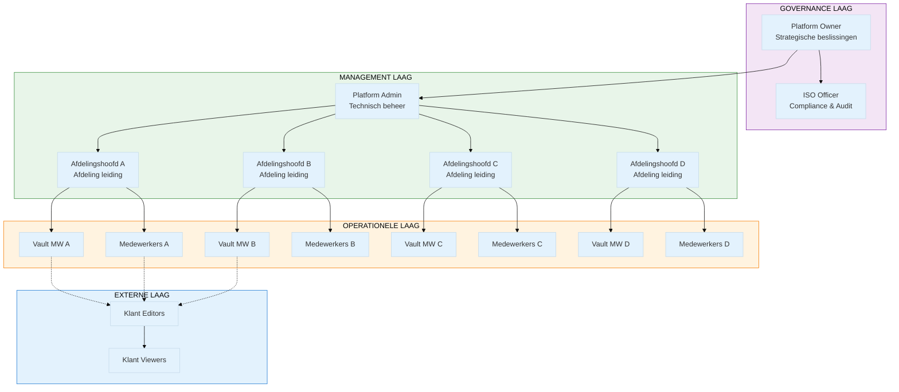
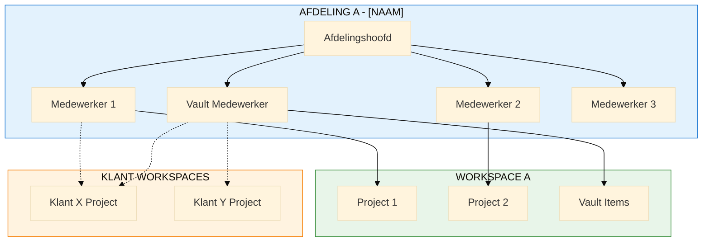
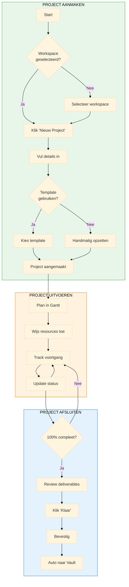
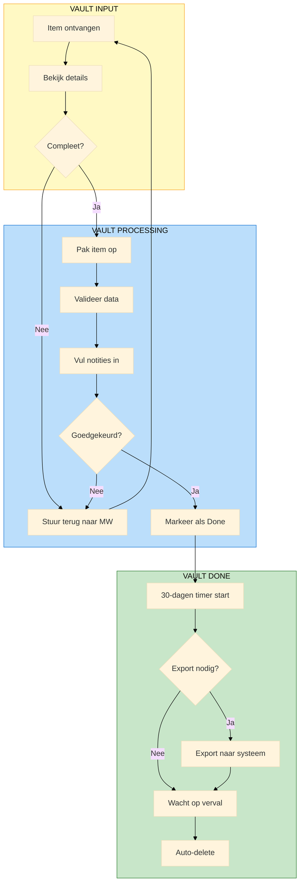
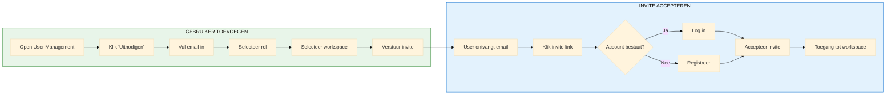
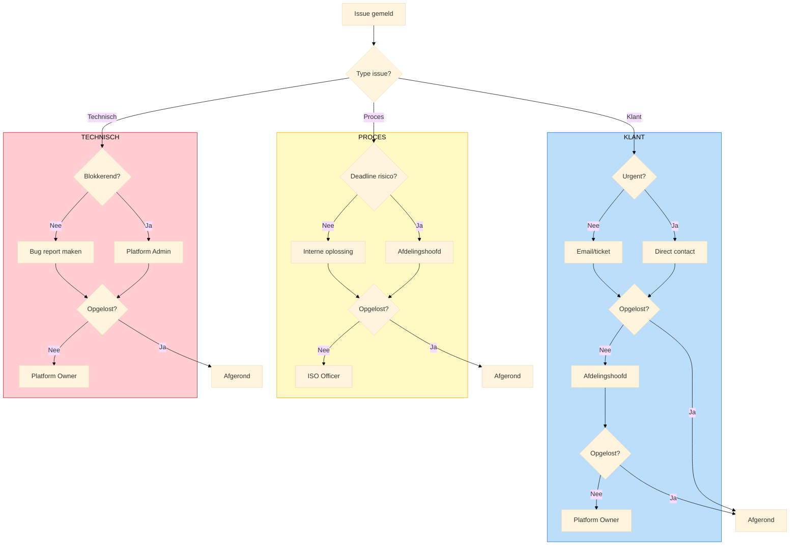
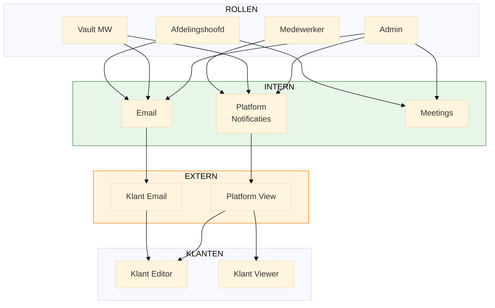
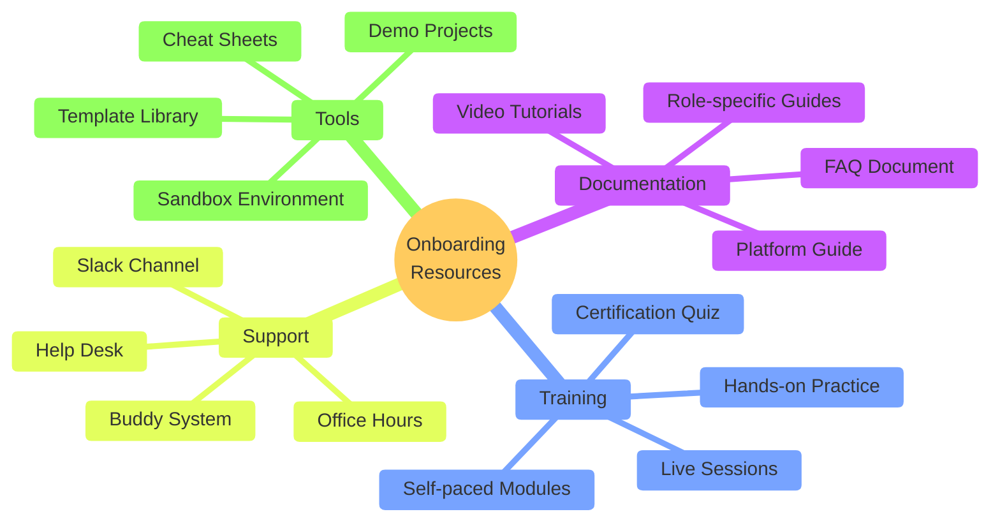

# M7: O9 Rollen & Procedures Board Specificatie

> **Miro Board Specificatie voor Rollen & Procedures**
> **Versie:** 1.0
> **Datum:** 2024-12-30
> **Agent:** A9 (Visual Designer)

---

## Overzicht

Dit document bevat de volledige specificatie voor het M7 Miro Board dat O9 (Rollen & Procedures) visualiseert:

| Outcome | Beschrijving | Key Results |
|---------|--------------|-------------|
| **O9** | Rollen & Procedures | KR9.1-9.50 (50 KRs) |

---

## Board Structuur

```
M7-ROLLEN-BOARD
├── Frame 1: Header & Overview
├── Frame 2: Organisatie Structuur Diagram
├── Frame 3: Department Hierarchie
├── Frame 4: Procedure Flowcharts
├── Frame 5: Decision Trees voor Escalatie
├── Frame 6: Communication Flows
├── Frame 7: Onboarding Journey Maps per Rol
└── Frame 8: Decisions & Notes
```

---

## Frame 1: Header & Overview

### Layout

```
┌─────────────────────────────────────────────────────────────────────────────┐
│                                                                              │
│   ╔══════════════════════════════════════════════════════════════════════╗  │
│   ║  M7: ROLLEN & PROCEDURES BOARD                                        ║  │
│   ║  O9: Rollen & Procedures                                              ║  │
│   ╚══════════════════════════════════════════════════════════════════════╝  │
│                                                                              │
│   ┌─────────────────────────────────────────────────────────────────────┐   │
│   │  OUTCOME                                                             │   │
│   │                                                                      │   │
│   │  O9: "Alle rollen, procedures, terminologie en classificaties       │   │
│   │       uitgewerkt"                                                    │   │
│   │                                                                      │   │
│   │  Categorieën (50 Key Results):                                      │   │
│   │  • KR9.1-9.5: Platform Rollen (5)                                   │   │
│   │  • KR9.6-9.9: Organisatie Rollen (4)                                │   │
│   │  • KR9.10-9.17: Platform Procedures (8)                             │   │
│   │  • KR9.18-9.22: Vault Procedures (5)                                │   │
│   │  • KR9.23-9.28: Klant Procedures (6)                                │   │
│   │  • KR9.29-9.33: ISO Procedures (5)                                  │   │
│   │  • KR9.34-9.37: Communicatie Procedures (4)                         │   │
│   │  • KR9.38-9.42: Glossary (5)                                        │   │
│   │  • KR9.43-9.50: Taxonomie (8)                                       │   │
│   └─────────────────────────────────────────────────────────────────────┘   │
│                                                                              │
│   ┌────────────────┐  ┌────────────────┐  ┌────────────────┐               │
│   │ Versie: 1.0    │  │ Datum: 30-12   │  │ Status: Draft  │               │
│   └────────────────┘  └────────────────┘  └────────────────┘               │
│                                                                              │
│   GERELATEERDE DOCUMENTEN:                                                  │
│   ┌────────┐  ┌────────┐  ┌────────┐  ┌────────┐  ┌────────┐              │
│   │   P1   │  │   P2   │  │   P3   │  │   P4   │  │   P5   │              │
│   │ROLLEN  │  │PROCED. │  │GLOSSARY│  │TAXONOMY│  │ONBOARD │              │
│   └────────┘  └────────┘  └────────┘  └────────┘  └────────┘              │
│                                                                              │
└─────────────────────────────────────────────────────────────────────────────┘
```

---

## Frame 2: Organisatie Structuur Diagram

### Mermaid Diagram - Full Organization



### Organisatie Structuur Detail

```
┌─────────────────────────────────────────────────────────────────────────────┐
│  ORGANISATIE STRUCTUUR - VOLLEDIG OVERZICHT                                 │
├─────────────────────────────────────────────────────────────────────────────┤
│                                                                              │
│                           ┌───────────────────┐                             │
│                           │   PLATFORM OWNER  │                             │
│                           │   (Strategisch)   │                             │
│                           └─────────┬─────────┘                             │
│                                     │                                        │
│                     ┌───────────────┼───────────────┐                       │
│                     │               │               │                        │
│                     ▼               ▼               ▼                        │
│            ┌────────────────┐ ┌───────────┐ ┌────────────────┐              │
│            │ PLATFORM ADMIN │ │ISO OFFICER│ │ (toekomstig)   │              │
│            │  (Technisch)   │ │(Compliance)│ │                │              │
│            └───────┬────────┘ └───────────┘ └────────────────┘              │
│                    │                                                         │
│    ┌───────────────┼───────────────┬───────────────┬───────────────┐        │
│    ▼               ▼               ▼               ▼               ▼        │
│ ┌──────────┐ ┌──────────┐ ┌──────────┐ ┌──────────┐                        │
│ │AFDELING A│ │AFDELING B│ │AFDELING C│ │AFDELING D│                        │
│ │──────────│ │──────────│ │──────────│ │──────────│                        │
│ │ Hoofd    │ │ Hoofd    │ │ Hoofd    │ │ Hoofd    │                        │
│ │ Vault MW │ │ Vault MW │ │ Vault MW │ │ Vault MW │                        │
│ │ MWs      │ │ MWs      │ │ MWs      │ │ MWs      │                        │
│ └────┬─────┘ └────┬─────┘ └────┬─────┘ └────┬─────┘                        │
│      │            │            │            │                               │
│      │            │            │            │                               │
│      ▼            ▼            ▼            ▼                               │
│ ┌──────────────────────────────────────────────────┐                       │
│ │              KLANT PROJECTEN                      │                       │
│ │  ┌─────────┐ ┌─────────┐ ┌─────────┐ ┌─────────┐│                       │
│ │  │Klant X  │ │Klant Y  │ │Klant Z  │ │ ...     ││                       │
│ │  │Editors  │ │Editors  │ │Editors  │ │         ││                       │
│ │  │Viewers  │ │Viewers  │ │Viewers  │ │         ││                       │
│ │  └─────────┘ └─────────┘ └─────────┘ └─────────┘│                       │
│ └──────────────────────────────────────────────────┘                       │
│                                                                              │
│  LEGENDA:                                                                   │
│  ━━━ = Directe rapportage                                                  │
│  --- = Functionele relatie                                                  │
│  ... = Optionele/toekomstige relatie                                       │
│                                                                              │
└─────────────────────────────────────────────────────────────────────────────┘
```

---

## Frame 3: Department Hierarchie

### Mermaid Diagram - Department Structure



### Role Cards per Department

```
┌─────────────────────────────────────────────────────────────────────────────┐
│  AFDELINGSSTRUCTUUR - DETAIL VIEW                                           │
├─────────────────────────────────────────────────────────────────────────────┤
│                                                                              │
│  ┌───────────────────────────────────────────────────────────────────────┐ │
│  │  AFDELINGSHOOFD                                            [ORG]      │ │
│  │  ─────────────────────────────────────────────────────────────────── │ │
│  │                                                                        │ │
│  │  VERANTWOORDELIJKHEDEN:                                               │ │
│  │  • Leidt de afdeling en stuurt medewerkers aan                        │ │
│  │  • Bewaakt voortgang van projecten binnen afdeling                    │ │
│  │  • Escaleert issues naar Platform Admin                               │ │
│  │  • Beoordeelt resource allocatie                                      │ │
│  │  • Controleert kwaliteit van deliverables                             │ │
│  │                                                                        │ │
│  │  PLATFORM ROL: Vaak Admin of Vault Medewerker                         │ │
│  │  REPORTS TO: Platform Owner                                           │ │
│  │  SUPERVISES: Vault MW, Medewerkers                                    │ │
│  │                                                                        │ │
│  │  DAGELIJKSE TAKEN:                                                    │ │
│  │  □ Review project dashboards                                          │ │
│  │  □ Team standup/sync                                                  │ │
│  │  □ Klant communicatie (escalaties)                                    │ │
│  │  □ Resource planning                                                  │ │
│  │                                                                        │ │
│  └───────────────────────────────────────────────────────────────────────┘ │
│                                                                              │
│  ┌───────────────────────────────────────────────────────────────────────┐ │
│  │  PROJECTLEIDER                                             [ORG]      │ │
│  │  ─────────────────────────────────────────────────────────────────── │ │
│  │                                                                        │ │
│  │  VERANTWOORDELIJKHEDEN:                                               │ │
│  │  • Leidt specifieke projecten                                         │ │
│  │  • Plant en bewaakt tijdlijnen (Gantt)                                │ │
│  │  • Coördineert tussen afdeling en klant                               │ │
│  │  • Houdt project administratie bij                                    │ │
│  │  • Markeert projecten als "klaar"                                     │ │
│  │                                                                        │ │
│  │  PLATFORM ROL: Medewerker (soms Vault MW)                             │ │
│  │  REPORTS TO: Afdelingshoofd                                           │ │
│  │  SUPERVISES: Project teamleden                                        │ │
│  │                                                                        │ │
│  │  DAGELIJKSE TAKEN:                                                    │ │
│  │  □ Update project planning                                            │ │
│  │  □ Team coördinatie                                                   │ │
│  │  □ Status updates naar klant                                          │ │
│  │  □ Risk management                                                    │ │
│  │                                                                        │ │
│  └───────────────────────────────────────────────────────────────────────┘ │
│                                                                              │
│  ┌───────────────────────────────────────────────────────────────────────┐ │
│  │  ISO OFFICER                                               [ORG]      │ │
│  │  ─────────────────────────────────────────────────────────────────── │ │
│  │                                                                        │ │
│  │  VERANTWOORDELIJKHEDEN:                                               │ │
│  │  • Bewaakt ISO compliance binnen platform                             │ │
│  │  • Voert periodieke audits uit                                        │ │
│  │  • Beheert procedure documentatie                                     │ │
│  │  • Training voor nieuwe procedures                                    │ │
│  │  • Escalatie bij compliance issues                                    │ │
│  │                                                                        │ │
│  │  PLATFORM ROL: Admin (read-only op alle data voor audit)             │ │
│  │  REPORTS TO: Platform Owner                                           │ │
│  │  SUPERVISES: N/A (adviserende rol)                                   │ │
│  │                                                                        │ │
│  │  PERIODIEKE TAKEN:                                                    │ │
│  │  □ Kwartaal audit report                                              │ │
│  │  □ Jaarlijkse procedure review                                        │ │
│  │  □ Training sessies                                                   │ │
│  │  □ Audit trail reviews                                                │ │
│  │                                                                        │ │
│  └───────────────────────────────────────────────────────────────────────┘ │
│                                                                              │
│  ┌───────────────────────────────────────────────────────────────────────┐ │
│  │  PLATFORM OWNER                                            [ORG]      │ │
│  │  ─────────────────────────────────────────────────────────────────── │ │
│  │                                                                        │ │
│  │  VERANTWOORDELIJKHEDEN:                                               │ │
│  │  • Strategische beslissingen over platform                            │ │
│  │  • Budget en resource goedkeuring                                     │ │
│  │  • Finale escalatie punt                                              │ │
│  │  • Stakeholder management                                             │ │
│  │  • Visie en roadmap                                                   │ │
│  │                                                                        │ │
│  │  PLATFORM ROL: Admin (super admin rechten)                            │ │
│  │  REPORTS TO: N/A (hoogste niveau)                                     │ │
│  │  SUPERVISES: Platform Admin, Afdelingshoofden                         │ │
│  │                                                                        │ │
│  └───────────────────────────────────────────────────────────────────────┘ │
│                                                                              │
└─────────────────────────────────────────────────────────────────────────────┘
```

---

## Frame 4: Procedure Flowcharts

### Mermaid Diagram - Project Lifecycle



### Vault Processing Procedure



### User Management Procedure



### Procedure Overview Table

```
┌─────────────────────────────────────────────────────────────────────────────┐
│  PROCEDURE OVERZICHT                                                        │
├─────────────────────────────────────────────────────────────────────────────┤
│                                                                              │
│  PLATFORM PROCEDURES (KR9.10-9.17)                                          │
│  ┌────────────────────────────────────────────────────────────────────────┐ │
│  │ Code   │ Procedure               │ Wie             │ Frequentie        │ │
│  │ ───────┼─────────────────────────┼─────────────────┼─────────────────  │ │
│  │ PR-01  │ Project aanmaken        │ MW, Vault MW    │ Ad-hoc           │ │
│  │ PR-02  │ Project afsluiten       │ MW, Vault MW    │ Per project      │ │
│  │ PR-03  │ Workspace aanmaken      │ Admin           │ Ad-hoc           │ │
│  │ PR-04  │ User toevoegen          │ Admin           │ Ad-hoc           │ │
│  │ PR-05  │ Rol toewijzen           │ Admin           │ Ad-hoc           │ │
│  │ PR-06  │ Template toepassen      │ MW, Vault MW    │ Per project      │ │
│  │ PR-07  │ Data exporteren         │ Vault MW        │ Per project      │ │
│  │ PR-08  │ Backup/restore          │ Admin           │ Dagelijks (auto) │ │
│  └────────────────────────────────────────────────────────────────────────┘ │
│                                                                              │
│  VAULT PROCEDURES (KR9.18-9.22)                                             │
│  ┌────────────────────────────────────────────────────────────────────────┐ │
│  │ Code   │ Procedure               │ Wie             │ Frequentie        │ │
│  │ ───────┼─────────────────────────┼─────────────────┼─────────────────  │ │
│  │ VL-01  │ Item beoordelen         │ Vault MW        │ Per item         │ │
│  │ VL-02  │ Item verwerken          │ Vault MW        │ Per item         │ │
│  │ VL-03  │ Item afkeuren           │ Vault MW        │ Indien nodig     │ │
│  │ VL-04  │ Bulk verwerking         │ Vault MW        │ Wekelijks        │ │
│  │ VL-05  │ Export uitvoeren        │ Vault MW        │ Per project      │ │
│  └────────────────────────────────────────────────────────────────────────┘ │
│                                                                              │
│  KLANT PROCEDURES (KR9.23-9.28)                                             │
│  ┌────────────────────────────────────────────────────────────────────────┐ │
│  │ Code   │ Procedure               │ Wie             │ Frequentie        │ │
│  │ ───────┼─────────────────────────┼─────────────────┼─────────────────  │ │
│  │ KL-01  │ Klant-omgeving opzetten │ Admin, Vault MW │ Per klant        │ │
│  │ KL-02  │ Klant uitnodigen        │ Admin, Vault MW │ Per klant        │ │
│  │ KL-03  │ Klant onboarding        │ Contact person  │ Per klant        │ │
│  │ KL-04  │ Klant offboarding       │ Admin           │ Per klant        │ │
│  │ KL-05  │ Project archiveren      │ Admin           │ Per project      │ │
│  │ KL-06  │ Support/escalatie       │ Alle            │ Ad-hoc           │ │
│  └────────────────────────────────────────────────────────────────────────┘ │
│                                                                              │
└─────────────────────────────────────────────────────────────────────────────┘
```

---

## Frame 5: Decision Trees voor Escalatie

### Mermaid Diagram - Escalation Decision Tree



### Escalation Matrix

```
┌─────────────────────────────────────────────────────────────────────────────┐
│  ESCALATIE MATRIX                                                           │
├─────────────────────────────────────────────────────────────────────────────┤
│                                                                              │
│  ┌────────────────────────────────────────────────────────────────────────┐ │
│  │ Issue Type        │ Level 1         │ Level 2          │ Level 3       │ │
│  │ ──────────────────┼─────────────────┼──────────────────┼───────────── │ │
│  │ TECHNISCH                                                              │ │
│  │ ──────────────────┼─────────────────┼──────────────────┼───────────── │ │
│  │ Bug (minor)       │ Self-service    │ Platform Admin   │ -            │ │
│  │ Bug (major)       │ Platform Admin  │ External support │ -            │ │
│  │ System down       │ Platform Admin  │ Platform Owner   │ External     │ │
│  │ Data loss         │ Platform Admin  │ Platform Owner   │ External     │ │
│  │ Security breach   │ Platform Admin  │ Platform Owner   │ ISO Officer  │ │
│  │ ──────────────────┼─────────────────┼──────────────────┼───────────── │ │
│  │ PROCES                                                                 │ │
│  │ ──────────────────┼─────────────────┼──────────────────┼───────────── │ │
│  │ Deadline risico   │ Projectleider   │ Afdelingshoofd   │ -            │ │
│  │ Resource conflict │ Afdelingshoofd  │ Platform Admin   │ -            │ │
│  │ Procedure vraag   │ ISO Officer     │ Platform Owner   │ -            │ │
│  │ Compliance issue  │ ISO Officer     │ Platform Owner   │ External     │ │
│  │ ──────────────────┼─────────────────┼──────────────────┼───────────── │ │
│  │ KLANT                                                                  │ │
│  │ ──────────────────┼─────────────────┼──────────────────┼───────────── │ │
│  │ Vraag             │ Contact person  │ -                │ -            │ │
│  │ Klacht            │ Contact person  │ Afdelingshoofd   │ -            │ │
│  │ Contract issue    │ Afdelingshoofd  │ Platform Owner   │ Legal        │ │
│  │ Toegang probleem  │ Platform Admin  │ Afdelingshoofd   │ -            │ │
│  └────────────────────────────────────────────────────────────────────────┘ │
│                                                                              │
│  RESPONSE TIMES:                                                            │
│  ┌────────────────────────────────────────────────────────────────────────┐ │
│  │ Priority    │ Response      │ Resolution    │ Escalate na             │ │
│  │ ────────────┼───────────────┼───────────────┼───────────────────────  │ │
│  │ Critical    │ 15 minuten    │ 4 uur         │ 1 uur zonder progress   │ │
│  │ High        │ 1 uur         │ 8 uur         │ 2 uur zonder progress   │ │
│  │ Medium      │ 4 uur         │ 2 werkdagen   │ 1 dag zonder progress   │ │
│  │ Low         │ 1 werkdag     │ 1 week        │ 2 dagen zonder progress │ │
│  └────────────────────────────────────────────────────────────────────────┘ │
│                                                                              │
└─────────────────────────────────────────────────────────────────────────────┘
```

---

## Frame 6: Communication Flows

### Mermaid Diagram - Communication Channels



### Communication Matrix

```
┌─────────────────────────────────────────────────────────────────────────────┐
│  COMMUNICATIE MATRIX                                                        │
├─────────────────────────────────────────────────────────────────────────────┤
│                                                                              │
│  ┌────────────────────────────────────────────────────────────────────────┐ │
│  │ Communicatie          │ Van           │ Naar          │ Kanaal         │ │
│  │ ──────────────────────┼───────────────┼───────────────┼────────────── │ │
│  │ DAGELIJKS                                                              │ │
│  │ ──────────────────────┼───────────────┼───────────────┼────────────── │ │
│  │ Status update         │ MW            │ Team          │ Platform      │ │
│  │ Task assignment       │ PL            │ MW            │ Platform      │ │
│  │ Comment/feedback      │ Anyone        │ Anyone        │ Platform      │ │
│  │ ──────────────────────┼───────────────┼───────────────┼────────────── │ │
│  │ WEKELIJKS                                                              │ │
│  │ ──────────────────────┼───────────────┼───────────────┼────────────── │ │
│  │ Team standup          │ AH            │ Team          │ Meeting       │ │
│  │ Klant status          │ PL            │ Klant         │ Email/Meet    │ │
│  │ Vault review          │ Vault MW      │ AH            │ Platform      │ │
│  │ ──────────────────────┼───────────────┼───────────────┼────────────── │ │
│  │ MAANDELIJKS                                                            │ │
│  │ ──────────────────────┼───────────────┼───────────────┼────────────── │ │
│  │ Platform report       │ Admin         │ PO            │ Email/Doc     │ │
│  │ Afdeling review       │ AH            │ Team          │ Meeting       │ │
│  │ ──────────────────────┼───────────────┼───────────────┼────────────── │ │
│  │ AD-HOC                                                                 │ │
│  │ ──────────────────────┼───────────────┼───────────────┼────────────── │ │
│  │ Escalatie             │ Anyone        │ Next level    │ Email/Phone   │ │
│  │ Incident              │ Admin         │ All           │ Platform/Mail │ │
│  │ Klant vraag           │ Klant         │ Contact       │ Email         │ │
│  └────────────────────────────────────────────────────────────────────────┘ │
│                                                                              │
│  NOTIFICATIE TYPES:                                                         │
│  ┌────────────────────────────────────────────────────────────────────────┐ │
│  │ Type                  │ Trigger                     │ Ontvangers      │ │
│  │ ──────────────────────┼─────────────────────────────┼───────────────  │ │
│  │ Task assigned         │ Task toewijzing             │ Assignee        │ │
│  │ Task due soon         │ Deadline < 2 dagen          │ Assignee, PL    │ │
│  │ Task overdue          │ Deadline gepasseerd         │ Assignee, PL, AH│ │
│  │ Project complete      │ 100% voltooid               │ Team, AH        │ │
│  │ Vault item ready      │ Item in Input               │ Vault MW        │ │
│  │ Export reminder       │ 7 dagen tot delete          │ Vault MW        │ │
│  │ User invited          │ Invite verstuurd            │ Admin           │ │
│  │ User joined           │ Invite geaccepteerd         │ Admin, Team     │ │
│  └────────────────────────────────────────────────────────────────────────┘ │
│                                                                              │
└─────────────────────────────────────────────────────────────────────────────┘
```

---

## Frame 7: Onboarding Journey Maps per Rol

### Mermaid Diagram - Onboarding Overview

```mermaid
%%{init: {'theme': 'base'}}%%
journey
    title Onboarding Journey - Medewerker
    section Dag 1: Toegang
        Ontvang invite email: 3: Medewerker
        Accepteer invite: 4: Medewerker
        Eerste login: 4: Medewerker
    section Dag 1-2: Oriëntatie
        Platform tour: 5: Medewerker, Admin
        Workspace bekijken: 4: Medewerker
        Profiel invullen: 3: Medewerker
    section Week 1: Training
        Gantt training: 4: Medewerker
        Calendar training: 4: Medewerker
        Eerste taak: 5: Medewerker
    section Week 2: Productief
        Zelfstandig werken: 5: Medewerker
        Feedback geven: 3: Medewerker
```

### Onboarding Journey Maps

```
┌─────────────────────────────────────────────────────────────────────────────┐
│  ONBOARDING JOURNEY MAPS                                                    │
├─────────────────────────────────────────────────────────────────────────────┤
│                                                                              │
│  ┌───────────────────────────────────────────────────────────────────────┐ │
│  │  MEDEWERKER ONBOARDING (5 dagen)                                       │ │
│  │  ─────────────────────────────────────────────────────────────────── │ │
│  │                                                                        │ │
│  │  DAG 1: TOEGANG                                                        │ │
│  │  ●────────────●────────────●────────────●                             │ │
│  │  │            │            │            │                              │ │
│  │  Email       Klik link    Registreer   Eerste                         │ │
│  │  ontvangen   invite       account      login                          │ │
│  │                                                                        │ │
│  │  DAG 1-2: ORIËNTATIE                                                   │ │
│  │  ●────────────●────────────●────────────●                             │ │
│  │  │            │            │            │                              │ │
│  │  Platform    Bekijk       Vul profiel  Meet                           │ │
│  │  tour        workspace    in           team                           │ │
│  │                                                                        │ │
│  │  DAG 3-4: TRAINING                                                     │ │
│  │  ●────────────●────────────●────────────●                             │ │
│  │  │            │            │            │                              │ │
│  │  Gantt       Calendar     TaskBoard    Grid                           │ │
│  │  training    training     training     training                       │ │
│  │                                                                        │ │
│  │  DAG 5: PRAKTIJK                                                       │ │
│  │  ●────────────●────────────●                                          │ │
│  │  │            │            │                                           │ │
│  │  Eerste      Review       Klaar voor                                  │ │
│  │  taken       met AH       productie                                   │ │
│  │                                                                        │ │
│  │  CHECKLIST:                                                           │ │
│  │  □ Account actief                                                      │ │
│  │  □ Workspace toegang                                                   │ │
│  │  □ Profiel compleet                                                    │ │
│  │  □ Training afgerond                                                   │ │
│  │  □ Eerste taak voltooid                                               │ │
│  │  □ Feedback gegeven                                                    │ │
│  │                                                                        │ │
│  └───────────────────────────────────────────────────────────────────────┘ │
│                                                                              │
│  ┌───────────────────────────────────────────────────────────────────────┐ │
│  │  VAULT MEDEWERKER ONBOARDING (7 dagen)                                 │ │
│  │  ─────────────────────────────────────────────────────────────────── │ │
│  │                                                                        │ │
│  │  WEEK 1                                                                │ │
│  │  ●────●────●────●────●────●────●                                      │ │
│  │  │    │    │    │    │    │    │                                       │ │
│  │  D1   D2   D3   D4   D5   D6   D7                                      │ │
│  │  │    │    │    │    │    │    │                                       │ │
│  │  │    │    │    │    │    │    └── Zelfstandig                        │ │
│  │  │    │    │    │    │    └─────── Export training                    │ │
│  │  │    │    │    │    └──────────── Vault praktijk (begeleiding)       │ │
│  │  │    │    │    └───────────────── Vault processing training          │ │
│  │  │    │    └────────────────────── Vault workflow training            │ │
│  │  │    └─────────────────────────── Platform training + MW taken       │ │
│  │  └──────────────────────────────── Account + Oriëntatie               │ │
│  │                                                                        │ │
│  │  EXTRA CHECKLIST:                                                     │ │
│  │  □ Vault dashboard navigatie                                          │ │
│  │  □ Item processing workflow                                           │ │
│  │  □ Export procedure                                                    │ │
│  │  □ Audit trail begrip                                                 │ │
│  │  □ 5 items verwerkt (begeleiding)                                     │ │
│  │  □ 5 items verwerkt (zelfstandig)                                     │ │
│  │                                                                        │ │
│  └───────────────────────────────────────────────────────────────────────┘ │
│                                                                              │
│  ┌───────────────────────────────────────────────────────────────────────┐ │
│  │  KLANT EDITOR ONBOARDING (2 dagen)                                     │ │
│  │  ─────────────────────────────────────────────────────────────────── │ │
│  │                                                                        │ │
│  │  DAG 1: TOEGANG                                                        │ │
│  │  ●────────────●────────────●────────────●                             │ │
│  │  │            │            │            │                              │ │
│  │  Invite      Registreer   Login        Welkom                         │ │
│  │  email       account      platform     call                           │ │
│  │                                                                        │ │
│  │  DAG 2: TRAINING                                                       │ │
│  │  ●────────────●────────────●────────────●                             │ │
│  │  │            │            │            │                              │ │
│  │  Project     Taken        Status       Klaar                          │ │
│  │  overview    bewerken     updates                                     │ │
│  │                                                                        │ │
│  │  KLANT FOCUS:                                                         │ │
│  │  • Alleen eigen project zichtbaar                                      │ │
│  │  • Geen Vault toegang                                                 │ │
│  │  • Geen interne notities                                              │ │
│  │  • Focus op taken en communicatie                                     │ │
│  │                                                                        │ │
│  └───────────────────────────────────────────────────────────────────────┘ │
│                                                                              │
│  ┌───────────────────────────────────────────────────────────────────────┐ │
│  │  ADMIN ONBOARDING (10 dagen)                                           │ │
│  │  ─────────────────────────────────────────────────────────────────── │ │
│  │                                                                        │ │
│  │  WEEK 1: BASICS                                                        │ │
│  │  D1-2: Platform als medewerker                                         │ │
│  │  D3-4: Vault als Vault Medewerker                                      │ │
│  │  D5: User management basics                                            │ │
│  │                                                                        │ │
│  │  WEEK 2: ADMIN SPECIFIEK                                               │ │
│  │  D6: Workspace management                                              │ │
│  │  D7: Klant workspace setup                                             │ │
│  │  D8: System configuration                                              │ │
│  │  D9: Backup/restore procedures                                         │ │
│  │  D10: Admin handover + documentatie                                    │ │
│  │                                                                        │ │
│  │  ADMIN SPECIFIEKE CHECKLIST:                                          │ │
│  │  □ User CRUD operaties                                                 │ │
│  │  □ Rol assignments                                                     │ │
│  │  □ Workspace creation                                                  │ │
│  │  □ Klant workspace flow                                                │ │
│  │  □ System settings                                                     │ │
│  │  □ Backup verificatie                                                  │ │
│  │  □ Escalatie procedures                                                │ │
│  │                                                                        │ │
│  └───────────────────────────────────────────────────────────────────────┘ │
│                                                                              │
└─────────────────────────────────────────────────────────────────────────────┘
```

### Onboarding Resources Diagram



---

## Frame 8: Decisions & Notes

```
┌─────────────────────────────────────────────────────────────────────────────┐
│  ARCHITECTUUR BESLISSINGEN - ROLLEN & PROCEDURES                            │
├─────────────────────────────────────────────────────────────────────────────┤
│                                                                              │
│  ┌─────────────────────────────────────────────────────────────────────┐   │
│  │  ✅ BESLUIT: 5 platform rollen + 4 organisatie rollen                │   │
│  │  ─────────────────────────────────────────────────────────────────  │   │
│  │  Reden: Duidelijke scheiding tussen platform access en org functie   │   │
│  │  Alternatief: Meer granulaire rollen (te complex)                    │   │
│  │  Status: DEFINITIEF                                                  │   │
│  └─────────────────────────────────────────────────────────────────────┘   │
│                                                                              │
│  ┌─────────────────────────────────────────────────────────────────────┐   │
│  │  ✅ BESLUIT: Onboarding per rol type                                 │   │
│  │  ─────────────────────────────────────────────────────────────────  │   │
│  │  Reden: Verschillende rollen hebben verschillende needs              │   │
│  │  Alternatief: One-size-fits-all (niet effectief)                     │   │
│  │  Status: DEFINITIEF                                                  │   │
│  └─────────────────────────────────────────────────────────────────────┘   │
│                                                                              │
│  ┌─────────────────────────────────────────────────────────────────────┐   │
│  │  ✅ BESLUIT: 3-level escalatie model                                 │   │
│  │  ─────────────────────────────────────────────────────────────────  │   │
│  │  Reden: Voldoende levels voor complexe issues, niet te bureaucratisch│   │
│  │  Alternatief: 2-level (te beperkt) of 4+ level (te traag)           │   │
│  │  Status: DEFINITIEF                                                  │   │
│  └─────────────────────────────────────────────────────────────────────┘   │
│                                                                              │
│  ┌─────────────────────────────────────────────────────────────────────┐   │
│  │  ✅ BESLUIT: Nederlandse taal voor alle procedures                  │   │
│  │  ─────────────────────────────────────────────────────────────────  │   │
│  │  Reden: Target audience is Nederlands, vermindert ambiguïteit        │   │
│  │  Alternatief: Engels (future internationale klanten)                 │   │
│  │  Status: DEFINITIEF (met optie voor EN later)                        │   │
│  └─────────────────────────────────────────────────────────────────────┘   │
│                                                                              │
│  OPEN VRAGEN:                                                               │
│  ┌─────────────────────────────────────────────────────────────────────┐   │
│  │  ❓ Buddy system voor onboarding - wie kan buddy zijn?               │   │
│  │  ❓ Certificering na onboarding - nodig of overkill?                 │   │
│  │  ❓ Procedure review cyclus - jaarlijks of halfjaarlijks?            │   │
│  │  ❓ Externe klant training - zelf doen of door intern team?          │   │
│  └─────────────────────────────────────────────────────────────────────┘   │
│                                                                              │
│  DEPENDENCIES:                                                              │
│  ┌─────────────────────────────────────────────────────────────────────┐   │
│  │  M7 (dit board) ──► P1 (ROLLEN.md) - Gedetailleerde rol beschrijving│   │
│  │  M7 (dit board) ──► P2 (PROCEDURES.md) - Procedure details          │   │
│  │  M7 (dit board) ──► P5 (ONBOARDING.md) - Onboarding details         │   │
│  │  M4 (Security) ──► M7 - RBAC permissions per rol                    │   │
│  └─────────────────────────────────────────────────────────────────────┘   │
│                                                                              │
└─────────────────────────────────────────────────────────────────────────────┘
```

---

## Gerelateerde Documenten

| Relatie | Document | Beschrijving |
|---------|----------|--------------|
| Visualizes | OUTCOMES.md | O9 Key Results (50 KRs) |
| References | P1 | ROLLEN.md - Rol details |
| References | P2 | PROCEDURES.md - Procedure details |
| References | P3 | GLOSSARY.md - Terminologie |
| References | P4 | TAXONOMY.md - Classificaties |
| References | P5 | ONBOARDING.md - Onboarding details |
| Links to | M4 | Security Board (RBAC) |

---

## Versie Historie

| Versie | Datum | Auteur | Wijzigingen |
|--------|-------|--------|-------------|
| 1.0 | 2024-12-30 | A9 | Initieel document |

---

*Document versie: 1.0*
*Laatst bijgewerkt: 30 December 2024*
*Frames: 8 | Mermaid Diagrams: 9*
